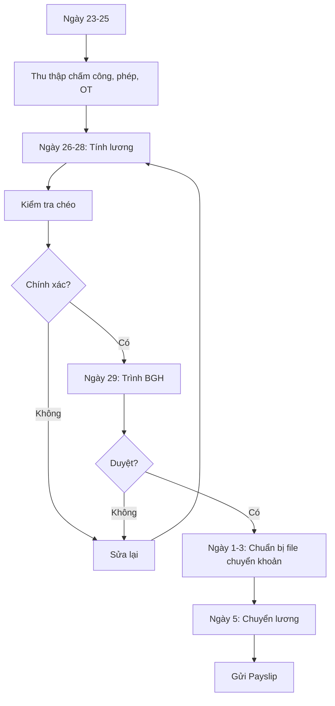

# SOP-05.1: QUẢN LÝ CHẾ ĐỘ LƯƠNG THƯỞNG

## 1. THÔNG TIN | Mã: SOP-05.1 | Tần suất: Hàng tháng

## 2. MỤC ĐÍCH
Tính lương chính xác, công bằng, đúng hạn

## 3. QUY TRÌNH

### 3.1. Thu thập dữ liệu (Ngày 23-25)
**Bước 1:** Thu thập chấm công, phép, OT, KPI

### 3.2. Tính lương (Ngày 26-28)
**Bước 2:** Tính lương theo công thức:
```
Lương = Lương cơ bản + Phụ cấp + Thưởng KPI - Trừ (BHXH, BHYT, BHTN, Thuế TNCN, Phạt...)
```

**Bước 3:** Kiểm tra chéo

### 3.3. Phê duyệt và chi trả (Ngày 29-5)
**Bước 4:** Trình BGH duyệt
**Bước 5:** Chuyển khoản ngày 5 hàng tháng
**Bước 6:** Gửi Payslip (phiếu lương) qua email

## 4. LƯU ĐỒ


## 5. BIỂU MẪU
- QT02-F38: Bảng lương tổng hợp
- QT02-F39: Payslip cá nhân

## 6. TIÊU CHUẨN
| Chỉ tiêu | Mục tiêu |
|---|---|
| Chuyển lương đúng ngày 5 | 100% |
| Sai sót | < 0.5% |

## 7. TRÁCH NHIỆM
- **Kế toán**: Tính lương
- **Phòng NS**: Cung cấp chấm công, KPI
- **BGH**: Phê duyệt

## 8. LƯU Ý
- ⚠️ Bảo mật thông tin lương
- ✅ Lưu trữ 10 năm

## 9. FAQ
**Q: NV thắc mắc lương?**  
A: Phòng NS giải thích chi tiết, cung cấp bảng tính.

---
**PHÊ DUYỆT** | Kế toán | NS | Phó HT |
