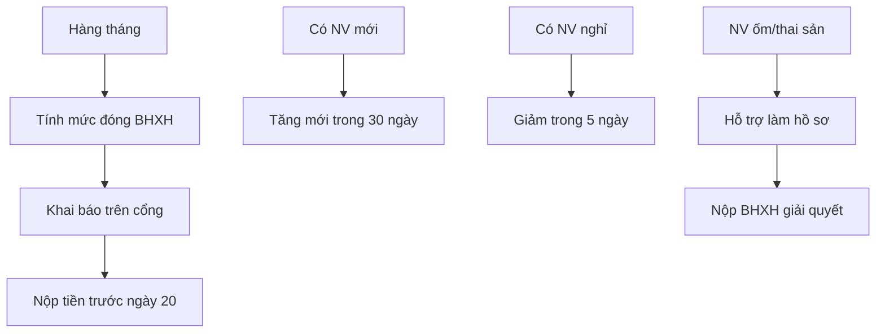

# SOP-05.2: QUẢN LÝ BẢO HIỂM XÃ HỘI

## 1. THÔNG TIN | Mã: SOP-05.2 | Tần suất: Hàng tháng

## 2. MỤC ĐÍCH
Đóng đầy đủ, đúng hạn BHXH, BHYT, BHTN theo luật

## 3. QUY TRÌNH

### 3.1. Đóng BHXH hàng tháng
**Bước 1:** Tính mức đóng (trước ngày 10)
- Lương đóng BHXH = Lương cơ bản + Phụ cấp
- Tỷ lệ: BHXH 17.5%, BHYT 3%, BHTN 1%

**Bước 2:** Khai báo trên cổng BHXH (trước ngày 15)
**Bước 3:** Nộp tiền (trước ngày 20)

### 3.2. Thay đổi nhân sự
**Tăng mới:** Trong 30 ngày kể từ ngày ký HĐLĐ
**Giảm:** Trong 5 ngày kể từ ngày nghỉ việc

### 3.3. Giải quyết chế độ
**Ốm đau, thai sản:** Hỗ trợ NV làm hồ sơ, nộp BHXH
**Hưu trí, tử tuất:** Theo quy định BHXH

## 4. LƯU ĐỒ

## 5. BIỂU MẪU
- QT02-F40: Danh sách tăng/giảm BHXH
- QT02-F41: Hồ sơ ốm đau, thai sản

## 6. TIÊU CHUẨN
| Chỉ tiêu | Mục tiêu |
|---|---|
| Đóng đúng hạn | 100% |
| Tăng/Giảm đúng hạn | 100% |

## 7. TRÁCH NHIỆM
- **Phòng NS**: Khai báo, theo dõi, hỗ trợ NV

## 8. LƯU Ý
- ⚠️ Chậm nộp bị phạt 0.05%/ngày
- ✅ NV thử việc < 1 tháng không đóng BHXH

## 9. FAQ
**Q: NV yêu cầu không đóng BHXH?**  
A: Không được. Bắt buộc theo luật.

---
**PHÊ DUYỆT** | Trưởng NS | Phó HT |
