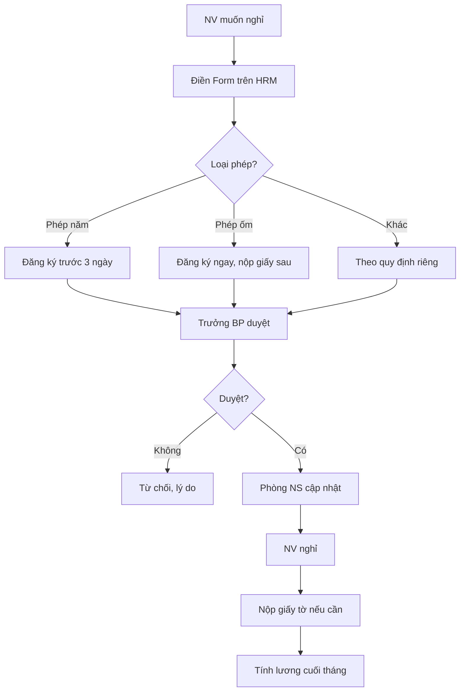

# SOP-05.3: QUẢN LÝ NGHỈ PHÉP VÀ CHẾ ĐỘ ĐẶC BIỆT

## 1. THÔNG TIN | Mã: SOP-05.3 | Tần suất: Liên tục

## 2. MỤC ĐÍCH
Quản lý phép năm, phép ốm, thai sản... đúng luật, công bằng

## 3. CÁC LOẠI PHÉP

| **Loại phép** | **Số ngày** | **Lương** | **Thủ tục** |
|---|---|---|---|
| **Phép năm** | 12 ngày | 100% | Đăng ký trước 3 ngày |
| **Phép ốm** | Theo bác sĩ | BHXH trả (từ ngày 1) | Giấy bác sĩ |
| **Thai sản (nữ)** | 6 tháng | BHXH trả | Giấy sinh con |
| **Con ốm (< 7 tuổi)** | 20 ngày/năm | BHXH trả (từ ngày 1) | Giấy bác sĩ |
| **Kết hôn** | 3 ngày | 100% | Giấy đăng ký kết hôn |
| **Tang (bố mẹ, vợ/chồng)** | 3 ngày | 100% | Giấy tử vong |
| **Không lương** | Không giới hạn | 0% | Thỏa thuận trước |

## 4. QUY TRÌNH

### 4.1. Xin phép
**Bước 1:** NV điền Form xin phép trên HRM
**Bước 2:** Trưởng BP duyệt (< 24h)
**Bước 3:** Phòng NS cập nhật

### 4.2. Nghỉ và xác nhận
**Bước 4:** NV nghỉ theo lịch
**Bước 5:** Nộp giấy tờ (nếu cần) khi đi làm lại

### 4.3. Tính lương
**Bước 6:** Phòng NS tổng hợp, trừ lương (nếu có)

## 5. LƯU ĐỒ

## 6. BIỂU MẪU
- QT02-F42: Form xin phép (trên HRM)
- QT02-R07: Báo cáo nghỉ phép tháng

## 7. TIÊU CHUẨN
| Chỉ tiêu | Mục tiêu |
|---|---|
| Thời gian duyệt phép | ≤ 24h |
| Tỷ lệ duyệt đúng quy định | 100% |

## 8. TRÁCH NHIỆM
- **NV**: Xin phép đúng quy trình
- **Trưởng BP**: Duyệt phép
- **Phòng NS**: Quản lý, tính lương

## 9. LƯU Ý
- ⚠️ Nghỉ không phép ≥ 5 ngày = vi phạm kỷ luật nghiêm trọng
- ✅ Phép năm không dùng hết không được chuyển sang năm sau (trừ thỏa thuận)

## 10. FAQ
**Q: Nghỉ ốm đột xuất không kịp xin phép?**  
A: Gọi điện/nhắn tin báo ngay. Xin phép và nộp giấy sau.

---
**PHÊ DUYỆT** | Trưởng NS | Phó HT |
