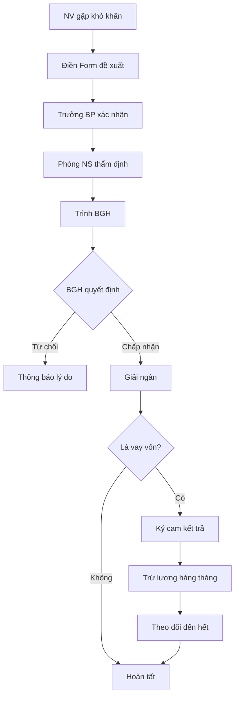

# SOP-05.4: HỖ TRỢ NHÂN VIÊN

## 1. THÔNG TIN | Mã: SOP-05.4 | Tần suất: Khi có nhu cầu

## 2. MỤC ĐÍCH
Hỗ trợ NV khi khó khăn, tạo sự gắn kết, giữ chân nhân tài

## 3. CÁC HÌNH THỨC HỖ TRỢ

| **Loại hỗ trợ** | **Mức độ** | **Điều kiện** | **Phê duyệt** |
|---|---|---|---|
| **Vay vốn lãi suất 0%** | 10-50 triệu | Làm ≥ 1 năm, mua nhà/xe, học con | BGH |
| **Hỗ trợ khó khăn đột xuất** | 5-20 triệu | Ốm nặng, tang, thiên tai | BGH |
| **Hỗ trợ học phí con** | 30-50% học phí | Con học tại trường | Tự động |
| **Quà sinh nhật** | 500K | Tất cả NV | Tự động |
| **Quà sinh con** | 2 triệu | Sinh con | Tự động |
| **Chăm sóc sức khỏe** | Khám định kỳ | Tất cả NV | Hàng năm |

## 4. QUY TRÌNH

### 4.1. Đề xuất hỗ trợ
**Bước 1:** NV điền Form đề xuất (QT02-F43)
**Bước 2:** Trưởng BP xác nhận
**Bước 3:** Phòng NS thẩm định

### 4.2. Phê duyệt
**Bước 4:** Trình BGH
**Bước 5:** BGH quyết định

### 4.3. Giải ngân
**Bước 6:** Chuyển khoản hoặc trao tay
**Bước 7:** NV ký xác nhận nhận (QT02-F44)

### 4.4. Theo dõi (Nếu vay vốn)
**Bước 8:** Trừ lương hàng tháng theo cam kết
**Bước 9:** Theo dõi đến khi trả hết

## 5. LƯU ĐỒ

## 6. BIỂU MẪU
- QT02-F43: Form đề xuất hỗ trợ
- QT02-F44: Biên bản trao/nhận
- QT02-F45: Cam kết vay/trả (nếu vay)

## 7. TIÊU CHUẨN
| Chỉ tiêu | Mục tiêu |
|---|---|
| Thời gian xét duyệt | ≤ 5 ngày |
| Tỷ lệ NV trả đủ khi vay | 100% |

## 8. TRÁCH NHIỆM
- **NV**: Đề xuất, cam kết trả (nếu vay)
- **Trưởng BP**: Xác nhận tình hình
- **Phòng NS**: Thẩm định, theo dõi
- **BGH**: Quyết định

## 9. LƯU Ý
- ⚠️ Vay vốn: Nếu NV nghỉ việc trước hạn, phải thanh toán hết
- ✅ Hỗ trợ khó khăn là "cho", không phải thu lại

## 10. FAQ
**Q: NV nghỉ việc khi đang vay vốn?**  
A: Phải trả hết. Nếu không, trừ vào lương cuối cùng và trợ cấp thôi việc.

---
**PHÊ DUYỆT** | Trưởng NS | Phó HT | HT |
