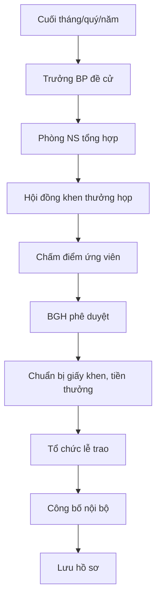

# SOP-06.1: HỆ THỐNG KHEN THƯỞNG

## 1. THÔNG TIN | Mã: SOP-06.1 | Tần suất: Tháng, Quý, Năm

## 2. MỤC ĐÍCH
Ghi nhận thành tích, động viên NV làm việc tốt hơn

## 3. CÁC LOẠI KHEN THƯỞNG

| **Loại** | **Tiêu chí** | **Giá trị** | **Tần suất** |
|---|---|---|---|
| **Nhân viên tháng** | KPI cao, thái độ tốt | 1-2 triệu + Giấy khen | Tháng |
| **Nhân viên quý** | Xuất sắc 3 tháng liên tục | 3-5 triệu + Giấy khen | Quý |
| **Nhân viên năm** | Top 5% toàn trường | 10-20 triệu + Cúp | Năm |
| **Giáo viên mẫu mực** | Dạy giỏi, được PH yêu mến | 15 triệu + Danh hiệu | Năm |
| **Thành tích đột xuất** | Giải thưởng lớn, dự án xuất sắc | 5-30 triệu | Khi có |
| **Thâm niên** | 5, 10, 15, 20 năm | Quà + Kỷ niệm chương | Khi đủ |

## 4. QUY TRÌNH

### 4.1. Đề cử
**Bước 1:** Trưởng BP đề cử (Form QT02-F46)
**Bước 2:** Phòng NS tổng hợp

### 4.2. Xét duyệt
**Bước 3:** Hội đồng khen thưởng họp (NS + BP + BGH)
**Bước 4:** Chấm điểm, bình chọn
**Bước 5:** BGH phê duyệt

### 4.3. Trao thưởng
**Bước 6:** Tổ chức lễ trao thưởng (tháng/quý)
**Bước 7:** Công khai, chụp ảnh, đăng nội bộ

## 5. LƯU ĐỒ

## 6. BIỂU MẪU
- QT02-F46: Form đề cử khen thưởng
- QT02-F47: Giấy khen/Quyết định

## 7. TIÊU CHUẨN
| Chỉ tiêu | Mục tiêu |
|---|---|
| Tỷ lệ NV được khen thưởng/năm | ≥ 50% |
| Công khai minh bạch | 100% |

## 8. TRÁCH NHIỆM
- **Trưởng BP**: Đề cử
- **Phòng NS**: Tổ chức, trao thưởng
- **BGH**: Phê duyệt

## 9. LƯU Ý
- ⚠️ Khen thưởng phải **công bằng, minh bạch**
- ✅ Trao **công khai** để lan tỏa, tạo động lực

## 10. FAQ
**Q: Có thể tự đề cử không?**  
A: Có, nhưng phải qua Trưởng BP xác nhận.

---
**PHÊ DUYỆT** | Trưởng NS | Phó HT | HT |
