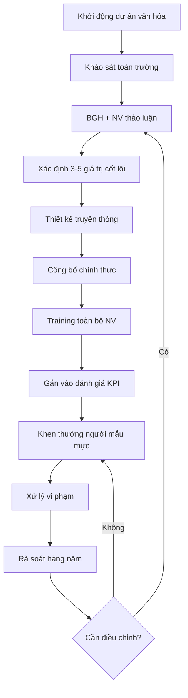

# SOP-06.2: XÂY DỰNG VĂN HÓA TỔ CHỨC

## 1. THÔNG TIN | Mã: SOP-06.2 | Tần suất: Liên tục

## 2. MỤC ĐÍCH
Xây dựng giá trị cốt lõi, hành vi chuẩn mực, văn hóa tích cực

## 3. GIÁ TRỊ CỐT LÕI (VÍ DỤ)

| **Giá trị** | **Ý nghĩa** | **Hành vi mong đợi** |
|---|---|---|
| **Học sinh là trung tâm** | Mọi quyết định vì lợi ích HS | Lắng nghe HS, Linh hoạt phương pháp |
| **Chất lượng** | Làm tốt nhất có thể | Chuẩn bị kỹ, Cải tiến liên tục |
| **Đoàn kết** | Hợp tác, hỗ trợ lẫn nhau | Chia sẻ kiến thức, Không ganh đua tiêu cực |
| **Sáng tạo** | Dám nghĩ, dám làm mới | Đề xuất ý tưởng, Không sợ thất bại |
| **Trách nhiệm** | Cam kết và hoàn thành | Làm đúng hạn, Chịu trách nhiệm |

## 4. QUY TRÌNH XÂY DỰNG

### 4.1. Xác định giá trị
**Bước 1:** Khảo sát NV, PH, HS (Form QT02-F48)
**Bước 2:** BGH + Đại diện NV thảo luận
**Bước 3:** Định hình 3-5 giá trị cốt lõi
**Bước 4:** Công bố toàn trường

### 4.2. Truyền thông
**Bước 5:** Poster, banner khắp trường
**Bước 6:** Training cho tất cả NV
**Bước 7:** Gắn vào đánh giá hiệu suất

### 4.3. Củng cố
**Bước 8:** Khen thưởng NV sống đúng giá trị
**Bước 9:** Nhắc nhở, xử lý khi vi phạm
**Bước 10:** Rà soát, cập nhật hàng năm

## 5. LƯU ĐỒ

## 6. BIỂU MẪU
- QT02-F48: Khảo sát giá trị văn hóa
- QT02-P04: Tài liệu đào tạo văn hóa

## 7. TIÊU CHUẨN
| Chỉ tiêu | Mục tiêu |
|---|---|
| Tỷ lệ NV hiểu rõ giá trị cốt lõi | ≥ 90% |
| Tỷ lệ NV sống đúng giá trị | ≥ 80% |

## 8. TRÁCH NHIỆM
- **BGH**: Định hình, dẫn dắt
- **Phòng NS**: Truyền thông, đào tạo
- **Tất cả NV**: Thực hành hàng ngày

## 9. LƯU Ý
- ⚠️ Văn hóa = Hành vi, không chỉ khẩu hiệu
- ✅ Lãnh đạo phải **nêu gương** trước

## 10. FAQ
**Q: Mất bao lâu để văn hóa thấm?**  
A: 2-3 năm. Cần kiên trì, nhất quán.

---
**PHÊ DUYỆT** | Trưởng NS | HT |
