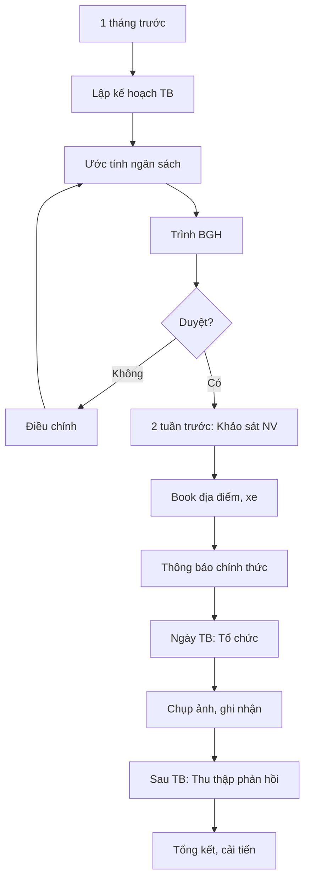

# SOP-06.3: HOẠT ĐỘNG TEAM BUILDING

## 1. THÔNG TIN | Mã: SOP-06.3 | Tần suất: Học kỳ, Năm

## 2. MỤC ĐÍCH
Gắn kết đội ngũ, giải tỏa stress, tạo tinh thần đồng đội

## 3. CÁC LOẠI HOẠT ĐỘNG

| **Loại** | **Nội dung** | **Tần suất** | **Ngân sách** |
|---|---|---|---|
| **Team building học kỳ** | Du lịch 2-3 ngày | 2 lần/năm | 3-5 triệu/người |
| **Picnic quý** | Dã ngoại 1 ngày | 4 lần/năm | 500K-1 triệu/người |
| **Happy hour tháng** | Ăn tối, sinh nhật tháng | Hàng tháng | 200-300K/người |
| **Sự kiện lớn** | Tất niên, Ngày 20/11, 8/3... | Theo lịch | Tùy quy mô |

## 4. QUY TRÌNH

### 4.1. Lập kế hoạch (Trước 1 tháng)
**Bước 1:** Phòng NS đề xuất kế hoạch
- Địa điểm, hoạt động, chi phí
**Bước 2:** BGH phê duyệt

### 4.2. Chuẩn bị (Trước 2 tuần)
**Bước 3:** Khảo sát ý kiến NV (ngày, địa điểm...)
**Bước 4:** Book địa điểm, xe, khách sạn
**Bước 5:** Thông báo chính thức

### 4.3. Triển khai
**Bước 6:** Tổ chức sự kiện
**Bước 7:** Chụp ảnh, quay video

### 4.4. Đánh giá
**Bước 8:** Thu thập phản hồi (Form QT02-F49)
**Bước 9:** Tổng kết, cải tiến

## 5. LƯU ĐỒ

## 6. BIỂU MẪU
- QT02-F49: Form phản hồi team building
- QT02-P05: Kế hoạch team building

## 7. TIÊU CHUẨN
| Chỉ tiêu | Mục tiêu |
|---|---|
| Tỷ lệ NV tham gia | ≥ 90% |
| Điểm hài lòng | ≥ 8.5/10 |

## 8. TRÁCH NHIỆM
- **Phòng NS**: Tổ chức, điều phối
- **BGH**: Phê duyệt, tham gia
- **NV**: Tham gia tích cực

## 9. LƯU Ý
- ⚠️ An toàn là ưu tiên số 1
- ✅ Hoạt động phải **vui, ý nghĩa**, không hình thức
- ✅ Tôn trọng NV không muốn tham gia (có lý do)

## 10. FAQ
**Q: NV có thể đề xuất địa điểm không?**  
A: Có, qua khảo sát hoặc góp ý trực tiếp.

---
**PHÊ DUYỆT** | Trưởng NS | Phó HT |
