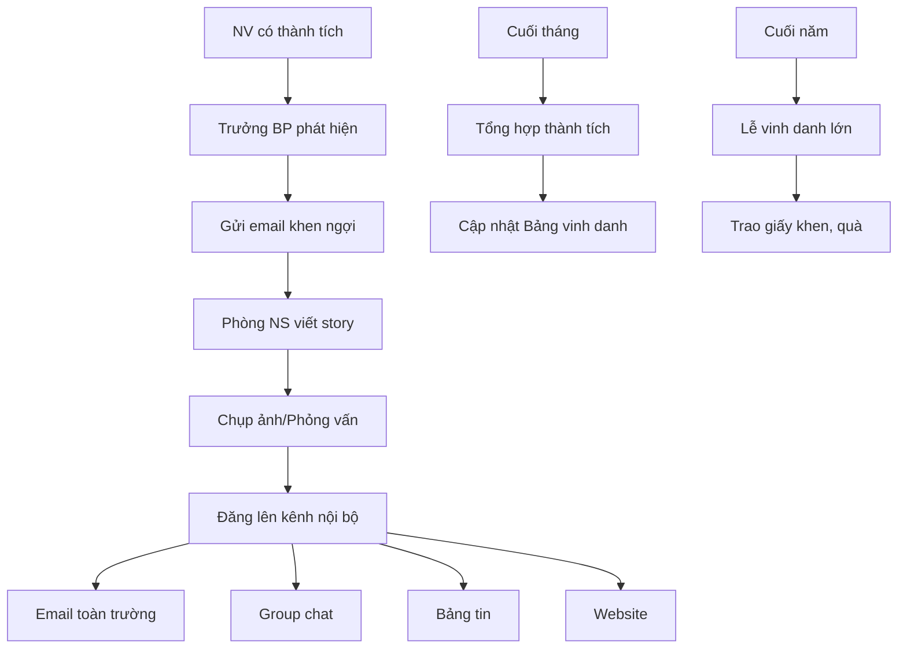

# SOP-06.4: GHI NHẬN VÀ TÔN VINH NHÂN VIÊN

## 1. THÔNG TIN | Mã: SOP-06.4 | Tần suất: Liên tục

## 2. MỤC ĐÍCH
Tạo văn hóa ghi nhận thành tích, lan tỏa tấm gương tốt

## 3. CÁC HÌNH THỨC GHI NHẬN

| **Hình thức** | **Khi nào** | **Ai làm** |
|---|---|---|
| **Lời cảm ơn công khai** | Hàng ngày | Trưởng BP, BGH |
| **Email khen ngợi** | Khi hoàn thành tốt công việc | Trưởng BP, BGH |
| **Bảng vinh danh** | Hàng tháng | Phòng NS |
| **Chia sẻ story thành công** | Khi có thành tích nổi bật | Phòng NS |
| **Lễ vinh danh chính thức** | Cuối năm | BGH |

## 4. QUY TRÌNH

### 4.1. Phát hiện và ghi nhận
**Bước 1:** Trưởng BP phát hiện thành tích
**Bước 2:** Gửi email khen ngợi (CC: Phòng NS, BGH)

### 4.2. Lan tỏa
**Bước 3:** Phòng NS viết story, chụp ảnh
**Bước 4:** Đăng lên các kênh nội bộ:
- Email toàn trường
- Group Zalo/Teams
- Bảng tin nội bộ
- Website trường

### 4.3. Vinh danh công khai
**Bước 5:** Tổng hợp thành tích tháng/năm
**Bước 6:** Tổ chức lễ vinh danh
**Bước 7:** Trao giấy khen, quà, chụp ảnh

## 5. LƯU ĐỒ


## 6. BIỂU MẪU
- QT02-F50: Form đề cử ghi nhận
- QT02-T01: Template story thành công

## 7. TIÊU CHUẨN
| Chỉ tiêu | Mục tiêu |
|---|---|
| Tần suất đăng story | ≥ 2 story/tuần |
| Tỷ lệ NV được ghi nhận/năm | ≥ 70% |

## 8. TRÁCH NHIỆM
- **Trưởng BP**: Phát hiện, khen ngợi kịp thời
- **Phòng NS**: Viết story, lan tỏa
- **BGH**: Ghi nhận công khai

## 9. LƯU Ý
- ⚠️ Ghi nhận phải **kịp thời** (trong 24h)
- ✅ **Cụ thể**, không chung chung: "Cô A đã làm X rất tốt, giúp được Y"
- ✅ Ghi nhận **thường xuyên**, không chỉ thành tích lớn

## 10. PHỤ LỤC

**Mẫu email khen ngợi:**
```
Subject: Cảm ơn cô [Tên] - [Thành tích]

Kính gửi cô [Tên],

Tôi rất ấn tượng với [Thành tích cụ thể]. Điều này đã giúp [Tác động tích cực].

Cảm ơn cô rất nhiều! Đây là tấm gương tốt cho cả team.

Trân trọng,
[Tên Trưởng BP]
```

## 11. FAQ
**Q: Chỉ ghi nhận thành tích lớn thôi à?**  
A: Không. Ghi nhận cả việc nhỏ, hành vi đúng đắn. Tạo văn hóa ghi nhận liên tục.

---
**PHÊ DUYỆT** | Trưởng NS | Phó HT |
