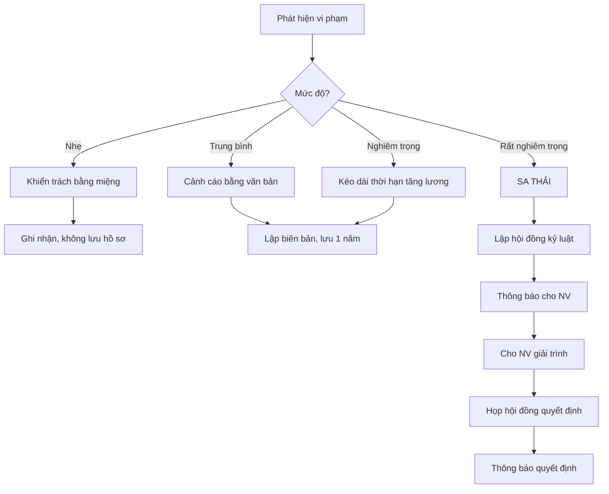

# SOP-07.1: QUY ĐỊNH KỶ LUẬT LAO ĐỘNG

## 1. THÔNG TIN | Mã: SOP-07.1 | Tần suất: Ban hành 1 lần, Rà soát hàng năm

## 2. MỤC ĐÍCH
Quy định rõ hành vi cấm, hình thức xử lý để duy trì kỷ luật lao động

## 3. CÁC HÌNH THỨC KỶ LUẬT

| **Hình thức** | **Áp dụng** | **Lưu hồ sơ** |
|---|---|---|
| **1. Khiển trách** | Vi phạm nhẹ lần đầu | 6 tháng |
| **2. Cảnh cáo** | Vi phạm lần 2 hoặc vi phạm trung bình | 1 năm |
| **3. Kéo dài thời hạn nâng lương** | Vi phạm nghiêm trọng | Vĩnh viễn |
| **4. Sa thải** | Vi phạm rất nghiêm trọng | Vĩnh viễn |

## 4. HÀNH VI VI PHẠM

### 4.1. Vi phạm nhẹ
- Đi muộn, về sớm < 3 lần/tháng
- Vi phạm trang phục
- Sử dụng điện thoại trong giờ làm việc (không khẩn cấp)

### 4.2. Vi phạm trung bình
- Đi muộn thường xuyên (≥ 3 lần/tháng)
- Không hoàn thành công việc
- Thái độ tiêu cực với đồng nghiệp
- Vắng mặt không phép 1-2 ngày

### 4.3. Vi phạm nghiêm trọng
- Vi phạm an toàn học sinh
- Gian lận chứng chỉ, bằng cấp
- Vắng mặt không phép 3-4 ngày liên tục
- Mất đoàn kết, gây chia rẽ

### 4.4. Vi phạm rất nghiêm trọng (SA THẢI)
- Bạo hành học sinh
- Tham ô, trộm cắp tài sản
- Làm lộ bí mật trường, thông tin học sinh
- Vắng mặt không phép ≥ 5 ngày liên tục
- Vi phạm pháp luật, bị xử lý hình sự

## 5. LƯU ĐỒ XỬ LÝ VI PHẠM

## 6. BIỂU MẪU
- QT02-F51: Biên bản vi phạm
- QT02-F52: Quyết định kỷ luật

## 7. TIÊU CHUẨN
| Chỉ tiêu | Mục tiêu |
|---|---|
| Tỷ lệ vi phạm kỷ luật | < 5%/năm |
| Xử lý đúng quy trình | 100% |

## 8. TRÁCH NHIỆM
- **Trưởng BP**: Phát hiện, báo cáo
- **Phòng NS**: Lập hồ sơ, quy trình
- **BGH**: Quyết định xử lý

## 9. LƯU Ý
- ⚠️ Phải có **bằng chứng** rõ ràng
- ✅ **Lắng nghe giải trình** trước khi xử lý
- ✅ Theo đúng Bộ luật Lao động 2019

## 10. FAQ
**Q: Có thể sa thải ngay không?**  
A: Chỉ khi vi phạm RẤT nghiêm trọng. Phải qua hội đồng kỷ luật.

---
**PHÊ DUYỆT** | Trưởng NS | Phó HT | HT |
