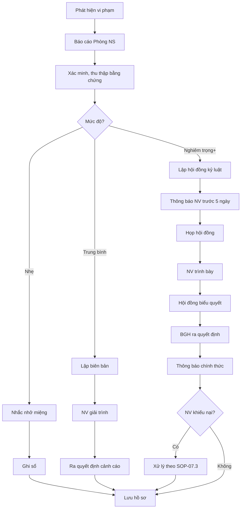

# SOP-07.2: XỬ LÝ VI PHẠM KỶ LUẬT

## 1. THÔNG TIN | Mã: SOP-07.2 | Tần suất: Khi phát sinh

## 2. MỤC ĐÍCH
Xử lý vi phạm công bằng, đúng luật, kịp thời

## 3. QUY TRÌNH

### 3.1. Phát hiện và báo cáo
**Bước 1:** Trưởng BP/Đồng nghiệp phát hiện vi phạm
**Bước 2:** Báo cáo Phòng NS (Form QT02-F53)
**Bước 3:** Phòng NS xác minh, thu thập bằng chứng

### 3.2. Xử lý theo mức độ

**VI PHẠM NHẸ:**
**Bước 4a:** Trưởng BP nhắc nhở bằng miệng
**Bước 5a:** Ghi nhận vào sổ theo dõi
**Bước 6a:** Kết thúc

**VI PHẠM TRUNG BÌNH:**
**Bước 4b:** Lập biên bản vi phạm
**Bước 5b:** Cho NV giải trình (bằng văn bản)
**Bước 6b:** Trưởng BP + Phòng NS quyết định hình thức
**Bước 7b:** Ra quyết định cảnh cáo
**Bước 8b:** Lưu hồ sơ 1 năm

**VI PHẠM NGHIÊM TRỌNG/RẤT NGHIÊM TRỌNG:**
**Bước 4c:** Lập hội đồng kỷ luật (BGH + NS + BP + Đại diện NV)
**Bước 5c:** Thông báo cho NV trước 5 ngày
**Bước 6c:** Họp hội đồng, NV được trình bày
**Bước 7c:** Hội đồng biểu quyết
**Bước 8c:** BGH ra quyết định chính thức
**Bước 9c:** Thông báo NV (trực tiếp + văn bản)
**Bước 10c:** Lưu hồ sơ vĩnh viễn

### 3.3. Khiếu nại (nếu có)
**Bước 11:** NV có quyền khiếu nại trong 30 ngày
**Bước 12:** Xử lý theo SOP-07.3

## 4. LƯU ĐỒ

## 5. BIỂU MẪU
- QT02-F53: Form báo cáo vi phạm
- QT02-F54: Biên bản họp hội đồng kỷ luật
- QT02-F55: Quyết định kỷ luật

## 6. TIÊU CHUẨN
| Chỉ tiêu | Mục tiêu |
|---|---|
| Thời gian xử lý | ≤ 15 ngày |
| Xử lý đúng quy trình | 100% |

## 7. TRÁCH NHIỆM
- **Trưởng BP**: Phát hiện, báo cáo, xử lý nhẹ
- **Phòng NS**: Xác minh, lập hồ sơ, tổ chức hội đồng
- **Hội đồng kỷ luật**: Xem xét, quyết định
- **BGH**: Quyết định cuối

## 8. LƯU Ý
- ⚠️ **Nguyên tắc vô tội**: Chưa chứng minh → Chưa xử lý
- ✅ **Quyền được bào chữa**: NV được giải trình, mời luật sư (nếu sa thải)
- ✅ **Thời hiệu xử lý**: Trong 6 tháng kể từ khi phát hiện (luật quy định)

## 9. FAQ
**Q: NV không đến họp hội đồng kỷ luật?**  
A: Thông báo 2 lần. Nếu vẫn không đến, hội đồng họp vắng mặt.

---
**PHÊ DUYỆT** | Trưởng NS | Phó HT | HT |
