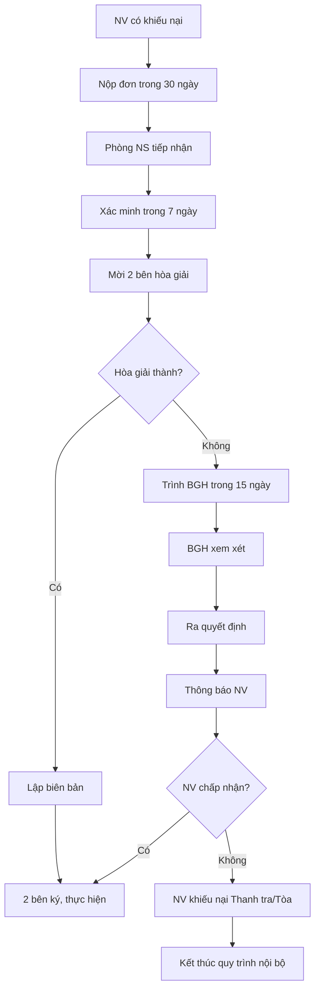

# SOP-07.3: KHIẾU NẠI VÀ GIẢI QUYẾT TRANH CHẤP

## 1. THÔNG TIN | Mã: SOP-07.3 | Tần suất: Khi phát sinh

## 2. MỤC ĐÍCH
Lắng nghe, giải quyết tranh chấp công bằng, hòa giải trước khi ra tòa

## 3. PHẠM VI
- Khiếu nại về kỷ luật, đánh giá, lương thưởng
- Tranh chấp lao động (chấm dứt HĐLĐ, quyền lợi...)
- Bạo lực, quấy rối tại nơi làm việc

## 4. QUY TRÌNH

### 4.1. Tiếp nhận khiếu nại
**Bước 1:** NV nộp đơn khiếu nại (QT02-F56) cho Phòng NS
- Trong 30 ngày kể từ khi biết quyết định
- Nêu rõ: Khiếu nại gì? Lý do? Yêu cầu?

**Bước 2:** Phòng NS tiếp nhận, ghi sổ

### 4.2. Xem xét và hòa giải
**Bước 3:** Phòng NS xác minh thông tin (7 ngày)
**Bước 4:** Mời 2 bên gặp mặt hòa giải
- Lắng nghe cả 2 phía
- Tìm giải pháp thỏa mãn cả 2

**Bước 5:** Kết quả hòa giải
| **Kết quả** | **Hành động** |
|---|---|
| **Hòa giải thành** | Lập biên bản, 2 bên ký, kết thúc |
| **Hòa giải không thành** | Chuyển BGH xét |

### 4.3. Xử lý cấp cao
**Bước 6:** Trình BGH (trong 15 ngày)
**Bước 7:** BGH xem xét, quyết định
**Bước 8:** Thông báo kết quả cho NV (văn bản)

### 4.4. Nếu vẫn không đồng ý
**Bước 9:** NV có quyền:
- Khiếu nại lên Thanh tra lao động
- Khởi kiện ra Tòa án

## 5. LƯU ĐỒ

## 6. BIỂU MẪU
- QT02-F56: Đơn khiếu nại
- QT02-F57: Biên bản hòa giải
- QT02-F58: Quyết định giải quyết khiếu nại

## 7. TIÊU CHUẨN
| Chỉ tiêu | Mục tiêu |
|---|---|
| Thời gian giải quyết | ≤ 30 ngày |
| Tỷ lệ hòa giải thành | ≥ 70% |
| Tỷ lệ bị thua kiện | < 10% |

## 8. TRÁCH NHIỆM
- **Phòng NS**: Tiếp nhận, hòa giải, hồ sơ
- **BGH**: Quyết định cuối cùng
- **Luật sư (nếu cần)**: Tư vấn pháp lý

## 9. LƯU Ý
- ⚠️ **Thời hiệu khiếu nại**: 30 ngày (luật quy định)
- ✅ **Không trả thù**: Không được đối xử bất lợi với NV khiếu nại
- ✅ **Bảo mật thông tin**: Không tiết lộ nội dung khiếu nại

## 10. FAQ
**Q: Khiếu nại ẩn danh có được chấp nhận không?**  
A: Không. Phải có tên, chữ ký rõ ràng.

**Q: Nếu BGH quyết định vẫn không công bằng?**  
A: NV có quyền khiếu nại lên Thanh tra lao động hoặc khởi kiện ra Tòa.

---
**PHÊ DUYỆT** | Trưởng NS | Phó HT | HT |
