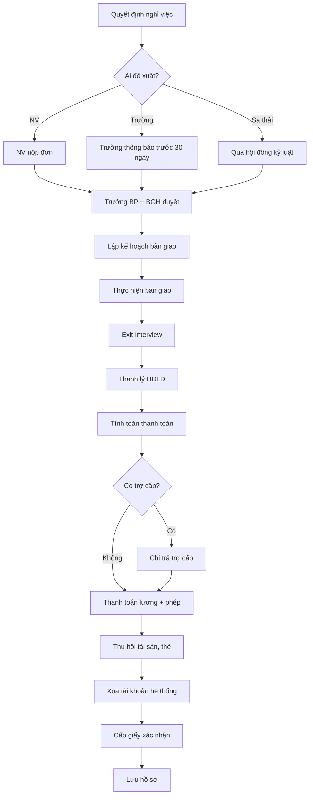

# SOP-07.4: CHẤM DỨT HỢP ĐỒNG LAO ĐỘNG

## 1. THÔNG TIN | Mã: SOP-07.4 | Tần suất: Khi có nhu cầu

## 2. MỤC ĐÍCH
Xử lý thủ tục nghỉ việc đúng luật, văn minh, giữ quan hệ tốt

## 3. CÁC TRƯỜNG HỢP CHẤM DỨT

| **Trường hợp** | **Thời gian báo trước** | **Trợ cấp** | **Ghi chú** |
|---|---|---|---|
| **NV xin nghỉ** | 30 ngày (HĐLĐ không thời hạn), 3 ngày (HĐLĐ < 12 tháng) | Không | NV tự nguyện |
| **Hết hạn HĐLĐ** | Thông báo trước 15 ngày | Không (trừ khi gia hạn nhiều lần) | Theo thỏa thuận |
| **Thỏa thuận 2 bên** | Thỏa thuận | Thỏa thuận | Cả 2 bên đồng ý |
| **Trường đơn phương** | 30 ngày | Có (1/2 tháng lương × số năm) | Phải có lý do chính đáng |
| **Sa thải** | Ngay (không báo trước) | Không | Chỉ khi vi phạm nghiêm trọng (xem mục 4.3.1) |

## 4. QUY TRÌNH

### 4.1. NV xin nghỉ việc
**Bước 1:** NV nộp đơn xin nghỉ (QT02-F59)
- 30 ngày trước (HĐLĐ không thời hạn)
- 3 ngày trước (HĐLĐ < 12 tháng)

**Bước 2:** Trưởng BP xác nhận
**Bước 3:** BGH phê duyệt
**Bước 4:** Bàn giao công việc
**Bước 5:** Exit Interview (QT02-F60)
**Bước 6:** Thanh lý HĐLĐ, quyết toán
**Bước 7:** Bàn giao tài sản, xóa tài khoản

### 4.2. Trường đơn phương chấm dứt
**Bước 1:** Trưởng BP đề xuất chấm dứt (lý do rõ ràng)
**Bước 2:** Phòng NS thẩm định
**Bước 3:** Thông báo NV trước 30 ngày
**Bước 4:** Thanh lý HĐLĐ
**Bước 5:** Chi trả trợ cấp thôi việc
**Bước 6:** Bàn giao, thanh toán

### 4.3. Sa thải

#### 4.3.1. Tiêu chí sa thải

**SA THẢI NGAY (Không cần báo trước):**

1. **Vi phạm đạo đức, danh dự nghiêm trọng:**
   - Lừa dối, gian lận trong công việc
   - Quấy rối tình dục, bạo lực tại nơi làm việc
   - Làm nhục, xúc phạm danh dự nhân phẩm đồng nghiệp, học sinh, phụ huynh
   - Sử dụng ma túy, rượu bia trong giờ làm việc

2. **Vi phạm an toàn lao động:**
   - Cố ý gây tai nạn lao động
   - Vi phạm quy định an toàn dẫn đến thiệt hại nghiêm trọng
   - Từ chối thực hiện biện pháp an toàn sau khi đã được cảnh báo

3. **Tham ô, thất thoát tài sản:**
   - Chiếm đoạt tài sản của trường, học sinh, phụ huynh
   - Làm giả giấy tờ, chứng từ tài chính
   - Tham nhũng, nhận hối lộ

4. **Tiết lộ bí mật:**
   - Tiết lộ thông tin bí mật kinh doanh, dữ liệu học sinh
   - Cung cấp thông tin cho đối thủ cạnh tranh
   - Vi phạm cam kết bảo mật sau khi đã cảnh cáo

5. **Vi phạm kỷ luật lao động:**
   - Tự ý bỏ việc 5 ngày liên tiếp không có lý do chính đáng
   - Đã bị kỷ luật cảnh cáo 2 lần trong 1 năm, lại vi phạm lần thứ 3
   - Từ chối thực hiện công việc được giao sau khi đã cảnh cáo

6. **Vi phạm pháp luật:**
   - Bị kết án tù (trừ trường hợp được miễn trách nhiệm hình sự)
   - Sử dụng giấy tờ giả (bằng cấp, chứng chỉ)
   - Có hành vi vi phạm pháp luật nghiêm trọng ảnh hưởng đến uy tín trường

**ĐIỀU KIỆN BẮT BUỘC:**
- ✅ Phải có bằng chứng rõ ràng, đầy đủ
- ✅ Phải qua hội đồng kỷ luật (theo SOP-07.2)
- ✅ NV được quyền giải trình, bào chữa
- ✅ Quyết định sa thải phải bằng văn bản, có chữ ký BGH

#### 4.3.2. Quy trình sa thải
**Bước 1:** Qua hội đồng kỷ luật (SOP-07.2)
**Bước 2:** BGH ra quyết định sa thải
**Bước 3:** Thông báo NV ngay
**Bước 4:** Thanh lý HĐLĐ (không trợ cấp)
**Bước 5:** Bàn giao, thu hồi tài sản
**Bước 6:** Xóa tài khoản, thu thẻ

## 5. THANH TOÁN KHI NGHỈ VIỆC

| **Khoản** | **Cách tính** |
|---|---|
| Lương còn lại | Số ngày làm × Lương ngày |
| Phép năm chưa nghỉ | Số ngày phép × Lương ngày |
| Trợ cấp thôi việc (nếu có) | 1/2 tháng lương × Số năm làm |
| Trừ: Vay vốn chưa trả | Số tiền còn nợ |
| Trừ: Tài sản thiếu | Giá trị tài sản |

## 6. LƯU ĐỒ

## 7. BIỂU MẪU
- QT02-F59: Đơn xin nghỉ việc
- QT02-F60: Form Exit Interview
- QT02-F61: Biên bản thanh lý HĐLĐ
- QT02-F62: Biên bản bàn giao
- QT02-F63: Giấy xác nhận nghỉ việc

## 8. TIÊU CHUẨN
| Chỉ tiêu | **Mục tiêu** |
|---|---|
| Hoàn tất thủ tục | ≤ 7 ngày |
| Thanh toán đúng hạn | 100% |
| Exit interview | 100% |

## 9. TRÁCH NHIỆM
- **NV**: Bàn giao đầy đủ
- **Trưởng BP**: Xác nhận bàn giao
- **Phòng NS**: Thủ tục, thanh toán
- **Kế toán**: Quyết toán lương

## 10. LƯU Ý
- ⚠️ **Bàn giao kỹ**: Đừng để công việc bị đứt gãy
- ✅ **Exit Interview quan trọng**: Hiểu lý do thật → Cải tiến
- ✅ **Giữ quan hệ tốt**: NV cũ là đại sứ thương hiệu

## 11. FAQ

**Q: NV không muốn làm nốt 30 ngày?**  
A: Thương lượng. Nếu 2 bên đồng ý, có thể rút ngắn.

**Q: Giấy xác nhận nghỉ việc ghi gì?**  
A: Thời gian làm việc, vị trí, lý do nghỉ (nếu NV đồng ý), xác nhận hoàn tất nghĩa vụ.

**Q: Khi nào được sa thải NV?**  
A: Chỉ khi NV vi phạm nghiêm trọng theo 6 nhóm tiêu chí (xem mục 4.3.1). Bắt buộc phải có bằng chứng rõ ràng và qua hội đồng kỷ luật.

**Q: NV bị cảnh cáo 2 lần, lần thứ 3 có được sa thải không?**  
A: Có, nếu lần thứ 3 vi phạm trong cùng 1 năm. Nhưng vẫn phải qua hội đồng kỷ luật và có bằng chứng.

**Q: Sa thải có cần báo trước không?**  
A: Không. Sa thải là hình thức kỷ luật nặng nhất, có hiệu lực ngay sau khi ra quyết định.

**Q: NV bị sa thải có được trợ cấp không?**  
A: Không. Sa thải là do lỗi của NV, không được hưởng trợ cấp thôi việc. Chỉ thanh toán lương và phép năm còn lại.

---
**PHÊ DUYỆT** | Trưởng NS | Phó HT | HT |

---
