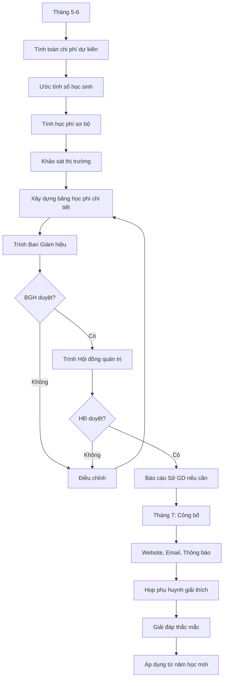

# SOP-01.1: QUY ĐỊNH THU HỌC PHÍ

## 1. THÔNG TIN QUY TRÌNH

| **Thuộc tính** | **Nội dung** |
|---|---|
| Mã SOP | SOP-01.1 |
| Tên quy trình | Quy định thu học phí |
| Quy trình cha | SOP-01: Thu học phí |
| Phiên bản | 1.0 |
| Tần suất | Hàng năm (Trước năm học mới) |

## 2. MỤC ĐÍCH

- **Minh bạch**: Công khai rõ ràng mức học phí, các khoản thu
- **Công bằng**: Áp dụng nhất quán cho tất cả học sinh cùng cấp
- **Hợp pháp**: Tuân thủ quy định của Nhà nước về giáo dục tư thục

## 3. PHẠM VI ÁP DỤNG

Tất cả học sinh từ Mầm non đến THCS

## 4. QUY TRÌNH THỰC HIỆN

### 4.1. Xây dựng mức học phí

**Bước 1: Tính toán chi phí (Tháng 5-6)**

Phòng Kế toán tổng hợp chi phí dự kiến năm học mới:

| **Loại chi phí** | **Tỷ lệ** | **Ghi chú** |
|---|---|---|
| Lương giáo viên, nhân viên | 55-60% | Chi lớn nhất |
| Cơ sở vật chất, trang thiết bị | 15-20% | Khấu hao, bảo trì |
| Học liệu, đồ dùng | 5-10% | Sách, đồ chơi, thiết bị dạy |
| Hoạt động giáo dục | 5-10% | Ngoại khóa, dã ngoại |
| Quản lý, hành chính | 5-8% | Điện, nước, văn phòng |
| Lợi nhuận | 5-10% | Tái đầu tư |

**Công thức tính học phí:**
```
Học phí = (Tổng chi phí + Lợi nhuận) / Tổng số học sinh
```

**Bước 2: So sánh thị trường**

- Khảo sát học phí các trường tương đương
- Đảm bảo cạnh tranh nhưng đủ chi phí vận hành

**Bước 3: Xây dựng bảng học phí**

| **Cấp học** | **Học phí/tháng** | **Phí nhập học (lần đầu)** | **Phí khác** |
|---|---|---|---|
| Mầm non (1.5-3 tuổi) | [X] triệu | [Y] triệu | Đồng phục, BHYT, ăn |
| Mẫu giáo (3-5 tuổi) | [X] triệu | [Y] triệu | Đồng phục, BHYT, ăn |
| Tiểu học (lớp 1-5) | [X] triệu | [Y] triệu | Đồng phục, BHYT, ăn, xe |
| THCS (lớp 6-9) | [X] triệu | [Y] triệu | Đồng phục, BHYT, ăn, xe |

**Các khoản phí khác:**
- Phí xe đưa đón: [Z] triệu/tháng (tùy khoảng cách)
- Phí ăn: [A] triệu/tháng (3 bữa)
- Hoạt động ngoại khóa: [B] triệu/năm
- Học phí hè: [C] triệu/khóa

### 4.2. Phê duyệt

**Bước 4: Trình Ban Giám hiệu**

- Thuyết trình bảng tính chi phí
- Giải trình cơ sở tính toán

**Bước 5: Trình Hội đồng quản trị**

- BGH trình HĐ phê duyệt
- Điều chỉnh nếu cần

**Bước 6: Báo cáo Sở Giáo dục (nếu yêu cầu)**

Một số địa phương yêu cầu trường tư thục báo cáo mức học phí

### 4.3. Công bố

**Bước 7: Công khai rộng rãi (Tháng 7)**

- Website trường
- Email phụ huynh hiện tại
- Thông báo tại trường
- Tư vấn tuyển sinh

**Bước 8: Giải đáp thắc mắc**

- Tổ chức họp phụ huynh giải thích
- Hotline, email tư vấn

## 5. LƯU ĐỒ QUY TRÌNH



## 6. BIỂU MẪU LIÊN QUAN

| **Mã** | **Tên** |
|---|---|
| QT03-F01 | Bảng tính chi phí và học phí |
| QT03-F02 | Bảng học phí chính thức |
| QT03-F03 | Thông báo học phí gửi phụ huynh |

## 7. TIÊU CHUẨN VÀ CHỈ TIÊU

| **Chỉ tiêu** | **Mục tiêu** |
|---|---|
| Công bố trước năm học | ≥ 2 tháng |
| Tỷ lệ phụ huynh hiểu rõ học phí | ≥ 95% |
| Khiếu nại về học phí | < 2% |

## 8. TRÁCH NHIỆM CỤ THỂ

| **Vai trò** | **Trách nhiệm** |
|---|---|
| **Phòng Kế toán** | Tính toán, xây dựng bảng học phí |
| **BGH** | Thẩm định, điều chỉnh, phê duyệt sơ bộ |
| **Hội đồng quản trị** | Phê duyệt cuối cùng |
| **Phòng Tuyển sinh** | Công bố, tư vấn, giải đáp |

## 9. LƯU Ý QUAN TRỌNG

- ⚠️ **Minh bạch tuyệt đối**: Phải giải thích được từng khoản phí
- ✅ **Không tăng đột ngột**: Tăng không quá 10-15%/năm để PH chấp nhận
- ✅ **Công bố sớm**: Để phụ huynh chuẩn bị tài chính
- 🔥 **Chính sách ưu đãi**: Miễn giảm cho anh chị em ruột, con CBNV, HS giỏi

## 10. PHỤ LỤC

### 10.1. Mẫu thông báo học phí

```
THÔNG BÁO HỌC PHÍ NĂM HỌC 20XX-20XX

Kính gửi Quý phụ huynh,

[Tên trường] trân trọng thông báo mức học phí năm học 20XX-20XX:

TIỂU HỌC (Lớp 1-5):
• Học phí: XX triệu đồng/tháng × 10 tháng
• Phí ăn: XX triệu đồng/tháng × 10 tháng
• Phí xe (nếu có): XX triệu đồng/tháng × 10 tháng
• Phí nhập học (chỉ năm đầu): XX triệu đồng
• Đồng phục, BHYT, sách: XX triệu đồng

Tổng cộng năm học: [Tổng] triệu đồng

CHÍNH SÁCH ƯU ĐÃI:
- Anh chị em ruột: Giảm 10% từ em thứ 2
- Con CBNV: Giảm 30-50%
- Học sinh giỏi: Giảm 20-100%

Mọi thắc mắc xin liên hệ: [SĐT/Email]
```

## 11. FAQ

**Q1: Học phí có thể thương lượng không?**  
A: Không. Học phí áp dụng thống nhất. Nếu khó khăn, có thể xin xét miễn giảm theo chính sách.

**Q2: Nếu học sinh nghỉ học giữa chừng?**  
A: Hoàn học phí các tháng chưa học (trừ tháng đang học). Chi tiết xem SOP-01.5.

**Q3: Học phí có bao gồm tất cả không?**  
A: Bao gồm học chính khóa. Ngoại khóa, dã ngoại, Summer camp tính riêng.

---

**PHÊ DUYỆT**

| Trưởng phòng KT | Phó HT | Hiệu trưởng | Chủ tịch HĐ |
|---|---|---|---|
| [Họ tên] | [Họ tên] | [Họ tên] | [Họ tên] |
