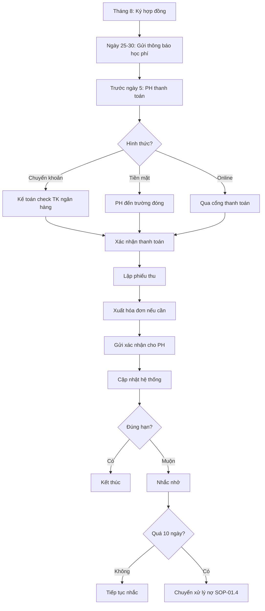

# SOP-01.2: QUY TRÌNH THU HỌC PHÍ

## 1. THÔNG TIN | Mã: SOP-01.2 | Tần suất: Liên tục

## 2. MỤC ĐÍCH
Thu học phí đầy đủ, đúng hạn, chính xác, tạo thuận lợi cho phụ huynh

## 3. PHẠM VI
Tất cả học sinh đang theo học

## 4. QUY TRÌNH THỰC HIỆN

### 4.1. Đầu năm học - Ký hợp đồng

**Bước 1: Chuẩn bị hồ sơ (Tháng 8)**
- Danh sách HS đăng ký học
- Bảng học phí chi tiết
- Hợp đồng dịch vụ giáo dục (QT03-F04)

**Bước 2: Ký hợp đồng với phụ huynh**

Nội dung hợp đồng:
| **Mục** | **Nội dung** |
|---|---|
| Bên A | Trường |
| Bên B | Phụ huynh học sinh |
| Cam kết | Trường: Cung cấp dịch vụ giáo dục, PH: Đóng học phí đúng hạn |
| Học phí | Chi tiết từng khoản, tổng năm học |
| Thời hạn | 10 tháng (T9-T6) |
| Thanh toán | Trước ngày 5 hàng tháng |
| Ưu đãi | Nếu có |
| Điều khoản | Chấm dứt, hoàn phí, xử lý nợ |

**Bước 3: Phụ huynh ký, lưu 2 bản (Trường 1, PH 1)**

### 4.2. Thu học phí hàng tháng

**Bước 4: Thông báo học phí (Ngày 25-30 tháng trước)**

Gửi email/SMS nhắc nhở:
- Số tiền phải đóng tháng sau
- Hạn cuối: Ngày 5
- Các hình thức thanh toán
- Link thanh toán online (nếu có)

**Bước 5: Phụ huynh thanh toán (Trước ngày 5)**

**Hình thức thanh toán:**

| **Hình thức** | **Ưu điểm** | **Nhược điểm** |
|---|---|---|
| Chuyển khoản | Nhanh, an toàn, có chứng từ | Cần công nghệ |
| Tiền mặt tại trường | Trực tiếp | Mất thời gian, rủi ro |
| Cổng thanh toán online | Tiện lợi, tự động | Phí giao dịch |
| Ví điện tử (Momo, ZaloPay...) | Nhanh | Phí, cần app |

**Bước 6: Kế toán xác nhận thanh toán**

- Nhận tiền
- Lập phiếu thu (QT03-F05)
- Xuất hóa đơn GTGT (nếu PH yêu cầu)
- Gửi xác nhận cho PH (email/SMS)

**Bước 7: Cập nhật vào hệ thống**

- Phần mềm quản lý học phí (EdSoft, iSMS...)
- Sổ kế toán
- Báo cáo nợ

### 4.3. Xử lý trường hợp đặc biệt

**Đóng muộn (sau ngày 5):**
- Nhắc nhở qua điện thoại/email
- Phạt chậm nộp: 0.05%/ngày (nếu quy định)
- Nếu quá 10 ngày → Chuyển sang xử lý nợ (SOP-01.4)

**Đóng sai số tiền:**
- Liên hệ PH ngay
- Hoàn lại hoặc bù vào tháng sau

**Đóng trước nhiều tháng:**
- Ghi nhận, trừ dần hàng tháng
- Ưu đãi chiết khấu nếu đóng cả năm (VD: giảm 5%)

## 5. LƯU ĐỒ



## 6. BIỂU MẪU
- QT03-F04: Hợp đồng dịch vụ giáo dục
- QT03-F05: Phiếu thu học phí
- QT03-F06: Hóa đơn GTGT

## 7. TIÊU CHUẨN
| Chỉ tiêu | Mục tiêu |
|---|---|
| Tỷ lệ đóng đúng hạn (trước ngày 5) | ≥ 90% |
| Thời gian xác nhận thanh toán | ≤ 24h |
| Sai sót trong thu | < 0.1% |

## 8. TRÁCH NHIỆM
- **Kế toán thu**: Thu, lập phiếu, xác nhận
- **Thủ quỹ**: Nhận tiền mặt, bảo quản
- **IT**: Hỗ trợ thanh toán online

## 9. LƯU Ý
- ⚠️ **Bảo mật thông tin**: Không tiết lộ ai nợ, ai trả
- ✅ **Thái độ**: Lịch sự, tôn trọng dù PH nợ
- ✅ **Hóa đơn**: Xuất đúng quy định thuế

## 10. PHỤ LỤC

### 10.1. Mẫu SMS/Email nhắc học phí

```
[Tên trường] kính chào Quý PH,

Nhắc nhở học phí tháng [X]:
• Học sinh: [Tên HS] - Lớp [X]
• Số tiền: [X] đồng
• Hạn cuối: Ngày 5/[tháng]

Chuyển khoản:
• TK: [Số TK]
• Ngân hàng: [Tên NH]
• Nội dung: [Tên HS] - [Lớp] - T[X]

Hoặc thanh toán online: [Link]

Trân trọng!
```

## 11. FAQ

**Q: Quên đóng học phí, có bị phạt không?**  
A: Trong 10 ngày đầu chỉ nhắc nhở. Sau đó mới tính phạt hoặc xử lý theo hợp đồng.

**Q: Đóng học phí online có an toàn không?**  
A: An toàn. Sử dụng cổng thanh toán uy tín, có mã hóa SSL.

---
**PHÊ DUYỆT** | Trưởng KT | Phó HT |
