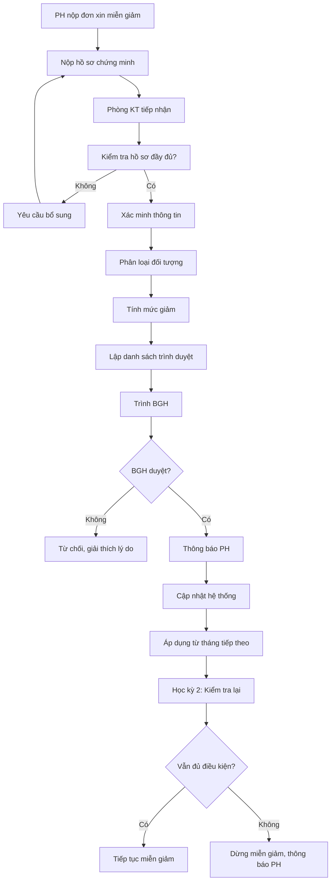

# SOP-01.3: QUẢN LÝ MIỄN GIẢM HỌC PHÍ

## 1. THÔNG TIN | Mã: SOP-01.3 | Tần suất: Theo đề nghị

## 2. MỤC ĐÍCH
Hỗ trợ học sinh khó khăn, khuyến khích học sinh giỏi, tạo công bằng xã hội

## 3. CHÍNH SÁCH MIỄN GIẢM

| **Đối tượng** | **Mức giảm** | **Điều kiện** |
|---|---|---|
| **Con CBNV** | 30-50% | Làm việc chính thức ≥ 1 năm |
| **Anh chị em ruột** | 10% em thứ 2, 15% em thứ 3+ | Cùng học tại trường |
| **Học sinh giỏi** | 20-100% | Giải quốc gia/quốc tế, HKI đạt Giỏi |
| **Hoàn cảnh khó khăn** | 20-50% | Mồ côi, nghèo, thiên tai... |
| **Con liệt sĩ, thương binh** | 50-100% | Theo chính sách nhà nước |

## 4. QUY TRÌNH

### 4.1. Nộp hồ sơ (Đầu năm học)

**Bước 1: PH nộp đơn xin miễn giảm (QT03-F07)**

Hồ sơ kèm theo:
- **Con CBNV**: Hợp đồng lao động
- **Anh chị em**: Giấy khai sinh
- **HS giỏi**: Giấy khen, bằng khen, Học bạ
- **Hoàn cảnh khó khăn**: Xác nhận chính quyền, sổ hộ nghèo
- **Con liệt sĩ**: Giấy liệt sĩ, thương binh

**Bước 2: Nộp cho Phòng Kế toán**

### 4.2. Xét duyệt

**Bước 3: Phòng KT thẩm định**
- Kiểm tra hồ sơ đầy đủ, hợp lệ
- Xác minh thông tin (gọi điện, xác nhận)

**Bước 4: Phân loại đối tượng**
- Theo chính sách quy định
- Tính mức giảm cụ thể

**Bước 5: Lập danh sách trình duyệt**

| **STT** | **Họ tên HS** | **Lớp** | **Đối tượng** | **Mức giảm** | **Số tiền giảm** |
|---|---|---|---|---|---|
| 1 | Nguyễn Văn A | 3A | Con CBNV | 50% | 15 triệu/năm |
| 2 | Trần Thị B | 5B | HS Giỏi | 30% | 9 triệu/năm |

**Bước 6: Trình BGH phê duyệt**

### 4.3. Thông báo và thực hiện

**Bước 7: Thông báo kết quả cho PH**
- Email/Giấy xác nhận
- Mức giảm, thời hạn áp dụng

**Bước 8: Cập nhật vào hệ thống**
- Tự động trừ khi tính học phí hàng tháng
- Theo dõi riêng sổ miễn giảm

**Bước 9: Kiểm tra định kỳ (Học kỳ 2)**
- HS giỏi: Xem học lực có duy trì không
- Khó khăn: Hoàn cảnh có thay đổi không
- Điều chỉnh nếu cần

## 5. LƯU ĐỒ



## 6. BIỂU MẪU
- QT03-F07: Đơn xin miễn giảm học phí
- QT03-F08: Danh sách miễn giảm
- QT03-R01: Báo cáo miễn giảm học phí

## 7. TIÊU CHUẨN
| Chỉ tiêu | Mục tiêu |
|---|---|
| Thời gian xét duyệt | ≤ 15 ngày |
| Tỷ lệ HS được miễn giảm | 5-10% tổng HS |
| Tỷ lệ khiếu nại | < 1% |

## 8. TRÁCH NHIỆM
- **PH**: Nộp hồ sơ đúng, đủ, trung thực
- **Phòng KT**: Thẩm định, tính toán, đề xuất
- **BGH**: Quyết định cuối

## 9. LƯU Ý
- ⚠️ **Bảo mật**: Không công khai ai được miễn giảm
- ✅ **Công bằng**: Áp dụng nhất quán chính sách
- ✅ **Kiểm tra**: Định kỳ rà soát, tránh lợi dụng

## 10. PHỤ LỤC

### 10.1. Mẫu đơn xin miễn giảm

```
ĐƠN XIN MIỄN GIẢM HỌC PHÍ

Kính gửi: Ban Giám hiệu [Tên trường]

Tôi tên: [Họ tên phụ huynh]
Là phụ huynh của học sinh: [Họ tên HS] - Lớp: [X]

Đề nghị được xem xét miễn giảm học phí với lý do:
☐ Con cán bộ nhân viên
☐ Anh chị em ruột (em thứ: ___)
☐ Học sinh giỏi
☐ Hoàn cảnh khó khăn (ghi rõ: ___________)
☐ Khác: ___________

Hồ sơ kèm theo:
1. [Liệt kê]
2. ...

Tôi cam đoan nội dung trên là đúng sự thật.

Ngày... tháng... năm...
[Chữ ký PH]
```

## 11. FAQ

**Q: Nếu HS giỏi học kỳ 1, kém học kỳ 2?**  
A: Miễn giảm HK1 được giữ. HK2 không được nữa. Năm sau phải chứng minh lại.

**Q: Có giới hạn số lượng miễn giảm không?**  
A: Không giới hạn số lượng, nhưng tổng kinh phí miễn giảm không quá 5% doanh thu.

---
**PHÊ DUYỆT** | Trưởng KT | Phó HT | HT |
