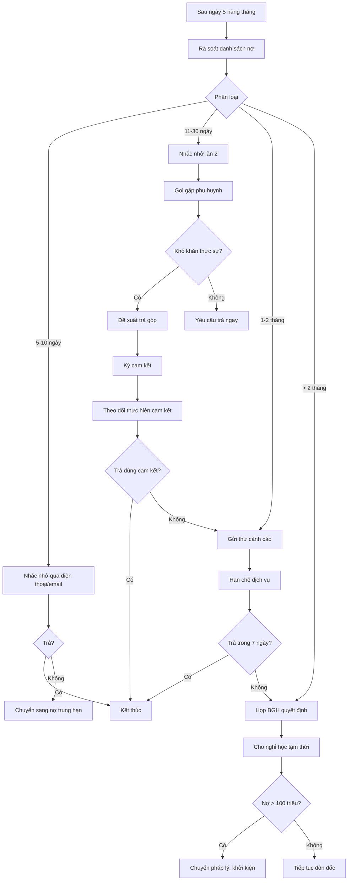

# SOP-01.4: XỬ LÝ NỢ HỌC PHÍ

## 1. THÔNG TIN | Mã: SOP-01.4 | Tần suất: Hàng tháng

## 2. MỤC ĐÍCH
Thu hồi nợ kịp thời, giảm rủi ro tài chính, duy trì kỷ luật đóng học phí

## 3. PHÂN LOẠI NỢ

| **Loại nợ** | **Thời gian** | **Mức độ** | **Hành động** |
|---|---|---|---|
| Nợ ngắn hạn | 5-10 ngày | Nhẹ | Nhắc nhở qua điện thoại/email |
| Nợ trung hạn | 11-30 ngày | Trung bình | Gặp trực tiếp, cam kết trả |
| Nợ dài hạn | 1-2 tháng | Nghiêm trọng | Cảnh cáo, hạn chế dịch vụ |
| Nợ khó đòi | > 2 tháng | Rất nghiêm trọng | Cho nghỉ học, chuyển pháp lý |

## 4. QUY TRÌNH XỬ LÝ

### 4.1. Phát hiện và phân loại

**Bước 1: Rà soát hàng ngày (Sau ngày 5)**

Kế toán lập danh sách nợ từ hệ thống:

| **STT** | **Họ tên HS** | **Lớp** | **Số tiền nợ** | **Số tháng nợ** | **Lý do** |
|---|---|---|---|---|---|
| 1 | Nguyễn Văn A | 3A | 30 triệu | 1 tháng | Quên |
| 2 | Trần Thị B | 5B | 90 triệu | 3 tháng | Khó khăn |

**Bước 2: Phân loại theo mức độ**

### 4.2. Xử lý từng cấp độ

**NỢ NGẮN HẠN (5-10 ngày):**

**Bước 3a: Nhắc nhở lần 1**
- Gọi điện/SMS/Email
- Hỏi lý do, nhắc hạn cuối

**NỢ TRUNG HẠN (11-30 ngày):**

**Bước 4b: Nhắc nhở lần 2 (Ngày 15)**
- Gọi điện trực tiếp
- Gửi thư nhắc chính thức
- Đề nghị gặp mặt

**Bước 5b: Gặp phụ huynh (Ngày 20)**
- Trao đổi lý do thực sự
- Nếu khó khăn: Đề xuất phương án trả góp
- Ký cam kết trả nợ (QT03-F09)

**NỢ DÀI HẠN (1-2 tháng):**

**Bước 6c: Cảnh cáo chính thức (Cuối tháng thứ 2)**

Gửi thư cảnh cáo (QT03-F10):
- Tổng số nợ
- Hạn cuối thanh toán (7 ngày)
- Hậu quả nếu không trả:
  - Không tham gia hoạt động ngoại khóa
  - Giữ học bạ, giấy tờ
  - Cho nghỉ học tạm thời

**Bước 7c: Họp với BGH**
- Báo cáo tình hình
- Xin ý kiến xử lý

**NỢ KHÓ ĐÒI (> 2 tháng):**

**Bước 8d: Quyết định cho nghỉ học**
- BGH ra quyết định
- Thông báo chính thức cho PH
- HS nghỉ học đến khi thanh toán đủ

**Bước 9d: Chuyển pháp lý (Nếu cần)**
- Nợ > 100 triệu
- Liên hệ luật sư
- Khởi kiện ra tòa

## 5. LƯU ĐỒ



## 6. BIỂU MẪU
- QT03-F09: Biên bản cam kết trả nợ
- QT03-F10: Thư cảnh cáo nợ học phí
- QT03-R02: Báo cáo công nợ học phí

## 7. TIÊU CHUẨN
| Chỉ tiêu | Mục tiêu |
|---|---|
| Tỷ lệ nợ / Doanh thu | ≤ 5% |
| Tỷ lệ thu hồi nợ | ≥ 95% |
| Nợ quá 2 tháng | < 1% tổng HS |

## 8. TRÁCH NHIỆM
- **Kế toán thu**: Rà soát, đôn đốc, báo cáo
- **Giáo viên chủ nhiệm**: Hỗ trợ liên lạc PH
- **BGH**: Quyết định xử lý cứng

## 9. LƯU Ý
- ⚠️ **Thái độ**: Kiên quyết nhưng tôn trọng
- ✅ **Phân biệt**: Khó khăn thật vs Cố tình nợ
- ✅ **Bảo mật**: Không tiết lộ danh sách nợ

## 10. PHỤ LỤC

### 10.1. Mẫu thư cảnh cáo

```
THƯ CẢNH CÁO NỢ HỌC PHÍ

Kính gửi: Phụ huynh học sinh [Tên]

Theo hợp đồng dịch vụ giáo dục, đến ngày [X], con Quý PH còn nợ:

• Tháng [X]: [Số tiền]
• Tháng [Y]: [Số tiền]
• Tổng cộng: [Tổng] đồng

Đây là LẦN CẢNH CÁO CUỐI CÙNG.

Vui lòng thanh toán trước ngày [Hạn cuối - 7 ngày].

NẾU KHÔNG, trường buộc phải:
☑ Giữ học bạ, giấy tờ
☑ Cho học sinh nghỉ học tạm thời
☑ Chuyển sang xử lý theo pháp luật

Mọi thắc mắc liên hệ: [SĐT/Email]

Trân trọng,
[Chữ ký Hiệu trưởng]
```

## 11. FAQ

**Q: Nếu PH thật sự khó khăn?**  
A: Xem xét cho trả góp, không lãi. Hoặc xét miễn giảm nếu đủ điều kiện.

**Q: Có thể giữ bằng tốt nghiệp không?**  
A: Không. Giữ bằng là vi phạm pháp luật. Chỉ giữ học bạ trong quá trình học.

---
**PHÊ DUYỆT** | Trưởng KT | Phó HT | HT |
