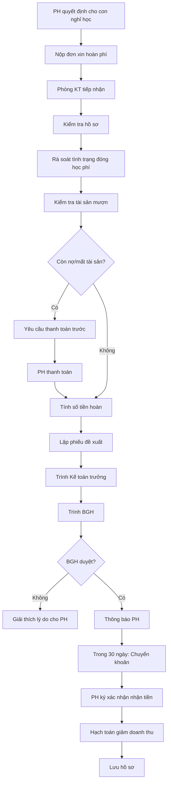

# SOP-01.5: HOÀN TRẢ HỌC PHÍ

## 1. THÔNG TIN | Mã: SOP-01.5 | Tần suất: Khi có yêu cầu

## 2. MỤC ĐÍCH
Hoàn trả học phí công bằng, đúng quy định khi HS nghỉ học

## 3. CÁC TRƯỜNG HỢP HOÀN PHÍ

| **Trường hợp** | **Mức hoàn** | **Điều kiện** |
|---|---|---|
| **HS nghỉ học giữa năm** | Các tháng chưa học (trừ tháng đang học) | Báo trước ≥ 30 ngày |
| **Trường ngừng hoạt động** | 100% học phí còn lại | Không điều kiện |
| **Chất lượng không đảm bảo** | Tùy thỏa thuận, tối đa 100% | Phụ huynh chứng minh được |
| **Đóng nhầm, đóng dư** | 100% số tiền thừa | Xác minh rõ |

## 4. QUY TRÌNH XỬ LÝ

### 4.1. Tiếp nhận đề nghị

**Bước 1: PH nộp đơn xin hoàn phí (QT03-F11)**

Nội dung đơn:
- Lý do nghỉ học (chuyển trường, di cư, bệnh...)
- Ngày nghỉ dự kiến
- Yêu cầu hoàn trả

**Bước 2: Nộp cho Phòng Kế toán**

### 4.2. Kiểm tra và tính toán

**Bước 3: Kiểm tra hồ sơ**
- Hợp đồng dịch vụ giáo dục
- Lịch sử đóng học phí
- Các khoản còn nợ (nếu có)
- Tài sản mượn (sách, đồng phục...)

**Bước 4: Tính số tiền hoàn trả**

**Công thức:**
```
Số tiền hoàn = Học phí đã đóng - Học phí các tháng đã học - Các khoản trừ khác
```

**Ví dụ:**
- Đóng trước cả năm: 300 triệu (10 tháng × 30 triệu)
- Học được 5 tháng rồi nghỉ
- Số tiền hoàn = 300 - (5 × 30) = **150 triệu**

**Các khoản trừ:**
| **Khoản** | **Điều kiện** |
|---|---|
| Học phí tháng đang học | Không hoàn (đã sử dụng dịch vụ) |
| Phí nhập học | Không hoàn (phí 1 lần) |
| Sách, đồng phục đã dùng | Không hoàn |
| Tài sản mất, hỏng | Trừ vào tiền hoàn |
| Nợ học phí | Trừ trước khi hoàn |

**Bước 5: Lập phiếu đề xuất hoàn phí (QT03-F12)**

### 4.3. Phê duyệt và chi trả

**Bước 6: Trình BGH**
- Kế toán trưởng trình
- BGH xét duyệt

**Bước 7: Thông báo PH**
- Email/Điện thoại thông báo kết quả
- Số tiền được hoàn
- Thời gian hoàn (trong 30 ngày)

**Bước 8: Hoàn trả**
- Chuyển khoản (ưu tiên) → Nhanh, có chứng từ
- Tiền mặt (nếu PH yêu cầu)

**Bước 9: PH ký nhận (QT03-F13)**

**Bước 10: Hạch toán**
- Ghi giảm doanh thu
- Lưu trữ hồ sơ

## 5. LƯU ĐỒ



## 6. BIỂU MẪU
- QT03-F11: Đơn xin hoàn học phí
- QT03-F12: Phiếu đề xuất hoàn phí
- QT03-F13: Biên bản hoàn trả học phí

## 7. TIÊU CHUẨN
| Chỉ tiêu | Mục tiêu |
|---|---|
| Thời gian xử lý | ≤ 30 ngày |
| Chính xác trong tính toán | 100% |
| Khiếu nại | < 1% |

## 8. TRÁCH NHIỆM
- **PH**: Nộp đơn, thanh toán các khoản còn nợ
- **Kế toán**: Kiểm tra, tính toán, đề xuất
- **BGH**: Phê duyệt

## 9. LƯU Ý
- ⚠️ **Thời hạn báo**: PH phải báo trước ≥ 30 ngày để tránh mất phí tháng đang học
- ✅ **Minh bạch**: Giải thích rõ công thức tính
- ✅ **Giữ quan hệ tốt**: Dù HS nghỉ, vẫn tôn trọng

## 10. PHỤ LỤC

### 10.1. Mẫu đơn xin hoàn phí

```
ĐƠN XIN HOÀN TRẢ HỌC PHÍ

Kính gửi: Ban Giám hiệu [Tên trường]

Tôi tên: [Họ tên PH]
Là phụ huynh của học sinh: [Tên HS] - Lớp [X]

Vì lý do: [Chuyển trường / Di cư / Bệnh tật / Khác...]

Tôi xin cho con nghỉ học từ ngày: [Ngày/Tháng/Năm]

Đề nghị Nhà trường xem xét hoàn trả học phí các tháng chưa học.

Thông tin nhận tiền:
• Tài khoản: [Số TK]
• Ngân hàng: [Tên NH]
• Chủ TK: [Tên]

Trân trọng,
[Chữ ký PH]
```

### 10.2. Ví dụ tính toán chi tiết

**Trường hợp: HS nghỉ học tháng 2**

| **Khoản** | **Số tiền** |
|---|---|
| Học phí đã đóng (10 tháng) | 300,000,000 |
| **TRỪ: Học phí đã học (T9-T2 = 6 tháng)** | -180,000,000 |
| **TRỪ: Sách mất** | -500,000 |
| **TRỪ: Đồng phục hỏng** | -1,000,000 |
| **SỐ TIỀN ĐƯỢC HOÀN** | **118,500,000** |

## 11. FAQ

**Q: Nếu HS nghỉ giữa tháng?**  
A: Tháng đó không hoàn. Chỉ hoàn từ tháng sau trở đi.

**Q: Phí nhập học có được hoàn không?**  
A: Không. Đây là phí một lần, không hoàn lại.

**Q: Bao lâu nhận được tiền?**  
A: Trong vòng 30 ngày kể từ khi BGH phê duyệt.

**PHÊ DUYỆT** | Trưởng KT | Phó HT | HT |

---

✅ **HOÀN THÀNH SOP-01: THU HỌC PHÍ (5 files)!**
