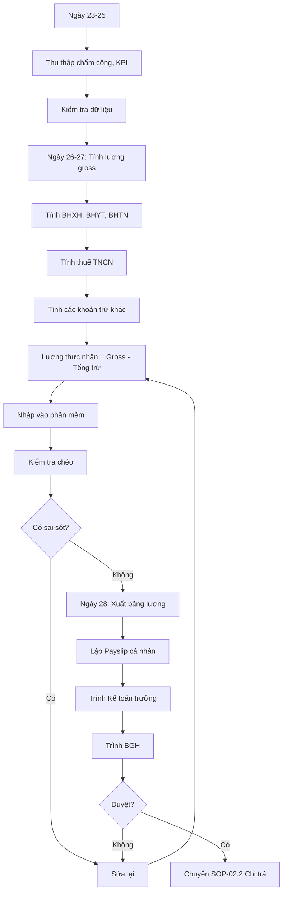

# SOP-02.1: TÍNH TOÁN LƯƠNG THƯỞNG

## 1. THÔNG TIN | Mã: SOP-02.1 | Tần suất: Hàng tháng (Ngày 23-28)

## 2. MỤC ĐÍCH
Tính lương chính xác, công bằng, đúng luật cho tất cả nhân viên

## 3. CẤU TRÚC LƯƠNG

| **Thành phần** | **% Tổng thu nhập** | **Cách tính** |
|---|---|---|
| Lương cơ bản | 60-70% | Theo HĐLĐ |
| Phụ cấp trách nhiệm | 10-15% | Chức vụ quản lý |
| Phụ cấp chuyên môn | 5-10% | Bằng cấp, chứng chỉ |
| Phụ cấp khác | 5-10% | Điện thoại, xăng xe, ăn trưa |
| Thưởng KPI | 10-20% | Theo hiệu suất |

## 4. QUY TRÌNH THỰC HIỆN

### 4.1. Thu thập dữ liệu (Ngày 23-25)

**Bước 1: Phòng NS cung cấp**
- Bảng chấm công tháng (QT03-D01)
- Danh sách nghỉ phép, nghỉ ốm
- Danh sách OT (overtime)
- Điểm KPI tháng
- Tăng lương, thăng chức (nếu có)
- NV mới, NV nghỉ việc

**Bước 2: Phòng KT kiểm tra**
- Đối chiếu với tháng trước
- Phát hiện bất thường (nghỉ nhiều, OT bất thường...)

### 4.2. Tính toán lương (Ngày 26-27)

**Bước 3: Tính lương từng người**

**Công thức tổng quát:**
```
Lương thực nhận = Lương gross + Thưởng - Các khoản trừ
```

**Chi tiết:**

**A. LƯƠNG GROSS (Lương gộp):**
```
= Lương cơ bản + Phụ cấp trách nhiệm + Phụ cấp chuyên môn + Phụ cấp khác + Thưởng KPI
```

**Ví dụ:**
- Lương cơ bản: 20,000,000
- PC trách nhiệm: 3,000,000
- PC chuyên môn: 2,000,000
- PC điện thoại: 500,000
- Thưởng KPI: 3,000,000
- **Lương gross = 28,500,000**

**B. CÁC KHOẢN TRỪ:**

| **Khoản trừ** | **Tỷ lệ** | **Ai đóng** |
|---|---|---|
| BHXH | 8% lương gross | NV |
| BHYT | 1.5% lương gross | NV |
| BHTN | 1% lương gross | NV |
| **Tổng BH** | **10.5%** | |
| Thuế TNCN | Lũy tiến 5-35% | NV |
| Vay tạm ứng | Theo cam kết | NV |
| Phạt kỷ luật | Nếu có | NV |

**Tính thuế TNCN:**
```
Thu nhập tính thuế = Lương gross - Bảo hiểm (10.5%) - Giảm trừ bản thân (11 triệu) - Giảm trừ người phụ thuộc (4.4 triệu/người)

Thuế = Thu nhập tính thuế × Thuế suất (lũy tiến)
```

**Bậc thuế:**
| **Thu nhập/tháng** | **Thuế suất** |
|---|---|
| ≤ 5 triệu | 5% |
| 5-10 triệu | 10% |
| 10-18 triệu | 15% |
| 18-32 triệu | 20% |
| 32-52 triệu | 25% |
| 52-80 triệu | 30% |
| > 80 triệu | 35% |

**Bước 4: Sử dụng phần mềm tính lương**
- Excel template hoặc
- Phần mềm (MISA, Fast, Viettel...)
- Tự động tính toán, giảm sai sót

**Bước 5: Kiểm tra chéo**
- So với tháng trước
- Các con số bất thường
- Tổng quỹ lương có vượt ngân sách không

### 4.3. Lập bảng lương (Ngày 28)

**Bước 6: Xuất bảng lương tổng hợp (QT03-B01)**

| **Họ tên** | **Chức vụ** | **Gross** | **BHXH** | **BHYT** | **BHTN** | **Thuế** | **Trừ khác** | **Thực nhận** |
|---|---|---|---|---|---|---|---|---|
| Nguyễn Văn A | Giáo viên | 28,500,000 | 2,280,000 | 427,500 | 285,000 | 1,200,000 | 0 | 24,307,500 |

**Bước 7: Lập bảng lương cá nhân (Payslip)**
Gửi cho từng NV qua email (bảo mật)

**Bước 8: Trình BGH duyệt**

## 5. LƯU ĐỒ



## 6. BIỂU MẪU
- QT03-D01: Bảng chấm công tháng
- QT03-B01: Bảng lương tổng hợp
- QT03-B02: Payslip cá nhân

## 7. TIÊU CHUẨN
| Chỉ tiêu | Mục tiêu |
|---|---|
| Sai sót | < 0.5% |
| Hoàn thành đúng hạn (ngày 28) | 100% |
| NV hiểu rõ bảng lương | ≥ 95% |

## 8. TRÁCH NHIỆM
- **Phòng NS**: Cung cấp chấm công, KPI
- **Kế toán lương**: Tính toán, lập bảng
- **Kế toán trưởng**: Kiểm tra, phê duyệt sơ bộ
- **BGH**: Phê duyệt cuối

## 9. LƯU Ý
- ⚠️ **Bảo mật tuyệt đối**: Không ai biết lương của ai
- ✅ **Kiểm tra kỹ**: Sai lương = mất uy tín nghiêm trọng
- ✅ **Lưu trữ 10 năm**: Theo luật kế toán

## 10. PHỤ LỤC

### 10.1. Ví dụ tính lương chi tiết

**Giáo viên Nguyễn Văn A:**

**THU NHẬP:**
- Lương cơ bản: 20,000,000
- PC trách nhiệm (Tổ trưởng): 3,000,000
- PC chuyên môn (Thạc sĩ): 2,000,000
- PC điện thoại: 500,000
- Thưởng KPI (90%): 3,000,000
- **TỔNG THU: 28,500,000**

**KHẤU TRỪ:**
- BHXH (8%): 2,280,000
- BHYT (1.5%): 427,500
- BHTN (1%): 285,000
- **Tổng BH: 2,992,500**

- Thu nhập tính thuế: 28,500,000 - 2,992,500 - 11,000,000 = 14,507,500
- Thuế TNCN (bậc 15%): ~1,200,000

**THỰC NHẬN: 24,307,500**

## 11. FAQ

**Q: Nếu NV không đồng ý lương?**  
A: Giải thích chi tiết bảng tính. Nếu vẫn không đồng ý, báo Kế toán trưởng xem xét.

**Q: Có thể đối chiếu lương không?**  
A: Được. NV có quyền xem chi tiết bảng tính lương của mình (chỉ mình họ thôi).

---
**PHÊ DUYỆT** | Kế toán lương | KT trưởng | Phó HT | HT |
