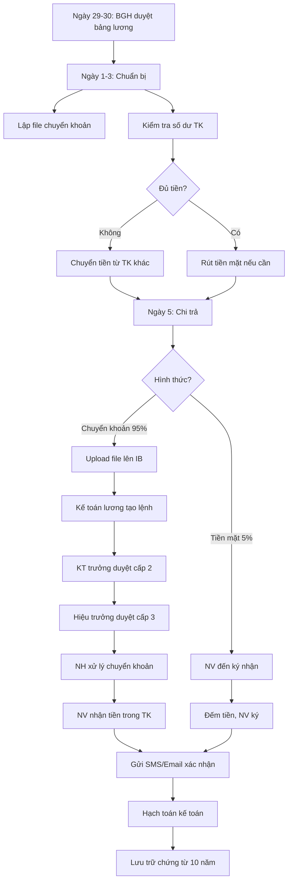

# SOP-02.2: CHI TRẢ LƯƠNG

## 1. THÔNG TIN | Mã: SOP-02.2 | Tần suất: Hàng tháng (Ngày 5)

## 2. MỤC ĐÍCH
Chi lương đúng hạn, đầy đủ, an toàn cho tất cả nhân viên

## 3. HÌNH THỨC CHI TRẢ

| **Hình thức** | **Ưu điểm** | **Nhược điểm** | **Tỷ lệ áp dụng** |
|---|---|---|---|
| Chuyển khoản | Nhanh, an toàn, có chứng từ | Cần TK ngân hàng | **95%** (Ưu tiên) |
| Tiền mặt | Trực tiếp, linh hoạt | Rủi ro, mất thời gian | 5% (NV đặc biệt) |

## 4. QUY TRÌNH THỰC HIỆN

### 4.1. Chuẩn bị (Ngày 29-3)

**Bước 1: BGH phê duyệt bảng lương (Ngày 29-30)**

**Bước 2: Chuẩn bị file chuyển khoản (Ngày 1-3)**

Kế toán lập file theo format ngân hàng:

| **STT** | **Họ tên** | **Số TK** | **Ngân hàng** | **Số tiền** | **Nội dung** |
|---|---|---|---|---|---|
| 1 | Nguyễn Văn A | 0123456789 | Vietcombank | 24,307,500 | Luong thang 01/2024 |

**Bước 3: Kiểm tra số dư tài khoản**
- Đảm bảo đủ tiền trong TK trường
- Nếu thiếu: Rút từ tiết kiệm hoặc vay ngắn hạn

**Bước 4: Chuẩn bị tiền mặt (nếu có NV nhận mặt)**
- Rút từ ngân hàng trước 1 ngày
- Bảo quản an toàn trong két

### 4.2. Chi trả (Ngày 5)

**PHƯƠNG ÁN A: Chuyển khoản**

**Bước 5: Upload file lên Internet Banking**
- Đăng nhập IB bằng token/OTP
- Upload file lương
- Kiểm tra lại danh sách

**Bước 6: Phê duyệt chuyển khoản**
- **Người tạo lệnh**: Kế toán lương (Token 1)
- **Người duyệt**: Kế toán trưởng (Token 2)
- **Người duyệt cuối**: Hiệu trưởng (Token 3)

**Phê duyệt 3 cấp** để đảm bảo an toàn

**Bước 7: Giao dịch thành công**
- NH xử lý (vài phút đến vài giờ)
- NV nhận tiền vào TK

**PHƯƠNG ÁN B: Tiền mặt**

**Bước 8: Chi trả tại Phòng Kế toán**
- NV đến ký nhận (QT03-B03 - Bảng thanh toán tiền mặt)
- Đếm tiền trước mặt NV
- NV ký xác nhận

### 4.3. Xác nhận và hạch toán

**Bước 9: Gửi xác nhận cho NV**
- SMS/Email: "Lương tháng X đã được chuyển"
- Kèm Payslip

**Bước 10: Hạch toán kế toán**

```
Nợ TK 334 (Chi phí phải trả - Lương)
  Có TK 112 (Tiền gửi ngân hàng)
```

**Bước 11: Lưu trữ chứng từ**
- Bảng lương đã duyệt
- File chuyển khoản
- Sao kê ngân hàng
- Phiếu chi tiền mặt (nếu có)

## 5. LƯU ĐỒ



## 6. BIỂU MẪU
- QT03-B03: Bảng thanh toán lương tiền mặt
- QT03-D02: File chuyển khoản lương

## 7. TIÊU CHUẨN
| Chỉ tiêu | Mục tiêu |
|---|---|
| Chi đúng ngày 5 | 100% |
| Sai sót (sai TK, sai số tiền) | 0% |
| NV không nhận được lương | 0% |

## 8. TRÁCH NHIỆM
- **Kế toán lương**: Lập file, tạo lệnh chuyển khoản
- **Kế toán trưởng**: Duyệt cấp 2
- **Hiệu trưởng**: Duyệt cấp 3
- **Thủ quỹ**: Chi tiền mặt (nếu có)

## 9. LƯU Ý
- ⚠️ **Bảo mật Token**: Không chia sẻ, không để lộ
- ✅ **Kiểm tra kỹ file**: Sai 1 số → Rắc rối lớn
- ✅ **Backup**: Lưu file ở 2 nơi (máy tính + cloud)
- 🔥 **Ngày 5 rơi vào nghỉ**: Chi trước 1 ngày làm việc

## 10. PHỤ LỤC

### 10.1. Xử lý sự cố

| **Sự cố** | **Nguyên nhân** | **Xử lý** |
|---|---|---|
| NV không nhận được tiền | Sai STK, TK bị khóa | Kiểm tra lại, chuyển lại ngay |
| Chuyển nhầm số tiền | Nhập sai file | Thu hồi (nếu được), hoặc bù trừ tháng sau |
| NH lỗi hệ thống | Sự cố kỹ thuật | Chuyển qua NH khác hoặc chi mặt tạm |

### 10.2. Mẫu SMS xác nhận

```
[Tên trường] thông báo:

Lương tháng 01/2024 đã được chuyển vào TK của bạn.

Số tiền: 24,307,500 VNĐ

Chi tiết Payslip đã gửi email.

Trân trọng!
```

## 11. FAQ

**Q: Nếu NV không có tài khoản ngân hàng?**  
A: Yêu cầu NV mở TK. Tạm thời chi tiền mặt, nhưng không lâu dài.

**Q: Có thể chi lương qua ví điện tử (Momo, ZaloPay) không?**  
A: Có thể, nhưng cần xem xét phí giao dịch và tính hợp pháp về thuế.

---
**PHÊ DUYỆT** | KT lương | KT trưởng | Phó HT | HT |
