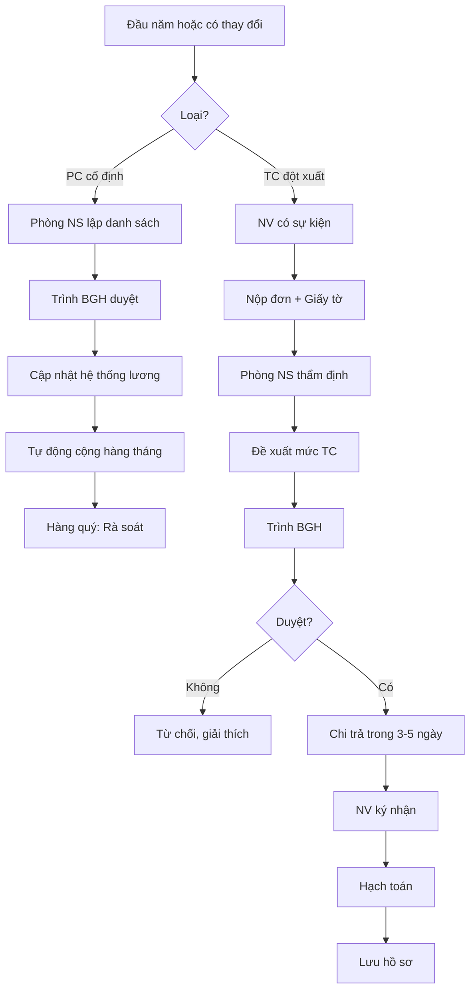

# SOP-02.3: QUẢN LÝ PHỤ CẤP VÀ TRỢ CẤP

## 1. THÔNG TIN | Mã: SOP-02.3 | Tần suất: Hàng tháng

## 2. MỤC ĐÍCH
Quản lý các khoản phụ cấp, trợ cấp đúng chính sách, minh bạch

## 3. CÁC LOẠI PHỤ CẤP VÀ TRỢ CẤP

### 3.1. Phụ cấp cố định (Hàng tháng)

| **Loại PC** | **Đối tượng** | **Mức** | **Điều kiện** |
|---|---|---|---|
| **PC trách nhiệm** | Quản lý | 2-5 triệu | Theo cấp quản lý |
| **PC chuyên môn** | GV có bằng cao | 1-3 triệu | Thạc sĩ, Tiến sĩ, Chứng chỉ quốc tế |
| **PC thâm niên** | NV lâu năm | 500K-2 triệu | 5, 10, 15, 20 năm |
| **PC độc hại** | Bếp, Y tế, Kỹ thuật | 500K-1 triệu | Môi trường đặc biệt |
| **PC điện thoại** | Tất cả | 200K-500K | Liên lạc công việc |
| **PC xăng xe** | Quản lý, Bảo vệ | 500K-2 triệu | Đi công tác thường xuyên |

### 3.2. Trợ cấp đột xuất

| **Loại TC** | **Mức** | **Điều kiện** |
|---|---|---|
| **TC ốm đau** | 2-5 triệu | Ốm nặng, tai nạn |
| **TC hiếu** | 3-5 triệu | Bố mẹ, vợ/chồng mất |
| **TC hỉ** | 1-2 triệu | Kết hôn |
| **TC sinh con** | 2-3 triệu | Sinh con |
| **TC khó khăn** | 5-20 triệu | Thiên tai, hỏa hoạn, bệnh hiểm nghèo |

## 4. QUY TRÌNH THỰC HIỆN

### 4.1. Phụ cấp cố định

**Bước 1: Xác định đối tượng hưởng (Đầu năm hoặc khi thay đổi)**

Phòng NS lập danh sách:

| **Họ tên** | **Chức vụ** | **Loại PC** | **Mức** | **Từ tháng** |
|---|---|---|---|---|
| Nguyễn Văn A | Tổ trưởng | PC trách nhiệm | 3,000,000 | T9/2024 |
| Trần Thị B | GV | PC chuyên môn (TS) | 2,000,000 | T1/2025 |

**Bước 2: Trình BGH phê duyệt**

**Bước 3: Cập nhật vào hệ thống lương**
- Tự động cộng vào lương hàng tháng
- Không phải tính lại mỗi tháng

**Bước 4: Rà soát định kỳ (Hàng quý)**
- Kiểm tra còn đủ điều kiện không
- Có thay đổi (bổ nhiệm, miễn nhiệm...)
- Điều chỉnh kịp thời

### 4.2. Trợ cấp đột xuất

**Bước 5: NV nộp đơn đề nghị (QT03-F14)**

Kèm theo:
- Giấy chứng minh (Giấy bác sĩ, Giấy khai tử, Giấy đăng ký kết hôn...)

**Bước 6: Phòng NS thẩm định**
- Xác minh thông tin
- Đề xuất mức trợ cấp theo chính sách

**Bước 7: Trình BGH quyết định**

**Bước 8: Chi trả**
- Chuyển khoản hoặc tiền mặt (tùy tình huống)
- NV ký nhận

**Bước 9: Hạch toán**
```
Nợ TK 642 (Chi phúc lợi)
  Có TK 111/112 (Tiền mặt/NH)
```

## 5. LƯU ĐỒ



## 6. BIỂU MẪU
- QT03-F14: Đơn xin trợ cấp đột xuất
- QT03-B04: Danh sách phụ cấp cố định
- QT03-B05: Bảng chi trả trợ cấp

## 7. TIÊU CHUẨN
| Chỉ tiêu | Mục tiêu |
|---|---|
| Cập nhật PC kịp thời khi thay đổi | 100% |
| Thời gian xét TC đột xuất | ≤ 5 ngày |
| Chi phí PC+TC / Tổng quỹ lương | 15-20% |

## 8. TRÁCH NHIỆM
- **Phòng NS**: Lập danh sách PC, thẩm định TC
- **Kế toán**: Tính vào lương, chi trả, hạch toán
- **BGH**: Phê duyệt

## 9. LƯU Ý
- ⚠️ **Công bằng**: Áp dụng nhất quán chính sách
- ✅ **Linh hoạt**: TC đột xuất xem xét từng trường hợp
- ✅ **Kịp thời**: Đừng để NV khó khăn chờ lâu

## 10. PHỤ LỤC

### 10.1. Bảng PC trách nhiệm chi tiết

| **Chức vụ** | **Mức PC/tháng** |
|---|---|
| Hiệu trưởng | 10,000,000 |
| Phó Hiệu trưởng | 7,000,000 |
| Trưởng phòng | 5,000,000 |
| Phó phòng | 3,500,000 |
| Trưởng khối | 3,000,000 |
| Tổ trưởng | 2,000,000 |

### 10.2. Mẫu đơn xin trợ cấp

```
ĐƠN XIN TRỢ CẤP ĐỘT XUẤT

Kính gửi: Ban Giám hiệu

Tôi tên: [Họ tên]
Chức vụ: [Chức vụ]

Vì lý do: [Mất bố/mẹ / Ốm nặng / Hỏa hoạn...]

Đề nghị Nhà trường xem xét hỗ trợ trợ cấp.

Hồ sơ kèm theo:
1. [Giấy chứng minh]

Trân trọng,
[Chữ ký]
```

## 11. FAQ

**Q: PC thâm niên tính từ khi nào?**  
A: Từ ngày ký HĐLĐ chính thức. Thời gian thử việc không tính.

**Q: Có giới hạn số lần xin TC đột xuất không?**  
A: Không giới hạn nếu thực sự khó khăn. Nhưng mỗi sự kiện chỉ hỗ trợ 1 lần.

---
**PHÊ DUYỆT** | Trưởng NS | KT trưởng | Phó HT | HT |
