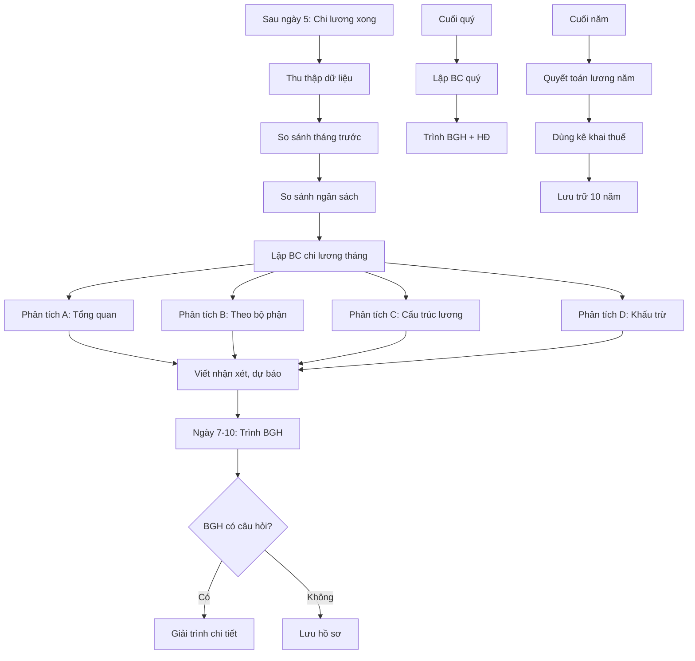

SOP-02.4: BÁO CÁO CHI LƯƠNG

## 1. THÔNG TIN | Mã: SOP-02.4 | Tần suất: Hàng tháng

## 2. MỤC ĐÍCH
Minh bạch, trách nhiệm giải trình chi phí nhân sự, hỗ trợ quyết định

## 3. CÁC LOẠI BÁO CÁO

| **Loại BC** | **Tần suất** | **Người nhận** | **Mục đích** |
|---|---|---|---|
| BC chi lương tháng | Hàng tháng | BGH | Theo dõi chi phí |
| BC phân tích quỹ lương | Hàng quý | BGH, HĐ quản trị | Phân tích xu hướng |
| BC so sánh ngân sách | Hàng quý | BGH | Kiểm soát ngân sách |
| BC quyết toán lương năm | Hàng năm | BGH, HĐ, Thuế | Quyết toán, kê khai thuế |

## 4. QUY TRÌNH THỰC HIỆN

### 4.1. Báo cáo tháng (Sau ngày 5)

**Bước 1: Thu thập dữ liệu**
- Bảng lương tháng đã chi
- So sánh với tháng trước
- So sánh với ngân sách

**Bước 2: Lập báo cáo chi lương tháng (QT03-R03)**

**NỘI DUNG:**

**A. Tổng quan:**
| **Chỉ tiêu** | **Tháng này** | **Tháng trước** | **Chênh lệch** |
|---|---|---|---|
| Tổng quỹ lương | 2,500 triệu | 2,450 triệu | +50 triệu (+2%) |
| Số nhân viên | 85 người | 83 người | +2 người |
| Lương TB/người | 29.4 triệu | 29.5 triệu | -0.1 triệu |

**B. Chi tiết theo bộ phận:**
| **Bộ phận** | **Số NV** | **Tổng lương** | **% Tổng** |
|---|---|---|---|
| Giáo viên | 50 | 1,500 triệu | 60% |
| Hành chính | 15 | 450 triệu | 18% |
| Phục vụ | 20 | 550 triệu | 22% |

**C. Cấu trúc lương:**
| **Thành phần** | **Số tiền** | **% Tổng** |
|---|---|---|
| Lương cơ bản | 1,625 triệu | 65% |
| Phụ cấp | 375 triệu | 15% |
| Thưởng KPI | 500 triệu | 20% |

**D. Khấu trừ:**
| **Khoản** | **Số tiền** |
|---|---|
| BHXH (NV + DN) | 437.5 triệu |
| Thuế TNCN | 250 triệu |
| Tổng khấu trừ | 687.5 triệu |

**E. Phân tích:**
- Lý do tăng/giảm
- Các điểm bất thường
- Dự báo tháng sau

**Bước 3: Trình BGH (Ngày 7-10)**

### 4.2. Báo cáo quý

**Bước 4: Phân tích xu hướng 3 tháng (QT03-R04)**

**NỘI DUNG:**
- Biểu đồ quỹ lương 3 tháng
- Tỷ lệ tăng trưởng
- So với ngân sách quý (% thực hiện)
- Dự báo quý sau

**Bước 5: Trình BGH + HĐ quản trị**

### 4.3. Báo cáo năm

**Bước 6: Quyết toán lương năm (Tháng 1 năm sau)**

**NỘI DUNG:**
- Tổng quỹ lương cả năm
- So với ngân sách năm (% thực hiện)
- Phân tích chi tiết 12 tháng
- Xu hướng, đề xuất năm sau

**Bước 7: Dùng cho kê khai thuế TNDN, thuế TNCN**

## 5. LƯU ĐỒ



## 6. BIỂU MẪU
- QT03-R03: Báo cáo chi lương tháng
- QT03-R04: Báo cáo phân tích quỹ lương quý
- QT03-R05: Quyết toán lương năm

## 7. TIÊU CHUẨN
| Chỉ tiêu | Mục tiêu |
|---|---|
| Hoàn thành BC đúng hạn | 100% |
| Chính xác số liệu | 100% |
| BGH hài lòng với BC | ≥ 9/10 |

## 8. TRÁCH NHIỆM
- **Kế toán lương**: Lập báo cáo
- **Kế toán trưởng**: Kiểm tra, bổ sung phân tích
- **BGH**: Xem xét, quyết định

## 9. LƯU Ý
- ⚠️ **Trực quan**: Dùng biểu đồ, màu sắc dễ hiểu
- ✅ **Phân tích sâu**: Không chỉ số liệu, còn giải thích nguyên nhân
- ✅ **So sánh**: Với tháng trước, với ngân sách, với cùng kỳ năm trước

## 10. PHỤ LỤC

### 10.1. Mẫu biểu đồ phân tích

**Biểu đồ 1: Xu hướng quỹ lương**
```
Tháng    | Quỹ lương (triệu)
---------|-------------------
T1       | ████████ 2,400
T2       | █████████ 2,450
T3       | █████████▌ 2,500
```

**Biểu đồ 2: Cơ cấu chi phí nhân sự**
```
Lương cơ bản: ██████████ 65%
Phụ cấp:      ███ 15%
Thưởng:       ████ 20%
```

### 10.2. Các chỉ số quan trọng

| **Chỉ số** | **Công thức** | **Ý nghĩa** |
|---|---|---|
| Chi phí NS/Doanh thu | Quỹ lương / Doanh thu | Nên ≤ 55-60% |
| Lương TB/người | Tổng lương / Số NV | Theo dõi xu hướng |
| Tăng trưởng lương | (Tháng này - Tháng trước) / Tháng trước | Kiểm soát tốc độ tăng |

## 11. FAQ

**Q: BGH muốn xem chi tiết lương từng người?**  
A: Cung cấp nếu được yêu cầu. Nhưng phải bảo mật, không công khai.

**Q: Báo cáo có cần gửi Sở Giáo dục không?**  
A: Không bắt buộc. Chỉ gửi nếu Sở yêu cầu (trường tư thục).

**PHÊ DUYỆT** | KT lương | KT trưởng | Phó HT |

---

✅ **HOÀN THÀNH SOP-02: CHI LƯƠNG (4 files)!**
