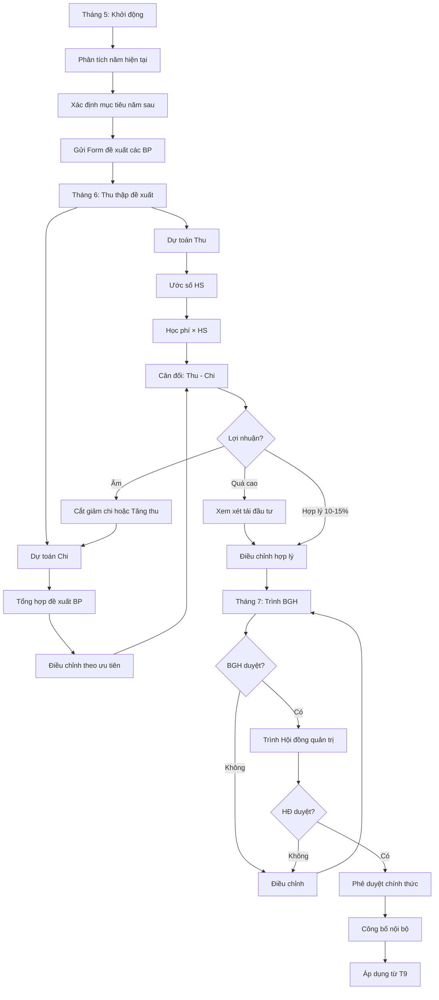

# SOP-03.1: LẬP NGÂN SÁCH HÀNG NĂM

## 1. THÔNG TIN | Mã: SOP-03.1 | Tần suất: Hàng năm (T5-T7)

## 2. MỤC ĐÍCH
Lập kế hoạch tài chính toàn diện, định hướng thu chi cả năm, đảm bảo cân đối

## 3. CẤU TRÚC NGÂN SÁCH

**Ngân sách = Dự toán Thu + Dự toán Chi + Lợi nhuận mục tiêu**

### 3.1. Dự toán Thu

| **Khoản thu** | **Tỷ trọng** | **Cách ước tính** |
|---|---|---|
| Học phí | 85-90% | Số HS dự kiến × Học phí/HS |
| Phí ăn, xe | 5-10% | Số HS đăng ký × Phí |
| Hoạt động ngoại khóa | 2-3% | Số HS tham gia × Phí |
| Thu khác | 1-2% | Summer camp, cho thuê CSVC... |

### 3.2. Dự toán Chi

| **Khoản chi** | **Tỷ trọng** | **Cách ước tính** |
|---|---|---|
| Lương, BHXH | 55-60% | Số NV × Lương TB + Tăng lương dự kiến |
| Học liệu, đồ chơi | 8-12% | Số HS × Đơn giá |
| Bảo trì CSVC | 5-8% | Theo kế hoạch bảo trì |
| Điện nước | 3-5% | Theo lịch sử + Tăng trưởng |
| Marketing, tuyển sinh | 2-3% | Theo kế hoạch marketing |
| Hoạt động giáo dục | 3-5% | Dã ngoại, ngoại khóa, sự kiện |
| Chi quản lý | 5-7% | Văn phòng phẩm, điện thoại... |
| Dự phòng | 3-5% | Cho phát sinh bất ngờ |

## 4. QUY TRÌNH THỰC HIỆN

### 4.1. Chuẩn bị (Tháng 5)

**Bước 1: Phân tích tình hình năm hiện tại**
- Thu chi thực tế 9 tháng qua
- Dự báo 3 tháng cuối
- Tổng kết ước tính cả năm

**Bước 2: Xác định mục tiêu năm sau**
- Số HS mục tiêu (tăng/giảm bao nhiêu?)
- Lợi nhuận mục tiêu (10-15% doanh thu)
- Dự án đầu tư lớn (nếu có)

**Bước 3: Thu thập nhu cầu từ bộ phận**

Gửi Form đề xuất ngân sách (QT03-F15) cho:
- Phòng Học thuật: Học liệu, đào tạo GV, thiết bị dạy
- Phòng Hành chính: Bảo trì, điện nước, văn phòng
- Phòng Marketing: Quảng cáo, sự kiện
- Phòng NS: Lương, tuyển dụng, đào tạo NV
- Các khối: Hoạt động giáo dục

### 4.2. Lập dự toán (Tháng 6)

**Bước 4: Dự toán Thu**

**A. Dự toán số học sinh:**
```
Số HS năm sau = Số HS hiện tại + HS tuyển mới - HS nghỉ học dự kiến
```

**Ví dụ:**
- HS hiện tại: 800
- Tuyển mới: 150
- Nghỉ học: 50
- **HS năm sau: 900**

**B. Dự toán Doanh thu:**
```
Doanh thu = Số HS × Học phí × 10 tháng + Các khoản phí khác
```

**Bước 5: Dự toán Chi**

Tổng hợp đề xuất các bộ phận + Điều chỉnh theo mức độ ưu tiên

| **Bộ phận** | **Đề xuất** | **Điều chỉnh** | **Ngân sách** |
|---|---|---|---|
| Học thuật | 15 tỷ | -1 tỷ | 14 tỷ |
| Nhân sự | 30 tỷ | +2 tỷ | 32 tỷ |
| Hành chính | 8 tỷ | -500 triệu | 7.5 tỷ |

**Bước 6: Cân đối ngân sách**

```
Lợi nhuận dự kiến = Tổng Thu - Tổng Chi
```

- Nếu âm → Cắt giảm chi hoặc tăng thu
- Nếu quá cao (>20%) → Xem xét tái đầu tư

### 4.3. Phê duyệt (Tháng 7)

**Bước 7: Trình BGH**
- Thuyết trình ngân sách
- Giải trình các giả định
- Phân tích rủi ro

**Bước 8: BGH góp ý, điều chỉnh**

**Bước 9: Trình Hội đồng quản trị**

**Bước 10: Phê duyệt chính thức**
- Ký ban hành
- Công bố nội bộ

## 5. LƯU ĐỒ



## 6. BIỂU MẪU
- QT03-F15: Form đề xuất ngân sách bộ phận
- QT03-B06: Ngân sách tổng thể năm
- QT03-R06: Thuyết trình ngân sách

## 7. TIÊU CHUẨN
| Chỉ tiêu | Mục tiêu |
|---|---|
| Hoàn thành đúng hạn (trước T8) | 100% |
| Độ chính xác dự toán | ≥ 90% (so với thực tế sau) |
| Lợi nhuận/Doanh thu | 10-15% |

## 8. TRÁCH NHIỆM
- **Các bộ phận**: Đề xuất nhu cầu chi
- **Phòng KT**: Tổng hợp, lập dự toán, trình duyệt
- **BGH**: Điều chỉnh, trình HĐ
- **HĐ quản trị**: Phê duyệt cuối

## 9. LƯU Ý
- ⚠️ **Thực tế**: Dựa trên số liệu lịch sử, không tưởng tượng
- ✅ **Dự phòng**: Luôn có 3-5% cho bất ngờ
- ✅ **Linh hoạt**: Có thể điều chỉnh trong năm (SOP-03.4)

## 10. PHỤ LỤC

### 10.1. Mẫu ngân sách tổng thể (VD: 60 tỷ/năm)

**THU:**
- Học phí: 50 tỷ (800 HS × 50 triệu + 100 HS mới × 50 triệu)
- Phí ăn, xe: 6 tỷ
- Ngoại khóa: 2 tỷ
- Thu khác: 2 tỷ
- **TỔNG THU: 60 tỷ**

**CHI:**
- Lương, BHXH: 33 tỷ (55%)
- Học liệu: 6 tỷ (10%)
- Bảo trì: 3.6 tỷ (6%)
- Điện nước: 2.4 tỷ (4%)
- Marketing: 1.8 tỷ (3%)
- Hoạt động GD: 2.4 tỷ (4%)
- Chi quản lý: 3.6 tỷ (6%)
- Dự phòng: 1.8 tỷ (3%)
- **TỔNG CHI: 54.6 tỷ**

**LỢI NHUẬN: 5.4 tỷ (9%)** → Tái đầu tư CSVC

## 11. FAQ

**Q: Ngân sách có thể thay đổi trong năm không?**  
A: Có, theo SOP-03.4. Nhưng phải có lý do chính đáng và BGH duyệt.

**Q: Nếu thực tế vượt ngân sách?**  
A: Xem xét điều chỉnh hoặc cắt giảm chi tiêu khác. Ưu tiên: Lương > Học liệu > Marketing.

---
**PHÊ DUYỆT** | KT trưởng | Phó HT | HT | Chủ tịch HĐ |
