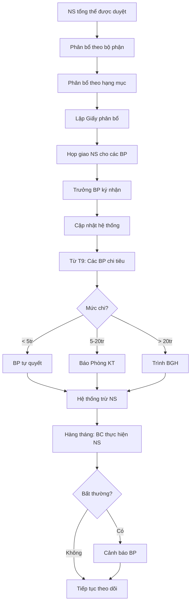

# SOP-03.2: PHÂN BỔ NGÂN SÁCH THEO BỘ PHẬN

## 1. THÔNG TIN | Mã: SOP-03.2 | Tần suất: Hàng năm (Sau khi NS được duyệt)

## 2. MỤC ĐÍCH
Phân bổ ngân sách hợp lý, rõ ràng cho từng bộ phận để quản lý hiệu quả

## 3. QUY TRÌNH

### 3.1. Phân bổ ngân sách

**Bước 1: Chia ngân sách theo bộ phận (Tháng 8)**

Sau khi ngân sách tổng thể được duyệt, Phòng KT phân bổ:

| **Bộ phận** | **Ngân sách năm** | **Phân bổ theo tháng** | **Ghi chú** |
|---|---|---|---|
| **Học thuật** | 14 tỷ | 1.4 tỷ/tháng | Học liệu, thiết bị dạy, đào tạo GV |
| **Nhân sự** | 33 tỷ | 3.3 tỷ/tháng | Lương, BHXH, tuyển dụng, đào tạo NV |
| **Hành chính** | 7.5 tỷ | 750 triệu/tháng | Bảo trì, điện nước, văn phòng |
| **Marketing** | 1.8 tỷ | 150 triệu/tháng | Quảng cáo, sự kiện, tuyển sinh |
| **Hoạt động GD** | 2.4 tỷ | 240 triệu/tháng | Dã ngoại, ngoại khóa, team building |
| **Dự phòng** | 1.8 tỷ | 150 triệu/tháng | Phát sinh, khẩn cấp |

**Lưu ý:** Một số chi phí không chia đều theo tháng (VD: Marketing cao tháng 1-3, Hoạt động GD cao tháng 4-5)

**Bước 2: Phân bổ chi tiết theo hạng mục**

Ví dụ **Học thuật**:

| **Hạng mục** | **Ngân sách năm** | **% Tổng BP** |
|---|---|---|
| Sách giáo khoa, tài liệu | 5 tỷ | 36% |
| Thiết bị dạy học | 4 tỷ | 28% |
| Đào tạo giáo viên | 3 tỷ | 21% |
| Thi cử, đánh giá | 1.5 tỷ | 11% |
| Khác | 500 triệu | 4% |

**Bước 3: Lập Giấy phân bổ ngân sách (QT03-D03)**

### 3.2. Giao cho bộ phận

**Bước 4: Họp giao ngân sách**

- BGH + Trưởng các BP họp
- Giải thích rõ ngân sách được giao
- Trưởng BP ký nhận (QT03-D04)

**Bước 5: Cấp hạn mức chi tiêu**

| **Mức chi** | **Quyền phê duyệt của Trưởng BP** |
|---|---|
| < 5 triệu | Tự quyết định |
| 5-20 triệu | Phải báo Phòng KT |
| > 20 triệu | Phải trình BGH |

**Bước 6: Cập nhật vào hệ thống**
- Mỗi BP có "ví" ngân sách
- Tự động trừ khi có chi tiêu
- Cảnh báo khi sắp hết (80%, 90%, 100%)

### 4.3. Giám sát

**Bước 7: Theo dõi hàng tháng**

Phòng KT lập báo cáo:

| **Bộ phận** | **NS giao** | **Đã chi** | **Còn lại** | **% Thực hiện** |
|---|---|---|---|---|
| Học thuật | 14 tỷ | 5.6 tỷ (4 tháng) | 8.4 tỷ | 40% |

**Bước 8: Cảnh báo khi bất thường**
- Chi quá nhanh (40% trong 2 tháng đầu)
- Sắp hết ngân sách
- Không chi gì (ngân sách bị đóng băng?)

## 5. LƯU ĐỒ

## 6. BIỂU MẪU
- QT03-D03: Giấy phân bổ ngân sách
- QT03-D04: Biên bản giao nhận ngân sách
- QT03-R07: Báo cáo thực hiện ngân sách theo BP

## 7. TIÊU CHUẨN
| Chỉ tiêu | Mục tiêu |
|---|---|
| Tổng NS phân bổ = NS tổng | 100% |
| BP chi đúng hạn mức | ≥ 95% |
| Sử dụng hết NS (không dư thừa) | 90-100% |

## 8. TRÁCH NHIỆM
- **Phòng KT**: Phân bổ, giao NS, theo dõi
- **Trưởng BP**: Quản lý NS bộ phận, chi đúng mục đích
- **BGH**: Giám sát tổng thể

## 9. LƯU Ý
- ⚠️ **Không chi vượt**: BP không được chi quá NS được giao (trừ khẩn cấp có duyệt)
- ✅ **Linh hoạt nội bộ**: BP có thể chuyển đổi giữa các hạng mục (trong tổng NS)
- ✅ **Dùng hết**: Khuyến khích BP dùng hết NS (đầu tư cho phát triển)

## 10. PHỤ LỤC

### 10.1. Ví dụ phân bổ theo tháng (Bộ phận Marketing)

| **Tháng** | **NS tháng** | **Lý do** |
|---|---|---|
| T9-T12 | 100 triệu/tháng | Bình thường |
| T1-T3 | 300 triệu/tháng | Mùa tuyển sinh cao điểm |
| T4-T8 | 50 triệu/tháng | Mùa thấp |

## 11. FAQ

**Q: Nếu BP không dùng hết NS?**  
A: Thu hồi vào dự phòng. Năm sau có thể giảm NS cho BP đó.

**Q: BP muốn chi vượt NS?**  
A: Phải có lý do rõ ràng, trình BGH duyệt, lấy từ NS bộ phận khác hoặc Dự phòng.

---
**PHÊ DUYỆT** | KT trưởng | Phó HT | HT |
