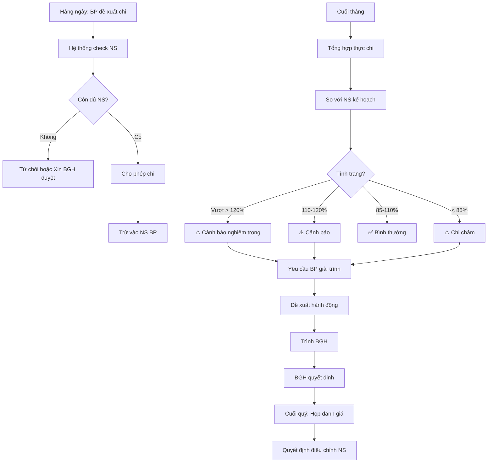

# SOP-03.3: KIỂM SOÁT NGÂN SÁCH

## 1. THÔNG TIN | Mã: SOP-03.3 | Tần suất: Hàng tháng

## 2. MỤC ĐÍCH
Theo dõi thực hiện, phát hiện sớm vượt ngân sách, đảm bảo cân đối tài chính

## 3. QUY TRÌNH

### 3.1. Theo dõi hàng ngày

**Bước 1: Mỗi lần chi tiêu**
- BP đề xuất chi (Form QT03-F16)
- Hệ thống check ngân sách còn lại
- Nếu đủ → Cho phép
- Nếu không đủ → Cảnh báo

### 3.2. Báo cáo hàng tháng

**Bước 2: Cuối tháng - Tổng hợp (Ngày 28-30)**

Phòng KT lập Báo cáo thực hiện ngân sách (QT03-R08):

| **Bộ phận** | **NS năm** | **NS lũy kế đến tháng X** | **Thực chi** | **Còn lại** | **% Thực hiện** | **Tình trạng** |
|---|---|---|---|---|---|---|
| Học thuật | 14 tỷ | 5.6 tỷ (4 tháng) | 5.2 tỷ | 8.8 tỷ | 93% | ✅ Bình thường |
| Marketing | 1.8 tỷ | 720 triệu | 850 triệu | 950 triệu | 118% | ⚠️ Vượt 18% |

**Tình trạng:**
- ✅ **Bình thường**: 85-110% kế hoạch
- ⚠️ **Cảnh báo**: 110-120% hoặc < 70%
- 🔥 **Nghiêm trọng**: > 120% hoặc < 50%

**Bước 3: Phân tích nguyên nhân**
- Tại sao vượt/dưới?
- Có hợp lý không?
- Cần hành động gì?

**Bước 4: Đề xuất hành động**

| **Tình trạng** | **Hành động** |
|---|---|
| Vượt > 120% | Cắt giảm chi tiêu ngay hoặc Xin điều chỉnh NS |
| Dưới 70% | Tăng tốc sử dụng hoặc Chuyển NS cho BP khác |

**Bước 5: Trình BGH (Đầu tháng sau)**

### 3.3. Họp đánh giá quý

**Bước 6: Cuối mỗi quý - Họp tài chính**

**Thành phần:**
- BGH
- Kế toán trưởng
- Trưởng các bộ phận

**Nội dung:**
- Xem báo cáo 3 tháng
- Các BP giải trình vượt/dưới NS
- Quyết định điều chỉnh (nếu cần)

## 4. CÔNG CỤ KIỂM SOÁT

### 4.1. Dashboard ngân sách (Phần mềm)

Hiển thị real-time:
- % Ngân sách đã dùng
- Thanh màu: Xanh (OK), Vàng (Cảnh báo), Đỏ (Vượt)
- Dự báo hết NS vào tháng nào

### 4.2. Cảnh báo tự động

| **Mốc** | **Hành động** |
|---|---|
| 80% NS | Email cảnh báo BP |
| 90% NS | Email cảnh báo BP + KT trưởng |
| 100% NS | Khóa chi tiêu, phải xin phê duyệt đặc biệt |

## 5. LƯU ĐỒ



## 6. BIỂU MẪU
- QT03-R08: Báo cáo thực hiện ngân sách tháng
- QT03-R09: Báo cáo phân tích ngân sách quý

## 7. TIÊU CHUẨN
| Chỉ tiêu | Mục tiêu |
|---|---|
| Tỷ lệ BP chi trong NS | ≥ 95% |
| Phát hiện vượt NS trong tháng | 100% |
| BC đúng hạn (ngày 5 tháng sau) | 100% |

## 8. TRÁCH NHIỆM
- **Trưởng BP**: Quản lý NS BP, giải trình khi vượt/dưới
- **Phòng KT**: Theo dõi, báo cáo, cảnh báo
- **BGH**: Giám sát, quyết định xử lý

## 9. LƯU Ý
- ⚠️ **Theo dõi sát**: Đừng đợi cuối tháng mới phát hiện vượt
- ✅ **Linh hoạt hợp lý**: Vượt 5-10% vì lý do chính đáng → Chấp nhận
- ✅ **Không vượt tổng**: Các BP có thể vượt, nhưng TỔNG không được vượt

## 10. PHỤ LỤC

### 10.1. Mẫu cảnh báo tự động

```
[CẢNH BÁO] Ngân sách sắp hết!

Bộ phận: Học thuật
NS năm: 14 tỷ
Đã chi: 11.2 tỷ (80%)
Còn lại: 2.8 tỷ
Thời gian còn lại: 3 tháng

Vui lòng kiểm soát chi tiêu!
```

## 11. FAQ

**Q: Nếu BP tiết kiệm được NS?**  
A: Khen thưởng BP. Năm sau vẫn giữ nguyên NS (không cắt giảm).

**Q: Hết NS nhưng còn 3 tháng nữa mới hết năm?**  
A: Phải xin điều chỉnh NS (SOP-03.4) hoặc cắt giảm chi tiêu.

---
**PHÊ DUYỆT** | KT trưởng | Phó HT |
