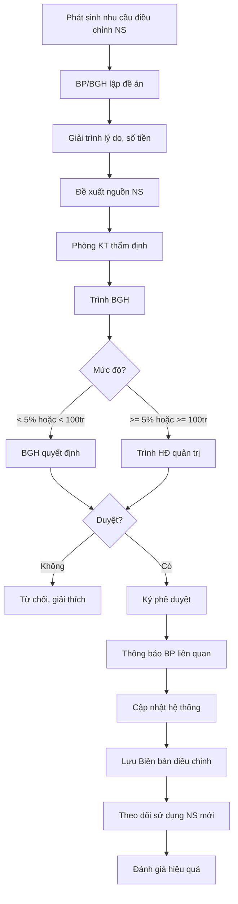

# SOP-03.4: ĐIỀU CHỈNH NGÂN SÁCH

## 1. THÔNG TIN | Mã: SOP-03.4 | Tần suất: Khi cần thiết

## 2. MỤC ĐÍCH
Linh hoạt điều chỉnh ngân sách khi có thay đổi lớn, đảm bảo hoạt động trường

## 3. CÁC TRƯỜNG HỢP ĐIỀU CHỈNH

| **Trường hợp** | **Ví dụ** | **Mức độ ảnh hưởng** |
|---|---|---|
| **Thay đổi quy mô** | Số HS tăng/giảm > 10% | Lớn - Cần điều chỉnh toàn bộ |
| **Chi phí bất ngờ** | Sửa chữa lớn, tai nạn, dịch bệnh | Trung bình - Điều chỉnh 1 BP |
| **Cơ hội đầu tư** | Mua thiết bị giảm giá sâu | Nhỏ - Tăng NS 1 hạng mục |
| **Thay đổi chính sách** | Luật mới, yêu cầu mới từ Sở GD | Tùy mức độ |

## 4. QUY TRÌNH

### 4.1. Đề xuất điều chỉnh

**Bước 1: BP hoặc BGH phát hiện cần điều chỉnh**

**Bước 2: Lập đề án điều chỉnh (QT03-F17)**

Nội dung:
| **Mục** | **Chi tiết** |
|---|---|
| Lý do | Tại sao cần điều chỉnh? |
| Phạm vi | BP nào? Hạng mục nào? |
| Số tiền | Tăng/Giảm bao nhiêu? |
| Nguồn | Lấy từ đâu? (NS khác, Dự phòng, Vay...) |
| Tác động | Ảnh hưởng đến gì? |
| Thời gian | Cần điều chỉnh từ khi nào? |

### 4.2. Thẩm định

**Bước 3: Phòng KT thẩm định**
- Kiểm tra tính khả thi
- Xem có ảnh hưởng đến BP khác không
- Đề xuất phương án tối ưu

**Bước 4: Trình BGH xem xét**

### 4.3. Phê duyệt

**ĐIỀU CHỈNH NHỎ (< 5% NS bộ phận):**

**Bước 5a: BGH phê duyệt**
- Hiệu trưởng ký
- Cập nhật hệ thống

**ĐIỀU CHỈNH LỚN (≥ 5% hoặc > 100 triệu):**

**Bước 5b: Trình Hội đồng quản trị**
- Thuyết trình đề án
- HĐ thảo luận, biểu quyết
- Ký phê duyệt

**Bước 6: Thông báo các bộ phận liên quan**

**Bước 7: Cập nhật ngân sách**
- Sửa trong hệ thống
- Lưu Biên bản điều chỉnh (QT03-D05)

### 4.4. Theo dõi sau điều chỉnh

**Bước 8: Theo dõi việc sử dụng NS mới**
- BP có chi đúng mục đích không
- Có hiệu quả không
- Có cần điều chỉnh tiếp không

## 5. LƯU ĐỒ

## 6. BIỂU MẪU
- QT03-F17: Đề án điều chỉnh ngân sách
- QT03-D05: Biên bản điều chỉnh NS
- QT03-R10: Báo cáo theo dõi sau điều chỉnh

## 7. TIÊU CHUẨN
| Chỉ tiêu | Mục tiêu |
|---|---|
| Thời gian xử lý đề án | ≤ 15 ngày |
| Số lần điều chỉnh/năm | ≤ 3 lần |
| Điều chỉnh có hiệu quả | ≥ 90% |

## 8. TRÁCH NHIỆM
- **BP đề xuất**: Lập đề án, giải trình
- **Phòng KT**: Thẩm định, tư vấn
- **BGH/HĐ**: Quyết định

## 9. LƯU Ý
- ⚠️ **Không tùy tiện**: Chỉ điều chỉnh khi thực sự cần thiết
- ✅ **Minh bạch**: Giải trình rõ ràng lý do
- ✅ **Có nguồn**: Phải xác định rõ lấy tiền từ đâu

## 10. PHỤ LỤC

### 10.1. Ví dụ đề án điều chỉnh

**Tình huống:** Số HS tăng đột biến 15% (từ 800 → 920 HS)

**ĐỀ ÁN:**
- **Lý do**: Tuyển sinh vượt mục tiêu 120 HS
- **Cần điều chỉnh**:
  - Tăng NS Nhân sự: +4 tỷ (tuyển thêm 8 GV)
  - Tăng NS Học thuật: +1.5 tỷ (sách, đồ dùng)
  - Tăng NS Bếp ăn: +1 tỷ (nguyên liệu)
  - **Tổng: +6.5 tỷ**
- **Nguồn**: Thu thêm từ 120 HS × 50 triệu = +6 tỷ + Dùng 500 triệu từ Dự phòng
- **Thời gian**: Từ tháng 9

## 11. FAQ

**Q: Có giới hạn số lần điều chỉnh không?**  
A: Không giới hạn, nhưng quá nhiều lần (>3) chứng tỏ lập NS không tốt.

**Q: Có thể điều chỉnh giảm NS không?**  
A: Có. Khi doanh thu giảm, buộc phải cắt giảm chi.

---
**PHÊ DUYỆT** | KT trưởng | Phó HT | HT | (HĐ nếu lớn) |

---

✅ **HOÀN THÀNH SOP-03: NGÂN SÁCH - DỰ TOÁN (4 files)!**
