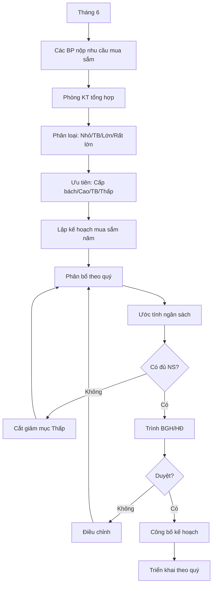

# SOP-04.1: LẬP KẾ HOẠCH MUA SẮM

## 1. THÔNG TIN | Mã: SOP-04.1 | Tần suất: Hàng năm, Hàng quý

## 2. MỤC ĐÍCH
Mua đúng nhu cầu, đúng thời điểm, tiết kiệm ngân sách

## 3. QUY TRÌNH

### 3.1. Thu thập nhu cầu (Tháng 6)

**Bước 1: Các BP nộp danh mục mua sắm (QT03-F18)**

| **STT** | **Tên hàng/Dịch vụ** | **Số lượng** | **Đơn giá dự kiến** | **Tổng** | **Mục đích** | **Độ ưu tiên** |
|---|---|---|---|---|---|---|
| 1 | Bàn ghế học sinh | 100 bộ | 1.5 triệu | 150 triệu | Thay cũ hỏng | Cao |
| 2 | Máy chiếu | 10 cái | 15 triệu | 150 triệu | Nâng cấp phòng học | Trung bình |

**Bước 2: Phòng KT tổng hợp**

### 3.2. Phân loại và ưu tiên

**Bước 3: Phân loại theo giá trị**

| **Loại** | **Giá trị** | **Quy trình** |
|---|---|---|
| Nhỏ | < 20 triệu | BP tự mua, báo cáo sau |
| Trung bình | 20-100 triệu | Phòng KT xin 3 báo giá, BGH duyệt |
| Lớn | 100-500 triệu | Đấu thầu rút gọn, BGH duyệt |
| Rất lớn | > 500 triệu | Đấu thầu đầy đủ, HĐ duyệt |

**Bước 4: Ưu tiên**

| **Mức ưu tiên** | **Tiêu chí** | **Xử lý** |
|---|---|---|
| **Cấp bách** | Hỏng, ảnh hưởng ngay đến dạy học | Mua ngay |
| **Cao** | Cần thiết trong 3 tháng tới | Mua trong quý này |
| **Trung bình** | Cần thiết nhưng không gấp | Mua khi có ngân sách |
| **Thấp** | Muốn có nhưng chưa cần | Xem xét năm sau |

### 3.3. Lập kế hoạch

**Bước 5: Lập kế hoạch mua sắm năm (QT03-P01)**

Phân bổ theo thời gian:

| **Quý** | **Hạng mục** | **Giá trị** | **Ghi chú** |
|---|---|---|---|
| Quý 1 (T9-11) | Học liệu, đồ dùng năm học | 5 tỷ | Đầu năm học |
| Quý 2 (T12-2) | Bảo trì định kỳ | 2 tỷ | |
| Quý 3 (T3-5) | Thiết bị dạy học | 3 tỷ | Chuẩn bị năm sau |
| Quý 4 (T6-8) | Sửa chữa, nâng cấp | 4 tỷ | Hè, HS nghỉ |

**Bước 6: Trình BGH/HĐ phê duyệt**

**Bước 7: Công bố kế hoạch cho các BP**

## 5. LƯU ĐỒ

## 6. BIỂU MẪU
- QT03-F18: Form đề xuất mua sắm
- QT03-P01: Kế hoạch mua sắm năm

## 7. TIÊU CHUẨN
| Chỉ tiêu | Mục tiêu |
|---|---|
| Thực hiện đúng kế hoạch | ≥ 90% |
| Tiết kiệm so với dự toán | 5-10% |

## 8. TRÁCH NHIỆM
- **Các BP**: Đề xuất nhu cầu cụ thể
- **Phòng KT**: Tổng hợp, lập kế hoạch
- **BGH/HĐ**: Phê duyệt

## 9. LƯU Ý
- ⚠️ **Mua tập trung**: Mua số lượng lớn để đàm phán giá tốt
- ✅ **Mua đúng lúc**: VD: Thiết bị dạy mua tháng 6-8 (hè, giá tốt)
- ✅ **Dự phòng 10%**: Giá có thể tăng

## 10. FAQ

**Q: Nếu phát sinh nhu cầu ngoài kế hoạch?**  
A: Lập đề xuất riêng, trình BGH. Nếu < 20 triệu, BP tự quyết trong NS.

---
**PHÊ DUYỆT** | KT trưởng | Phó HT | HT |
