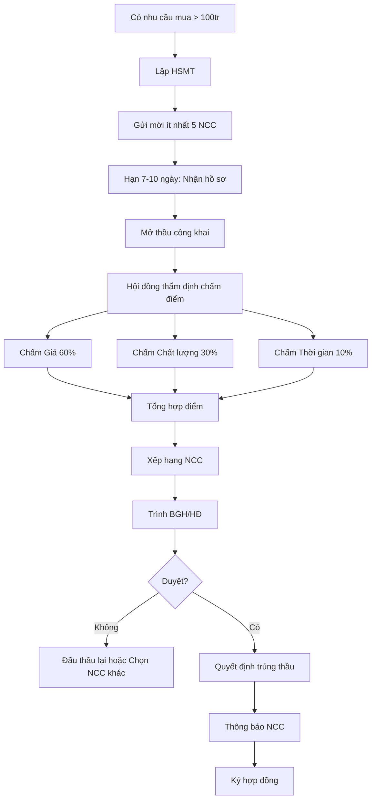

# SOP-04.2: QUY TRÌNH ĐẤU THẦU

## 1. THÔNG TIN | Mã: SOP-04.2 | Tần suất: Khi mua sắm > 100 triệu

## 2. MỤC ĐÍCH
Đảm bảo minh bạch, cạnh tranh, giá tốt nhất khi mua sắm lớn

## 3. HÌNH THỨC ĐẤU THẦU

| **Giá trị** | **Hình thức** | **Số NCC tối thiểu** |
|---|---|---|
| 20-100 triệu | Chào hàng (Xin 3 báo giá) | 3 |
| 100-500 triệu | Đấu thầu rút gọn | 5 |
| > 500 triệu | Đấu thầu đầy đủ | 7 |

## 4. QUY TRÌNH ĐẤU THẦU RÚT GỌN (100-500 triệu)

### 4.1. Chuẩn bị

**Bước 1: Lập hồ sơ mời thầu (HSMT) - QT03-D06**

Nội dung HSMT:
| **Mục** | **Chi tiết** |
|---|---|---|
| Thông tin trường | Tên, địa chỉ, người liên hệ |
| Mô tả nhu cầu | Mua gì, số lượng, thông số kỹ thuật |
| Tiêu chí đánh giá | Giá 60%, Chất lượng 30%, Thời gian 10% |
| Điều kiện NCC | Giấy phép KD, năng lực, kinh nghiệm |
| Thời gian | Nhận hồ sơ, mở thầu, quyết định |
| Hợp đồng mẫu | Dự thảo hợp đồng |

**Bước 2: Gửi mời thầu**
- Gửi cho ít nhất 5 NCC uy tín
- Email + Đăng trên website (nếu muốn công khai)

### 4.2. Nhận và đánh giá hồ sơ

**Bước 3: Nhận hồ sơ dự thầu (Hạn: 7-10 ngày)**

NCC nộp:
- Hồ sơ năng lực (Giấy phép, chứng chỉ, dự án đã làm)
- Hồ sơ kỹ thuật (Thông số sản phẩm, catalog)
- Hồ sơ tài chính (Bảng báo giá chi tiết)

**Bước 4: Mở thầu**
- Tại trường, công khai
- Thành phần: BGH, Phòng KT, BP đề xuất, NCC (nếu muốn)
- Đọc giá từng NCC, ghi biên bản (QT03-D07)

**Bước 5: Thẩm định hồ sơ**

**Hội đồng thẩm định** (3-5 người) chấm điểm:

| **Tiêu chí** | **Trọng số** | **Cách chấm** |
|---|---|---|
| Giá | 60% | NCC giá thấp nhất = 60 điểm. Còn lại tính tỷ lệ |
| Chất lượng sản phẩm | 30% | Chấm theo thông số kỹ thuật |
| Thời gian giao hàng | 10% | Giao nhanh = điểm cao |

**Ví dụ tính điểm:**
- NCC A: Giá 150 triệu → Điểm giá: 60 × (150/150) = 60
- NCC B: Giá 165 triệu → Điểm giá: 60 × (150/165) = 54.5

**Bước 6: Tổng hợp, xếp hạng**

### 4.3. Quyết định và ký hợp đồng

**Bước 7: Trình BGH/HĐ**
- Báo cáo kết quả thẩm định
- Đề xuất NCC trúng thầu

**Bước 8: Quyết định trúng thầu**

**Bước 9: Thông báo kết quả**
- NCC trúng: Mời ký hợp đồng
- NCC không trúng: Cảm ơn, giữ quan hệ

**Bước 10: Ký hợp đồng → Chuyển SOP-04.3**

## 5. LƯU ĐỒ

## 6. BIỂU MẪU
- QT03-D06: Hồ sơ mời thầu
- QT03-D07: Biên bản mở thầu
- QT03-D08: Biên bản thẩm định

## 7. TIÊU CHUẨN
| Chỉ tiêu | Mục tiêu |
|---|---|
| Số NCC tham gia | ≥ 3 |
| Tiết kiệm so với giá đề xuất ban đầu | ≥ 10% |
| Minh bạch | 100% |

## 8. TRÁCH NHIỆM
- **BP đề xuất**: Viết yêu cầu kỹ thuật
- **Phòng KT**: Lập HSMT, tổ chức đấu thầu
- **Hội đồng thẩm định**: Chấm điểm, xếp hạng
- **BGH/HĐ**: Quyết định cuối

## 9. LƯU Ý
- ⚠️ **Không thiên vị**: Đối xử công bằng với tất cả NCC
- ✅ **Ghi chép đầy đủ**: Biên bản từng bước
- ✅ **Bảo mật**: Giá của NCC này không tiết lộ cho NCC kia (trước khi mở thầu)

## 10. FAQ

**Q: Nếu chỉ có 2 NCC nộp hồ sơ?**  
A: Gia hạn thêm 5-7 ngày. Nếu vẫn < 3, xem xét đấu lại hoặc chỉ định thầu (có phê duyệt đặc biệt).

---
**PHÊ DUYỆT** | KT trưởng | Phó HT | HT |
