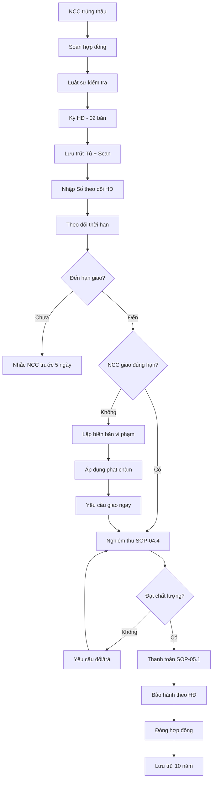

# SOP-04.3: QUẢN LÝ HỢP ĐỒNG MUA SẮM

## 1. THÔNG TIN | Mã: SOP-04.3 | Tần suất: Liên tục

## 2. MỤC ĐÍCH
Quản lý chặt chẽ hợp đồng, đảm bảo quyền lợi, theo dõi thực hiện

## 3. QUY TRÌNH

### 3.1. Soạn thảo hợp đồng

**Bước 1: Dựa trên kết quả đấu thầu**
- NCC trúng thầu
- Giá, số lượng, thông số đã cam kết

**Bước 2: Soạn hợp đồng (QT03-H01)**

**Nội dung bắt buộc:**
| **Điều khoản** | **Chi tiết** |
|---|---|
| Bên A (Trường) | Tên, địa chỉ, MST, người đại diện |
| Bên B (NCC) | Tên, địa chỉ, MST, người đại diện |
| Hàng hóa/Dịch vụ | Mô tả chi tiết, số lượng, chất lượng |
| Giá trị | Đơn giá, tổng giá (bao gồm VAT hay chưa) |
| Thời gian giao hàng | Ngày cụ thể hoặc trong X ngày |
| Địa điểm giao | Kho trường hoặc địa chỉ khác |
| Thanh toán | TM/CK, Trả trước/sau, Tỷ lệ, Thời hạn |
| Bảo hành | Thời gian, điều kiện |
| Phạt vi phạm | Chậm giao: X%/ngày, Không đúng chất lượng: Y% |
| Tranh chấp | Hòa giải → Trọng tài → Tòa án |

**Bước 3: Luật sư (hoặc Phòng Pháp chế) kiểm tra**

**Bước 4: NCC + Trường ký (02 bản)**

### 3.2. Quản lý hồ sơ hợp đồng

**Bước 5: Lưu trữ**
- Tủ hồ sơ (Bản giấy)
- Scan lưu máy tính, cloud (Bản điện tử)

**Bước 6: Nhập vào Sổ theo dõi HĐ (QT03-S01)**

| **Số HĐ** | **Ngày ký** | **NCC** | **Nội dung** | **Giá trị** | **Thời hạn** | **Người phụ trách** | **Tình trạng** |
|---|---|---|---|---|---|---|---|
| HĐ-001/2024 | 01/09/2024 | Công ty A | Mua bàn ghế | 150 triệu | 30 ngày | Nguyễn Văn X | Đang thực hiện |

### 3.3. Theo dõi thực hiện

**Bước 7: Nhắc nhở thời hạn**
- Trước 5 ngày: Nhắc NCC về hạn giao
- Đúng hạn: Kiểm tra đã giao chưa

**Bước 8: Xử lý vi phạm (nếu có)**
- Chậm giao → Phạt theo HĐ
- Không đúng chất lượng → Yêu cầu đổi hoặc trả lại
- Lập biên bản vi phạm (QT03-D09)

**Bước 9: Nghiệm thu → SOP-04.4**

**Bước 10: Thanh toán → SOP-05.1**

**Bước 11: Đóng hợp đồng**
- Khi hoàn tất nghĩa vụ 2 bên
- Cập nhật "Đã hoàn thành" trong Sổ

## 5. LƯU ĐỒ

## 6. BIỂU MẪU
- QT03-H01: Mẫu hợp đồng mua sắm
- QT03-S01: Sổ theo dõi hợp đồng
- QT03-D09: Biên bản vi phạm hợp đồng

## 7. TIÊU CHUẨN
| Chỉ tiêu | Mục tiêu |
|---|---|
| HĐ có đủ điều khoản bắt buộc | 100% |
| NCC giao đúng hạn | ≥ 90% |
| Tranh chấp HĐ | < 5% |

## 8. TRÁCH NHIỆM
- **Phòng KT**: Soạn HĐ, quản lý, theo dõi
- **Luật sư**: Kiểm tra điều khoản
- **BP đề xuất**: Theo dõi kỹ thuật
- **BGH**: Ký HĐ

## 9. LƯU Ý
- ⚠️ **Đọc kỹ trước khi ký**: Không ký HĐ mập mờ
- ✅ **Có phạt vi phạm**: 0.05-0.1%/ngày chậm giao
- ✅ **Bảo hành rõ ràng**: Thời gian, phạm vi, cách thức

## 10. FAQ

**Q: NCC chậm giao, phạt thế nào?**  
A: Theo HĐ (thường 0.05-0.1%/ngày). Quá 30 ngày → Hủy HĐ, yêu cầu bồi thường.

---
**PHÊ DUYỆT** | KT trưởng | Phó HT | HT |
