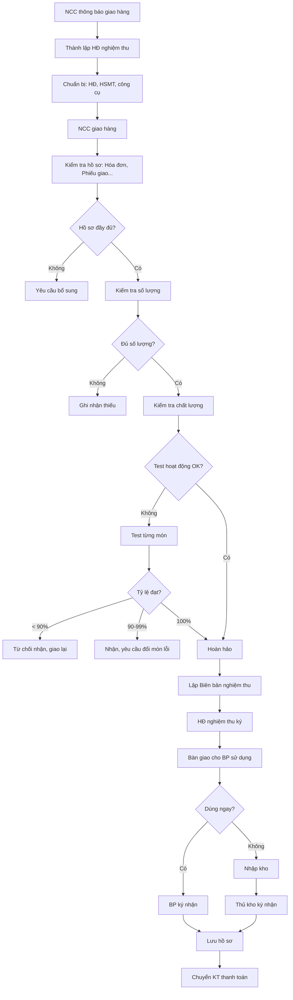

# SOP-04.4: KIỂM TRA VÀ NGHIỆM THU

## 1. THÔNG TIN | Mã: SOP-04.4 | Tần suất: Mỗi lần nhận hàng

## 2. MỤC ĐÍCH
Đảm bảo hàng hóa đúng số lượng, chất lượng, tránh thất thoát

## 3. QUY TRÌNH

### 3.1. Chuẩn bị nghiệm thu

**Bước 1: NCC thông báo giao hàng (Trước 1 ngày)**

**Bước 2: Thành lập Hội đồng nghiệm thu (QT03-D10)**

| **Thành viên** | **Vai trò** |
|---|---|
| Trưởng BP đề xuất | Chủ tịch HĐ |
| Phòng KT | Ủy viên |
| Phòng Hành chính (Kho) | Ủy viên |
| Chuyên gia kỹ thuật (nếu cần) | Tư vấn |

**Bước 3: Chuẩn bị tài liệu**
- Hợp đồng
- HSMT (yêu cầu kỹ thuật)
- Công cụ đo (nếu cần)

### 3.2. Nghiệm thu

**Bước 4: Kiểm tra hồ sơ giao hàng**

NCC phải có:
- Phiếu giao hàng (Delivery Note)
- Hóa đơn GTGT
- Phiếu bảo hành (nếu có)
- Tài liệu hướng dẫn (Manual)

**Bước 5: Kiểm tra thực tế**

**A. Kiểm tra số lượng:**
- Đếm từng món
- Đối chiếu với hợp đồng

**B. Kiểm tra chất lượng:**

| **Hạng mục kiểm tra** | **Cách kiểm tra** |
|---|---|
| Ngoại quan | Có hư hỏng, trầy xước, móp méo? |
| Nhãn mác | Có tem, logo, thông số? |
| Công năng | Test hoạt động (điện, máy móc...) |
| Thông số kỹ thuật | So với yêu cầu trong HĐ |
| Hạn sử dụng | Còn hạn đủ lâu không? |

**C. Kiểm tra bảo hành:**
- Có phiếu bảo hành?
- Thời gian bảo hành rõ ràng?

**Bước 6: Lập Biên bản nghiệm thu (QT03-D11)**

| **Kết quả** | **Hành động** |
|---|---|
| **Đạt 100%** | Ký nghiệm thu, thanh toán |
| **Đạt 90-99%** | Ký nghiệm thu có ghi nhận thiếu sót, NCC khắc phục trong X ngày |
| **Không đạt < 90%** | Từ chối nhận, yêu cầu giao lại |

**Bước 7: Tất cả thành viên HĐ ký biên bản**

### 3.3. Bàn giao và lưu trữ

**Bước 8: Bàn giao cho BP sử dụng**
- Ký biên bản bàn giao (QT03-D12)
- BP chịu trách nhiệm từ đây

**Bước 9: Nhập kho (nếu chưa dùng ngay)**
- Thủ kho ký nhận
- Gắn mã tài sản
- Nhập sổ kho

**Bước 10: Lưu hồ sơ nghiệm thu**
- Biên bản nghiệm thu
- Hóa đơn
- Phiếu bảo hành
- Lưu 10 năm

**Bước 11: Chuyển cho Kế toán thanh toán → SOP-05.1**

## 5. LƯU ĐỒ

## 6. BIỂU MẪU
- QT03-D10: Quyết định thành lập HĐ nghiệm thu
- QT03-D11: Biên bản nghiệm thu
- QT03-D12: Biên bản bàn giao

## 7. TIÊU CHUẨN
| Chỉ tiêu | Mục tiêu |
|---|---|
| Hàng hóa đạt yêu cầu lần đầu | ≥ 95% |
| Thời gian nghiệm thu | ≤ 1 ngày (hàng thường), ≤ 3 ngày (phức tạp) |

## 8. TRÁCH NHIỆM
- **HĐ nghiệm thu**: Kiểm tra kỹ, ký biên bản
- **NCC**: Giao đủ, đúng, có hồ sơ
- **Thủ kho**: Bảo quản tài sản

## 9. LƯU Ý
- ⚠️ **Kiểm tra KỸ**: Đừng vội ký, sau này phát hiện lỗi rất khó
- ✅ **Chụp ảnh/Video**: Quá trình nghiệm thu (nếu giá trị lớn)
- ✅ **Không nhận nếu không đạt**: Kiên quyết từ chối

## 10. PHỤ LỤC

### 10.1. Checklist nghiệm thu

**TRƯỚC KHI KÝ, KIỂM TRA:**
- [ ] Số lượng đúng
- [ ] Thông số kỹ thuật đúng
- [ ] Không hư hỏng, trầy xước
- [ ] Test hoạt động OK (nếu là thiết bị)
- [ ] Có đầy đủ phụ kiện
- [ ] Có hóa đơn GTGT hợp lệ
- [ ] Có phiếu bảo hành
- [ ] Có hướng dẫn sử dụng

## 11. FAQ

**Q: Nếu 1-2 món lỗi trong lô 100 món?**  
A: Nhận 98 món OK, ghi nhận 2 món lỗi. NCC đổi trong 3-5 ngày. Giữ lại 5-10% tiền để đảm bảo.

---
**PHÊ DUYỆT** | Trưởng BP | KT trưởng | Phó HT |

---

✅ **HOÀN THÀNH SOP-04: MUA SẮM (4 files)!**
