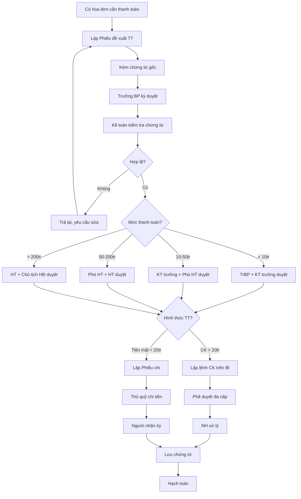

# SOP-05.1: QUY TRÌNH THANH TOÁN

## 1. THÔNG TIN | Mã: SOP-05.1 | Tần suất: Liên tục

## 2. MỤC ĐÍCH
Thanh toán đúng, đủ, kịp thời, có kiểm soát chặt chẽ

## 3. HÌNH THỨC THANH TOÁN

| **Hình thức** | **Áp dụng** | **Ưu điểm** |
|---|---|---|
| Chuyển khoản | Ưu tiên (>90%) | An toàn, có chứng từ, dễ kiểm soát |
| Tiền mặt | < 20 triệu | Nhanh, linh hoạt (nhưng rủi ro) |
| Séc | Ít dùng | An toàn nhưng chậm |

## 4. QUY TRÌNH

### 4.1. Đề xuất thanh toán

**Bước 1: Người đề nghị lập Phiếu đề xuất thanh toán (QT03-F19)**

Kèm theo chứng từ gốc:
- Hóa đơn GTGT (hợp lệ)
- Hợp đồng (nếu có)
- Biên bản nghiệm thu (nếu mua hàng)
- Biên bản thanh lý (nếu thanh lý HĐ)

**Bước 2: Trưởng BP ký duyệt**

### 4.2. Kiểm tra chứng từ

**Bước 3: Kế toán kiểm tra (QT03-CL01 - Checklist)**

| **Kiểm tra** | **Chi tiết** |
|---|---|---|
| Hóa đơn hợp lệ? | Đúng mẫu, đủ chữ ký, dấu, không tẩy xóa |
| Tên đơn vị đúng? | Đúng tên, MST của trường |
| Số tiền khớp? | Phiếu đề xuất = Hóa đơn = HĐ (nếu có) |
| Còn ngân sách? | Check hệ thống |
| Đúng mục đích? | Chi theo đúng HĐ, kế hoạch |

**Nếu SAI:** Trả lại, yêu cầu sửa/bổ sung

**Bước 4: Kế toán ký xác nhận chứng từ hợp lệ**

### 4.3. Phê duyệt thanh toán

**Bước 5: Phân cấp phê duyệt**

| **Mức thanh toán** | **Người duyệt 1** | **Người duyệt 2** | **Người duyệt 3** |
|---|---|---|---|
| < 10 triệu | Trưởng BP | Kế toán trưởng | - |
| 10-50 triệu | Kế toán trưởng | Phó HT | - |
| 50-200 triệu | Phó HT | Hiệu trưởng | - |
| > 200 triệu | Hiệu trưởng | Chủ tịch HĐ | - |

**Bước 6: Ký duyệt trên chứng từ**

### 4.4. Thanh toán

**PHƯƠNG ÁN A: Chuyển khoản (> 20 triệu)**

**Bước 7a: Kế toán lập lệnh chuyển khoản**
- Trên Internet Banking
- Điền: Tên người nhận, STK, Số tiền, Nội dung

**Bước 8a: Phê duyệt chuyển khoản**
- Người tạo lệnh (Token 1)
- Người duyệt (Token 2, 3...)

**PHƯƠNG ÁN B: Tiền mặt (< 20 triệu)**

**Bước 7b: Lập Phiếu chi (QT03-F20)**

**Bước 8b: Thủ quỹ chi tiền**
- Người nhận ký, ghi rõ họ tên, CMND
- Đếm tiền trước mặt

**Bước 9: Lưu chứng từ**
- Hóa đơn + Phiếu đề xuất + Phiếu chi/Lệnh CK
- Lưu 10 năm

**Bước 10: Hạch toán kế toán**

## 5. LƯU ĐỒ

## 6. BIỂU MẪU
- QT03-F19: Phiếu đề xuất thanh toán
- QT03-F20: Phiếu chi tiền mặt
- QT03-CL01: Checklist kiểm tra chứng từ

## 7. TIÊU CHUẨN
| Chỉ tiêu | Mục tiêu |
|---|---|
| Thanh toán trong thời hạn cam kết | ≥ 95% |
| Sai sót (sai TK, sai số tiền) | 0% |
| Chứng từ hợp lệ | 100% |

## 8. TRÁCH NHIỆM
- **Người đề xuất**: Cung cấp chứng từ đầy đủ, hợp lệ
- **Kế toán**: Kiểm tra, hạch toán
- **Người phê duyệt**: Kiểm soát chi tiêu
- **Thủ quỹ**: Chi tiền mặt an toàn

## 9. LƯU Ý
- ⚠️ **Không chi không có chứng từ**: Chứng từ không hợp lệ = Không thanh toán
- ✅ **Phân cấp rõ ràng**: Tránh chi tràn lan
- ✅ **Hạn chế tiền mặt**: Ưu tiên chuyển khoản

## 10. FAQ

**Q: Thanh toán trước hay sau khi nhận hàng?**  
A: Tùy HĐ. Thường: Trả sau khi nghiệm thu. Một số TH trả trước 30-50%, còn lại sau nghiệm thu.

---
**PHÊ DUYỆT** | KT trưởng | Phó HT |
