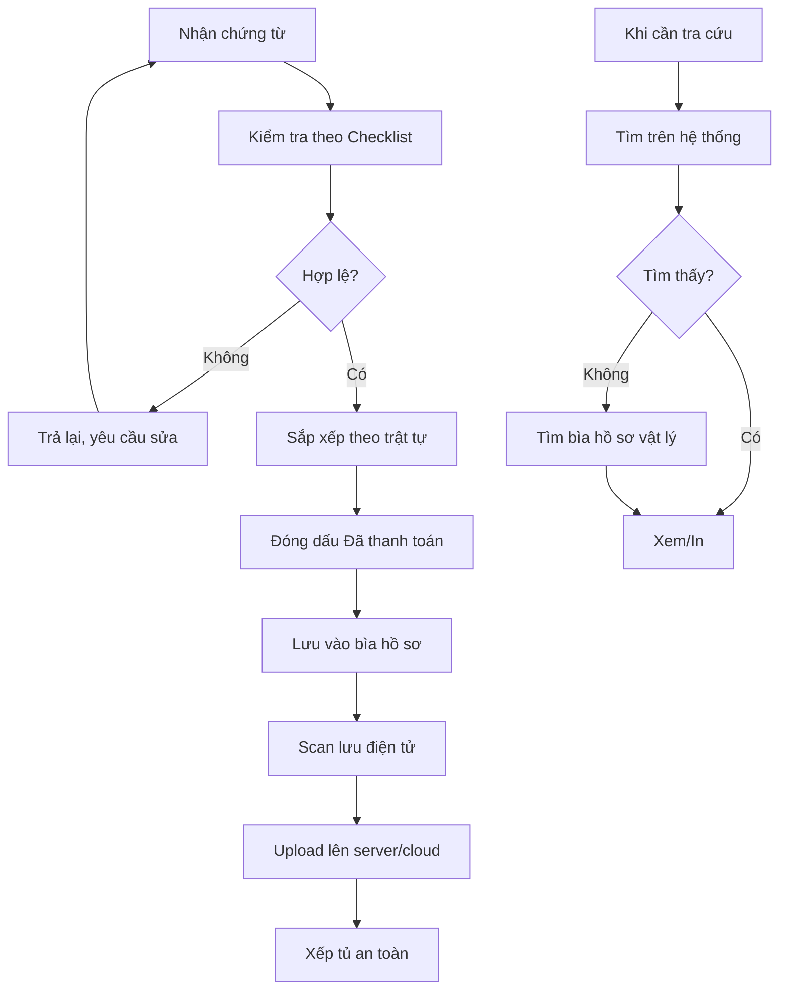

# SOP-05.2: QUẢN LÝ CHỨNG TỪ THANH TOÁN

## 1. THÔNG TIN | Mã: SOP-05.2 | Tần suất: Liên tục

## 2. MỤC ĐÍCH
Đảm bảo chứng từ hợp lệ, đầy đủ, lưu trữ an toàn

## 3. CHỨNG TỪ HỢP LỆ

### 3.1. Hóa đơn GTGT hợp lệ

| **Yếu tố** | **Yêu cầu** |
|---|---|
| Mẫu | Đúng mẫu Bộ Tài chính, có ký hiệu |
| Tên đơn vị mua | Đúng tên trường, MST |
| Ngày | Trong năm tài chính |
| Chữ ký, dấu | Đủ 2 yếu tố |
| Nội dung | Rõ ràng, cụ thể |
| Số tiền | Bằng số và bằng chữ khớp nhau |

**Lỗi thường gặp:**
- Không có dấu
- Sai tên, sai MST
- Tẩy xóa
- Hóa đơn photo, không có gốc

### 3.2. Chứng từ khác

- Phiếu thu, phiếu chi
- Biên bản (Nghiệm thu, Thanh lý, Hỏng hóc...)
- Hợp đồng
- Giấy ủy quyền (nếu người khác nhận tiền thay)

## 4. QUY TRÌNH

### 4.1. Tiếp nhận chứng từ

**Bước 1: Kiểm tra sơ bộ**
Dùng Checklist (QT03-CL01):
- [ ] Hóa đơn gốc (không photo)
- [ ] Tên, MST đúng
- [ ] Có chữ ký, dấu
- [ ] Số tiền rõ ràng
- [ ] Đủ chứng từ kèm theo

**Bước 2: Yêu cầu sửa nếu sai**

### 4.2. Lưu trữ

**Bước 3: Sắp xếp theo trật tự**
- Theo số chứng từ (Phiếu chi 001, 002...)
- Theo thời gian
- Theo loại (Mua hàng, Lương, Dịch vụ...)

**Bước 4: Đóng dấu "Đã thanh toán"**
- Tránh thanh toán 2 lần

**Bước 5: Lưu vào bìa, hộp**
- Ghi rõ: Tháng, năm, loại chứng từ
- Xếp tủ theo thứ tự

**Bước 6: Scan lưu điện tử**
- Backup trên server, cloud
- Dễ tra cứu, tránh mất

### 4.3. Tra cứu

**Bước 7: Khi cần tra cứu**
- Tìm trong hệ thống (nhanh)
- Hoặc tìm bìa hồ sơ (chậm hơn)

## 5. LƯU ĐỒ

## 6. BIỂU MẪU
- QT03-CL01: Checklist kiểm tra chứng từ
- QT03-S02: Sổ theo dõi chứng từ

## 7. TIÊU CHUẨN
| Chỉ tiêu | Mục tiêu |
|---|---|
| Chứng từ hợp lệ | 100% |
| Lưu trữ đầy đủ | 100% |
| Tìm được chứng từ khi cần | ≤ 5 phút |

## 8. TRÁCH NHIỆM
- **Kế toán**: Kiểm tra, lưu trữ
- **Thủ quỹ**: Lưu phiếu chi tiền mặt
- **IT**: Hỗ trợ scan, backup

## 9. LƯU Ý
- ⚠️ **Không nhận hóa đơn photo**: Không hợp lệ
- ✅ **Scan định kỳ**: Đừng để tồn đọng
- ✅ **Backup thường xuyên**: Tránh mất dữ liệu

## 10. FAQ

**Q: Hóa đơn bị rách, nhòe?**  
A: Liên hệ NCC xin bản sao (đóng dấu "Bản sao từ sổ gốc"). Hoặc dùng bản điện tử (nếu có).

---
**PHÊ DUYỆT** | KT trưởng | Phó HT |
