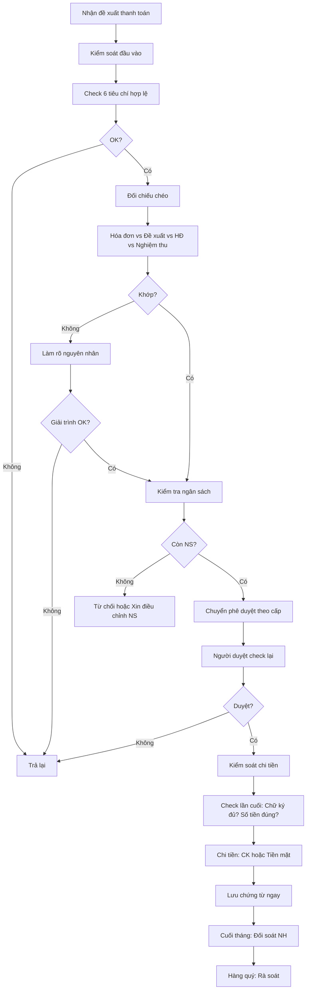

# SOP-05.3: KIỂM SOÁT THANH TOÁN

## 1. THÔNG TIN | Mã: SOP-05.3 | Tần suất: Mỗi lần thanh toán

## 2. MỤC ĐÍCH
Phòng ngừa gian lận, sai sót, thanh toán sai, chi không đúng mục đích

## 3. NGUYÊN TẮC KIỂM SOÁT

| **Nguyên tắc** | **Ý nghĩa** |
|---|---|
| **Phân công, phân nhiệm** | Người đề xuất ≠ Người kiểm tra ≠ Người chi tiền |
| **Phê duyệt đa cấp** | Thanh toán lớn phải qua nhiều người duyệt |
| **Chứng từ đầy đủ** | Không có chứng từ = Không thanh toán |
| **Đối chiếu** | Đối chiếu giữa: Đề xuất - Hóa đơn - HĐ - Nghiệm thu |
| **Hạn mức** | Mỗi người có hạn mức phê duyệt |

## 4. QUY TRÌNH KIỂM SOÁT

### 4.1. Kiểm soát đầu vào

**Bước 1: Check chứng từ (6 tiêu chí)**

1. **Hợp pháp**: Hóa đơn đúng mẫu, dấu, chữ ký
2. **Hợp lý**: Giá cả, số lượng hợp lý (so với thị trường)
3. **Hợp lệ**: Đúng tên, MST trường
4. **Đầy đủ**: Không thiếu chứng từ
5. **Hợp đồng**: Đúng theo HĐ (nếu có)
6. **Ngân sách**: Còn đủ NS

**Bước 2: Đối chiếu chéo**

| **Kiểm tra** | **So sánh** |
|---|---|
| Hóa đơn vs Phiếu đề xuất | Số tiền khớp? |
| Hóa đơn vs Hợp đồng | Đúng NCC, đúng đơn giá? |
| Hóa đơn vs Biên bản nghiệm thu | Số lượng, chất lượng OK? |
| Tổng thanh toán vs Ngân sách | Vượt NS không? |

**Nếu KHÔNG KHỚP:** Dừng lại, làm rõ

### 4.2. Kiểm soát phê duyệt

**Bước 3: Phê duyệt theo thẩm quyền**
- Đúng người, đúng cấp
- Ký đầy đủ (không thiếu chữ ký)

**Bước 4: Lưu log phê duyệt**
- Ai duyệt, khi nào (nếu dùng hệ thống)

### 4.3. Kiểm soát chi tiền

**Bước 5: Kiểm tra lần cuối trước khi chi**

Thủ quỹ/Kế toán chi kiểm tra:
- Đã đủ chữ ký duyệt chưa?
- Số tiền có đúng không?
- Người nhận có đúng không? (CMND)

**Bước 6: Chi tiền**

**Bước 7: Lưu chứng từ ngay**
- Không để rời rạc

### 4.4. Kiểm soát sau thanh toán

**Bước 8: Đối soát ngân hàng (Cuối tháng)**
- Sổ kế toán vs Sao kê NH
- Tìm chênh lệch (nếu có)

**Bước 9: Rà soát định kỳ (Hàng quý)**
- Kiểm tra mẫu các chứng từ
- Phát hiện bất thường
- Đề xuất cải tiến

## 5. LƯU ĐỒ

## 6. BIỂU MẪU
- QT03-CL02: Checklist kiểm soát thanh toán
- QT03-S03: Sổ đối chiếu ngân hàng

## 7. TIÊU CHUẨN
| Chỉ tiêu | Mục tiêu |
|---|---|
| Phát hiện chứng từ không hợp lệ | 100% |
| Phát hiện gian lận | 100% |
| Đối soát khớp | 100% |

## 8. TRÁCH NHIỆM
- **Kế toán**: Kiểm soát chứng từ
- **Người phê duyệt**: Kiểm soát chi tiêu
- **Thủ quỹ**: Kiểm soát chi tiền

## 9. LƯU Ý
- ⚠️ **Tách biệt nhiệm vụ**: 1 người không làm cả 3 bước (đề xuất - duyệt - chi)
- ✅ **Nghi ngờ thì dừng**: Thà chậm còn hơn sai
- ✅ **Báo cáo bất thường**: Ngay lập tức báo cáo KT trưởng, BGH

## 10. FAQ

**Q: Nếu phát hiện gian lận?**  
A: Báo ngay BGH, điều tra, xử lý kỷ luật, truy thu tiền, báo công an nếu nghiêm trọng.

---
**PHÊ DUYỆT** | KT trưởng | Phó HT |
