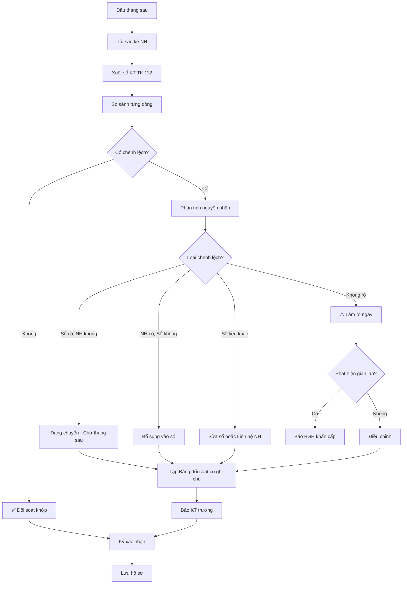

# SOP-05.4: ĐỐI SOÁT NGÂN HÀNG

## 1. THÔNG TIN | Mã: SOP-05.4 | Tần suất: Hàng tháng

## 2. MỤC ĐÍCH
Đảm bảo sổ sách khớp với ngân hàng, phát hiện sai sót, gian lận

## 3. QUY TRÌNH

### 3.1. Chuẩn bị (Đầu tháng sau)

**Bước 1: Tải sao kê ngân hàng**
- Đăng nhập Internet Banking
- Tải sao kê tháng (File Excel hoặc PDF)
- Hoặc nhận tại quầy NH

**Bước 2: Xuất sổ kế toán TK 112 (Tiền gửi NH)**
- Từ phần mềm kế toán
- File Excel

### 3.2. Đối soát

**Bước 3: So sánh từng dòng**

| **Ngày** | **Nội dung** | **Sổ KT** | **Sao kê NH** | **Chênh lệch** |
|---|---|---|---|---|
| 05/01 | Thu học phí HS A | 30,000,000 | 30,000,000 | 0 |
| 05/01 | Chi lương tháng 12 | -24,307,500 | -24,307,500 | 0 |
| 10/01 | Thu học phí HS B | 30,000,000 | - | **+30,000,000** ← Chưa vào TK |

**Bước 4: Phân tích chênh lệch**

**Nguyên nhân thường gặp:**

| **Loại chênh lệch** | **Nguyên nhân** | **Xử lý** |
|---|---|---|
| **Sổ có, NH không** | Séc/CK chưa về NH, Ghi nhận trước | Ghi nhận "Đang chuyển", tháng sau sẽ khớp |
| **NH có, Sổ không** | Quên ghi sổ, NH trừ phí tự động | Bổ sung vào sổ ngay |
| **Số tiền khác nhau** | Ghi sai số | Sửa sổ hoặc Xác nhận lại với NH |
| **Không rõ nguồn gốc** | Thu/Chi lạ | Làm rõ ngay, nghi ngờ gian lận |

**Bước 5: Lập Bảng đối soát (QT03-B07)**

### 3.3. Xử lý và báo cáo

**Bước 6: Điều chỉnh sổ sách (nếu sai ở sổ)**

**Bước 7: Liên hệ NH (nếu sai ở NH) - Rất hiếm**

**Bước 8: Báo cáo KT trưởng**
- Nếu đối soát khớp → OK
- Nếu có chênh lệch → Giải trình

**Bước 9: Ký xác nhận đối soát**
- Kế toán + KT trưởng ký

**Bước 10: Lưu hồ sơ**
- Bảng đối soát
- Sao kê NH
- Sổ KT

## 5. LƯU ĐỒ

## 6. BIỂU MẪU
- QT03-B07: Bảng đối soát ngân hàng
- QT03-R11: Báo cáo đối soát tháng

## 7. TIÊU CHUẨN
| Chỉ tiêu | Mục tiêu |
|---|---|
| Hoàn thành đối soát | ≤ 10 ngày/tháng |
| Tỷ lệ khớp | ≥ 95% |
| Giải trình chênh lệch | 100% |

## 8. TRÁCH NHIỆM
- **Kế toán NH**: Đối soát hàng tháng
- **KT trưởng**: Kiểm tra, ký xác nhận

## 9. LƯU Ý
- ⚠️ **Không bỏ qua chênh lệch nhỏ**: Tích lũy thành lớn
- ✅ **Làm sớm**: Đầu tháng làm ngay, đừng để cuối tháng
- ✅ **Đối soát cả nhiều TK**: Nếu trường có nhiều TK

## 10. FAQ

**Q: Nếu chênh lệch không giải trình được?**  
A: Báo BGH, kiểm tra toàn bộ chứng từ tháng đó. Nếu cần, mời kiểm toán độc lập.

---
**PHÊ DUYỆT** | Kế toán NH | KT trưởng |

---

✅ **HOÀN THÀNH SOP-05: THANH TOÁN (4 files)!**
