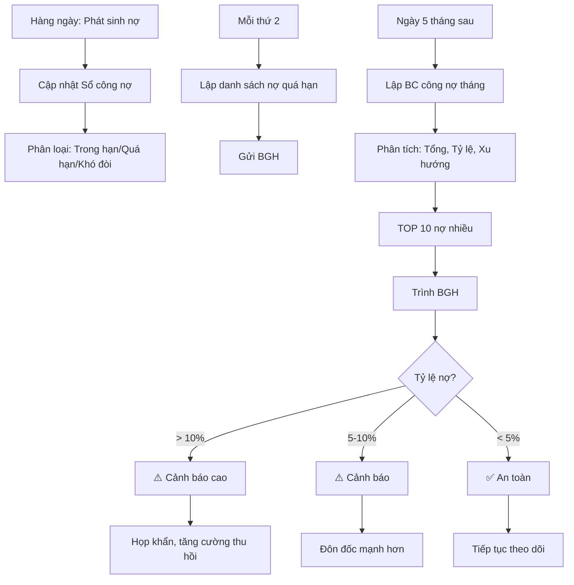

# SOP-06.1: THEO DÕI CÔNG NỢ PHẢI THU

## 1. THÔNG TIN | Mã: SOP-06.1 | Tần suất: Hàng ngày

## 2. MỤC ĐÍCH
Quản lý chặt nợ học phí, nợ khác, đôn đốc thu hồi kịp thời

## 3. PHÂN LOẠI NỢ PHẢI THU

| **Loại nợ** | **Nguồn** | **Tỷ trọng** |
|---|---|---|
| Nợ học phí | Phụ huynh chưa đóng đủ | 90-95% |
| Nợ khác | Cho vay tạm ứng NV, ứng công tác... | 5-10% |

## 4. QUY TRÌNH

### 4.1. Ghi nhận và cập nhật

**Bước 1: Hàng ngày - Cập nhật vào Sổ công nợ (QT03-S04)**

Mỗi khi phát sinh:

| **Ngày** | **Khách hàng** | **Nội dung** | **Phát sinh nợ** | **Thu tiền** | **Còn nợ** |
|---|---|---|---|---|---|
| 01/09 | PH Nguyễn Văn A | Học phí T9 | 30,000,000 | 0 | 30,000,000 |
| 05/09 | PH Nguyễn Văn A | Đóng học phí T9 | 0 | 30,000,000 | 0 |

**Bước 2: Phân loại theo thời gian**

| **Loại** | **Thời gian nợ** | **Hành động** |
|---|---|---|
| Nợ trong hạn | < 30 ngày | Theo dõi bình thường |
| Nợ quá hạn | 30-90 ngày | Đôn đốc |
| Nợ khó đòi | > 90 ngày | Xử lý đặc biệt |

### 4.2. Báo cáo

**Bước 3: Báo cáo tuần (Mỗi thứ 2)**

Danh sách nợ quá hạn → BGH

**Bước 4: Báo cáo tháng (Ngày 5)**

| **STT** | **Khách hàng** | **Tổng nợ** | **Trong hạn** | **Quá hạn** | **Khó đòi** | **Ghi chú** |
|---|---|---|---|---|---|---|
| 1 | PH Trần Văn B | 90 triệu | 30 triệu | 60 triệu | 0 | Nợ 2 tháng |

**Bước 5: Phân tích**
- Tổng nợ phải thu
- Tỷ lệ nợ / Doanh thu
- Xu hướng tăng/giảm
- TOP 10 nợ nhiều nhất

### 4.3. Đôn đốc thu hồi

**Bước 6: Xử lý theo mức độ**

- **Trong hạn**: Nhắc nhở nhẹ nhàng
- **Quá hạn**: Đôn đốc mạnh → SOP-01.4
- **Khó đòi**: Xử lý đặc biệt → SOP-06.4

## 5. LƯU ĐỒ

## 6. BIỂU MẪU
- QT03-S04: Sổ theo dõi công nợ phải thu
- QT03-R12: Báo cáo công nợ phải thu tháng

## 7. TIÊU CHUẨN
| Chỉ tiêu | Mục tiêu |
|---|---|
| Tỷ lệ nợ / Doanh thu | ≤ 5% |
| Nợ quá hạn > 90 ngày | < 1% |
| Cập nhật sổ đúng ngày | 100% |

## 8. TRÁCH NHIỆM
- **Kế toán thu**: Cập nhật sổ, đôn đốc, báo cáo
- **KT trưởng**: Phân tích, đề xuất xử lý
- **BGH**: Quyết định xử lý nợ khó

## 9. LƯU Ý
- ⚠️ **Cập nhật NGAY**: Đừng để tồn đọng
- ✅ **Phân loại rõ**: Dễ theo dõi, ưu tiên
- ✅ **Đôn đốc sớm**: Nợ càng lâu càng khó đòi

## 10. FAQ

**Q: Tỷ lệ nợ bao nhiêu là an toàn?**  
A: < 5% là tốt. 5-10% là chấp nhận được. > 10% là nguy hiểm.

---
**PHÊ DUYỆT** | Kế toán thu | KT trưởng |
