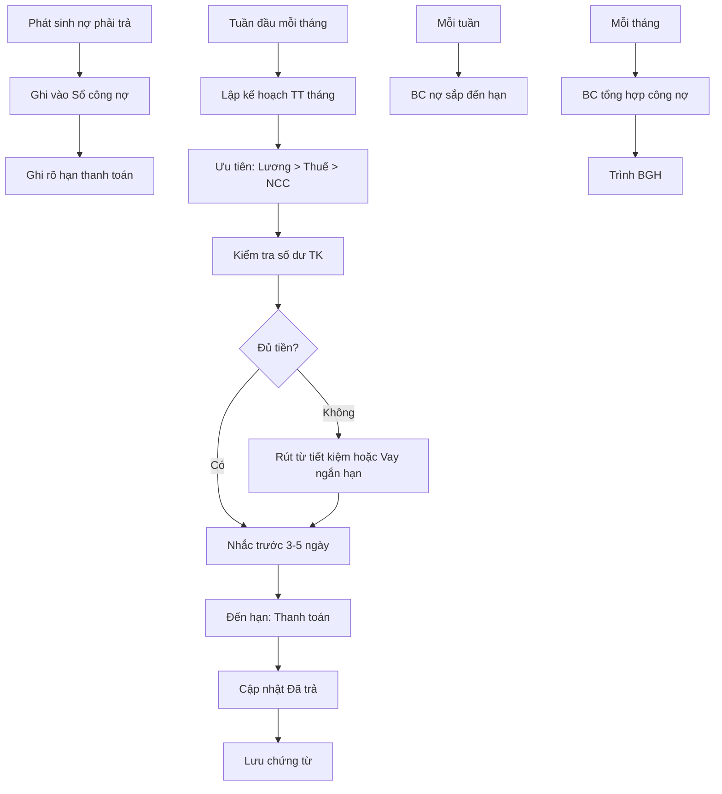

# SOP-06.2: THEO DÕI CÔNG NỢ PHẢI TRẢ

## 1. THÔNG TIN | Mã: SOP-06.2 | Tần suất: Hàng ngày

## 2. MỤC ĐÍCH
Quản lý nợ cần trả, thanh toán đúng hạn, duy trì uy tín với NCC

## 3. PHÂN LOẠI NỢ PHẢI TRẢ

| **Loại nợ** | **Nguồn** | **Tỷ trọng** |
|---|---|---|
| Nợ NCC | Mua hàng, dịch vụ chưa trả | 40-50% |
| Nợ lương | Chưa đến kỳ trả (ngày 5) | 30-40% |
| Nợ thuế | GTGT, TNDN, TNCN chưa nộp | 10-15% |
| Nợ khác | Vay ngân hàng, cá nhân... | 5-10% |

## 4. QUY TRÌNH

### 4.1. Ghi nhận

**Bước 1: Khi phát sinh nợ**
- Mua hàng có hóa đơn → Ghi nợ
- Nghiệm thu OK → Xác nhận nợ
- Thanh toán → Giảm nợ

**Bước 2: Cập nhật Sổ công nợ phải trả (QT03-S05)**

| **Ngày** | **NCC** | **Hóa đơn số** | **Nội dung** | **Phát sinh nợ** | **Đã trả** | **Còn nợ** | **Hạn trả** |
|---|---|---|---|---|---|---|---|
| 10/09 | Công ty A | HD001 | Mua bàn ghế | 150,000,000 | 0 | 150,000,000 | 10/10 |

### 4.2. Lập kế hoạch thanh toán

**Bước 3: Xếp lịch ưu tiên (Tuần 1 mỗi tháng)**

| **Ưu tiên** | **Loại nợ** | **Lý do** |
|---|---|---|
| **1 - Cao nhất** | Lương, BHXH | Ảnh hưởng NV, phạt nếu chậm |
| **2 - Cao** | Thuế | Phạt 0.05%/ngày |
| **3 - Trung bình** | NCC đến hạn | Giữ uy tín |
| **4 - Thấp** | NCC còn hạn | Trả đúng lịch |

**Bước 4: Lập Kế hoạch thanh toán tháng (QT03-P02)**

| **Ngày dự kiến** | **Nội dung** | **Số tiền** | **Hình thức** |
|---|---|---|---|
| 05/10 | Lương tháng 9 | 2,500 triệu | CK |
| 10/10 | Thanh toán Công ty A | 150 triệu | CK |
| 20/10 | Nộp thuế GTGT T9 | 300 triệu | CK |

### 4.3. Nhắc nhở và thanh toán

**Bước 5: Nhắc trước 3-5 ngày**
- Nhắc người phê duyệt chuẩn bị
- Kiểm tra tiền trong TK đủ chưa

**Bước 6: Thanh toán đúng hạn**

**Bước 7: Cập nhật "Đã trả" trong Sổ**

### 4.4. Báo cáo

**Bước 8: Báo cáo tuần**
- Danh sách sắp đến hạn tuần sau

**Bước 9: Báo cáo tháng (QT03-R13)**

| **Chỉ tiêu** | **Số liệu** |
|---|---|
| Tổng nợ phải trả đầu tháng | X triệu |
| Phát sinh nợ mới | +Y triệu |
| Đã trả trong tháng | -Z triệu |
| Tổng nợ cuối tháng | A triệu |
| Nợ quá hạn | B triệu |

## 5. LƯU ĐỒ

## 6. BIỂU MẪU
- QT03-S05: Sổ công nợ phải trả
- QT03-P02: Kế hoạch thanh toán tháng
- QT03-R13: Báo cáo công nợ phải trả

## 7. TIÊU CHUẨN
| Chỉ tiêu | Mục tiêu |
|---|---|
| Thanh toán đúng hạn | ≥ 95% |
| Nợ quá hạn | < 5% |
| Không bị phạt chậm | 100% |

## 8. TRÁCH NHIỆM
- **Kế toán chi**: Theo dõi, nhắc nhở, thanh toán
- **KT trưởng**: Lập kế hoạch, phê duyệt
- **BGH**: Quyết định ưu tiên khi thiếu tiền

## 9. LƯU Ý
- ⚠️ **Ưu tiên lương, thuế**: Chậm = Phạt + Mất lòng tin
- ✅ **Thanh toán NCC đúng hạn**: Giữ quan hệ tốt, được ưu đãi lần sau
- ✅ **Thương lượng nếu khó**: Xin trả chậm có lý do > Nợ quá hạn không báo

## 10. FAQ

**Q: Nếu thiếu tiền, ưu tiên trả gì trước?**  
A: 1. Lương NV, 2. Thuế, 3. BHXH, 4. NCC quan trọng, 5. NCC khác.

---
**PHÊ DUYỆT** | Kế toán chi | KT trưởng |
