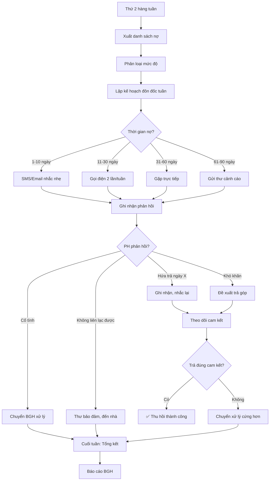

# SOP-06.3: THU HỒI CÔNG NỢ

## 1. THÔNG TIN | Mã: SOP-06.3 | Tần suất: Hàng tuần

## 2. MỤC ĐÍCH
Thu hồi nợ kịp thời, giảm rủi ro tài chính

## 3. CHIẾN LƯỢC THU HỒI

| **Thời gian nợ** | **Phương pháp** | **Tần suất liên hệ** |
|---|---|---|
| 1-10 ngày | Nhắc nhẹ nhàng (SMS/Email) | 1 lần |
| 11-30 ngày | Gọi điện nhắc nhở | 2 lần/tuần |
| 31-60 ngày | Gặp trực tiếp, ký cam kết | 1 lần |
| 61-90 ngày | Thư cảnh cáo | 1 lần |
| > 90 ngày | Xử lý pháp lý | Chuyển SOP-06.4 |

## 4. QUY TRÌNH

### 4.1. Rà soát hàng tuần

**Bước 1: Mỗi thứ 2 - Xuất danh sách nợ**

**Bước 2: Phân loại theo mức độ**

**Bước 3: Lập kế hoạch đôn đốc tuần**

| **Thứ 2** | **Thứ 3** | **Thứ 4** | **Thứ 5** | **Thứ 6** |
|---|---|---|---|---|
| Gọi TOP 5 nợ lớn | Gọi nợ 31-60 ngày | Gửi SMS nhắc nhở | Gặp PH nợ lâu | Tổng kết tuần |

### 4.2. Thực hiện đôn đốc

**Bước 4: Liên hệ theo kế hoạch**

**Script gọi điện:**
```
"Chào anh/chị [Tên PH],

Em là [Tên] - Phòng Kế toán [Tên trường].

Em gọi nhắc nhở về học phí tháng [X] của con [Tên HS], hạn đóng là ngày [Y].

Anh/chị có gặp khó khăn gì không ạ?

[Lắng nghe]

Nếu khó khăn, anh chị có thể đề nghị xin trả góp hoặc xét miễn giảm.

Anh/chị dự kiến đóng được khi nào ạ?"
```

**Bước 5: Ghi nhận kết quả**

| **Phản hồi** | **Hành động** |
|---|---|---|
| Hứa trả ngày X | Ghi nhận, nhắc lại ngày X-1 |
| Khó khăn thật | Đề xuất phương án hỗ trợ (trả góp, miễn giảm...) |
| Cố tình trì hoãn | Chuyển lên cấp cao hơn xử lý |
| Không liên lạc được | Gửi thư bảo đảm, đến tận nhà |

### 4.3. Báo cáo

**Bước 6: Báo cáo tuần**
- Đã liên hệ ai
- Kết quả ra sao
- Dự kiến thu được bao nhiêu

**Bước 7: Tổng hợp tháng**

## 5. LƯU ĐỒ



## 6. BIỂU MẪU
- QT03-F21: Nhật ký đôn đốc nợ
- QT03-R14: Báo cáo thu hồi nợ tuần

## 7. TIÊU CHUẨN
| Chỉ tiêu | Mục tiêu |
|---|---|
| Tỷ lệ thu hồi nợ < 30 ngày | ≥ 90% |
| Tỷ lệ thu hồi nợ 30-90 ngày | ≥ 70% |
| Liên hệ đúng kế hoạch | 100% |

## 8. TRÁCH NHIỆM
- **Kế toán thu**: Đôn đốc, liên hệ, báo cáo
- **GVCN**: Hỗ trợ liên lạc PH (nếu cần)
- **BGH**: Xử lý nợ cứng đầu

## 9. LƯU Ý
- ⚠️ **Thái độ**: Kiên quyết nhưng tôn trọng
- ✅ **Linh hoạt**: Nếu khó khăn thật, hỗ trợ hợp lý
- ✅ **Ghi chép**: Mọi cuộc gọi, cam kết đều ghi nhận

## 10. FAQ

**Q: Đôn đốc mãi không trả?**  
A: Chuyển SOP-06.4 (Xử lý nợ khó đòi) - Cho nghỉ học, khởi kiện.

---
**PHÊ DUYỆT** | Kế toán thu | KT trưởng |
