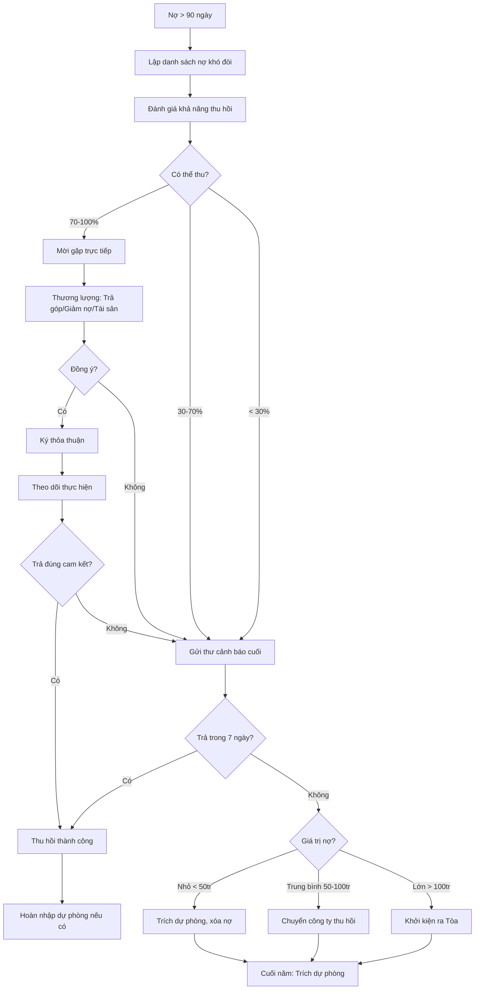

# SOP-06.4: XỬ LÝ CÔNG NỢ KHÓ ĐÒI

## 1. THÔNG TIN | Mã: SOP-06.4 | Tần suất: Hàng quý

## 2. MỤC ĐÍCH
Xử lý nợ > 90 ngày, thu hồi tối đa, giảm thiểu tổn thất

## 3. ĐỊNH NGHĨA NỢ KHÓ ĐÒI

Nợ có ít nhất 1 trong các đặc điểm:
- Quá hạn > 90 ngày
- Liên hệ không được
- Khách hàng từ chối trả
- Khách hàng mất khả năng thanh toán

## 4. QUY TRÌNH XỬ LÝ

### 4.1. Rà soát và phân loại (Cuối mỗi quý)

**Bước 1: Lập danh sách nợ khó đòi**

| **Khách hàng** | **Tổng nợ** | **Thời gian** | **Nguyên nhân** | **Phương án** |
|---|---|---|---|---|
| PH Nguyễn Văn A | 90 triệu | 120 ngày | Mất việc, không trả được | Trả góp dài hạn |
| PH Trần Thị B | 60 triệu | 150 ngày | Bỏ trốn, không liên lạc được | Khởi kiện |

**Bước 2: Đánh giá khả năng thu hồi**

| **Mức độ** | **Khả năng** | **Hành động** |
|---|---|---|
| Có thể thu hồi | 70-100% | Thương lượng, trả góp |
| Khó thu hồi | 30-70% | Giảm nợ một phần để thu nhanh |
| Không thể | < 30% | Xóa nợ, trích lập dự phòng |

### 4.2. Thương lượng

**Bước 3: Mời khách hàng gặp trực tiếp**

**Phương án thương lượng:**

| **Phương án** | **Điều kiện** |
|---|---|
| **Trả góp dài hạn** | Chia nhỏ, trả 6-12 tháng, không lãi |
| **Giảm nợ** | Trả 80% ngay → Giảm 20% |
| **Dùng tài sản đảm bảo** | Cầm cố tài sản cho đến khi trả hết |

**Bước 4: Ký thỏa thuận (nếu đồng ý)**

### 4.3. Xử lý cứng

**Bước 5: Gửi thư cảnh báo lần cuối (QT03-F22)**

Nội dung:
- Tổng nợ
- Hạn cuối thanh toán (7 ngày)
- Hậu quả: Chuyển pháp lý

**Bước 6: Nếu không trả → Quyết định xử lý**

**PHƯƠNG ÁN 1: Cho nghỉ học (Nợ học phí)**
- HS nghỉ đến khi PH trả
- Giữ học bạ (trong quá trình học, không giữ bằng tốt nghiệp)

**PHƯƠNG ÁN 2: Chuyển công ty thu hồi nợ**
- Ký hợp đồng với công ty chuyên thu hồi nợ
- Họ thu được → Hưởng % hoa hồng (20-30%)

**PHƯƠNG ÁN 3: Khởi kiện ra Tòa**
- Nợ > 100 triệu
- Làm đơn khởi kiện (QT03-F23)
- Nộp Tòa án, chờ xét xử

### 4.4. Trích lập dự phòng

**Bước 7: Cuối năm - Trích lập dự phòng nợ khó đòi**

| **Thời gian nợ** | **Tỷ lệ trích** |
|---|---|
| 1-6 tháng | 0% |
| 6-12 tháng | 30% |
| 1-2 năm | 50% |
| > 2 năm | 100% |

**Hạch toán:**
```
Nợ TK 642 (Chi phí dự phòng)
  Có TK 229 (Dự phòng nợ khó đòi)
```

**Bước 8: Nếu thu được → Hoàn nhập dự phòng**

## 5. LƯU ĐỒ



## 6. BIỂU MẪU
- QT03-F22: Thư cảnh báo nợ lần cuối
- QT03-F23: Đơn khởi kiện
- QT03-R15: Báo cáo xử lý nợ khó đòi quý

## 7. TIÊU CHUẨN
| Chỉ tiêu | Mục tiêu |
|---|---|
| Tỷ lệ thu hồi nợ 61-90 ngày | ≥ 50% |
| Tỷ lệ nợ khó đòi / Tổng doanh thu | < 1% |

## 8. TRÁCH NHIỆM
- **Kế toán**: Thương lượng, đôn đốc
- **KT trưởng**: Quyết định phương án xử lý
- **BGH**: Quyết định khởi kiện, xóa nợ
- **Luật sư**: Tư vấn, khởi kiện

## 9. LƯU Ý
- ⚠️ **Không để kéo dài**: Nợ càng lâu càng khó đòi
- ✅ **Thương lượng trước**: Ưu tiên hòa giải > Khởi kiện
- ✅ **Trích dự phòng**: Để BCTC phản ánh đúng thực tế

## 10. FAQ

**Q: Khởi kiện ra Tòa, có đòi được tiền không?**  
A: Tùy. Nếu PH có tài sản → Tòa kê biên, bán đấu giá để trả nợ. Nếu không có gì → Khó đòi.

---
**PHÊ DUYỆT** | KT trưởng | Phó HT | HT |

---

✅ **HOÀN THÀNH SOP-06: QUẢN LÝ CÔNG NỢ (4 files)!**
