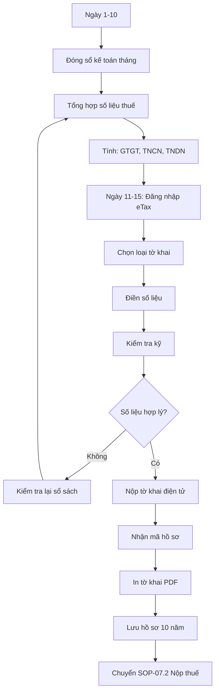

# SOP-07.1: KHAI BÁO THUẾ

## 1. THÔNG TIN | Mã: SOP-07.1 | Tần suất: Hàng tháng, Hàng quý

## 2. MỤC ĐÍCH
Khai báo đúng, đủ, đúng hạn các loại thuế

## 3. CÁC LOẠI THUẾ

| **Loại thuế** | **Đối tượng** | **Tần suất khai** | **Hạn nộp** |
|---|---|---|---|
| **Thuế GTGT** | Doanh thu dịch vụ giáo dục | Hàng tháng | Ngày 20 tháng sau |
| **Thuế TNCN** | Lương nhân viên | Hàng tháng | Ngày 20 tháng sau |
| **Thuế TNDN** | Lợi nhuận doanh nghiệp | Hàng quý | Ngày 30 tháng cuối quý |
| **Quyết toán thuế** | Tất cả | Hàng năm | 31/3 năm sau |

**Thuế suất:**
- GTGT: 10% (giáo dục)
- TNCN: Lũy tiến 5-35%
- TNDN: 20%

## 4. QUY TRÌNH

### 4.1. Chuẩn bị dữ liệu (Ngày 1-10)

**Bước 1: Đóng sổ kế toán tháng**
- Hạch toán hết các nghiệp vụ tháng trước
- Đối chiếu số liệu

**Bước 2: Tổng hợp số liệu thuế**

**THUẾ GTGT:**
- Doanh thu chịu thuế GTGT
- Thuế GTGT đầu ra = Doanh thu × 10%
- Thuế GTGT đầu vào = Tổng VAT trên hóa đơn mua vào
- Thuế phải nộp = Đầu ra - Đầu vào

**THUẾ TNCN:**
- Tổng thu nhập chịu thuế của tất cả NV
- Thuế TNCN đã khấu trừ từ lương

**THUẾ TNDN (Quý):**
- Doanh thu quý
- Tổng chi phí quý
- Lợi nhuận trước thuế = DT - CP
- Thuế TNDN = LN × 20%

### 4.2. Khai báo trên cổng (Ngày 11-15)

**Bước 3: Đăng nhập https://etax.gdt.gov.vn**
- Dùng Token/Sim thuế

**Bước 4: Khai tờ khai**

| **Loại thuế** | **Tờ khai** | **Nội dung** |
|---|---|---|
| GTGT | 01/GTGT | Doanh thu, VAT đầu vào/ra |
| TNCN | 05/KK-TNCN | Danh sách NV, lương, thuế |
| TNDN | 02/TNDN | Doanh thu, Chi phí, Lợi nhuận |

**Bước 5: Kiểm tra kỹ trước khi nộp**
- Số liệu có hợp lý không
- Có chênh lệch lớn so với tháng trước không

**Bước 6: Nộp tờ khai điện tử**
- Hệ thống sinh mã hồ sơ
- Lưu mã + PDF tờ khai

### 4.3. Lưu trữ

**Bước 7: In tờ khai đã nộp**

**Bước 8: Lưu hồ sơ**
- Tờ khai
- Bảng kê hóa đơn mua vào (GTGT)
- Bảng lương (TNCN)
- Lưu 10 năm

**Bước 9: Chuyển sang SOP-07.2 (Nộp thuế)**

## 5. LƯU ĐỒ

## 6. BIỂU MẪU
- QT03-T01: Tờ khai thuế GTGT
- QT03-T02: Tờ khai thuế TNCN
- QT03-T03: Tờ khai thuế TNDN

## 7. TIÊU CHUẨN
| Chỉ tiêu | Mục tiêu |
|---|---|
| Khai đúng hạn (trước ngày 20) | 100% |
| Sai sót trong tờ khai | 0% |
| Bị cưỡng chế thuế | 0% |

## 8. TRÁCH NHIỆM
- **Kế toán thuế**: Khai báo, nộp tờ khai
- **KT trưởng**: Kiểm tra, ký
- **Giám đốc/HT**: Ký tờ khai (nếu yêu cầu)

## 9. LƯU Ý
- ⚠️ **Khai đúng, đủ**: Khai thiếu = Trốn thuế
- ✅ **Lưu chứng từ**: Thuế kiểm tra phải cung cấp được
- ✅ **Tư vấn chuyên gia**: Nếu phức tạp

## 10. FAQ

**Q: Nếu khai sai, phát hiện sau?**  
A: Khai bổ sung ngay. Nếu tự phát hiện, nộp đơn điều chỉnh. Nếu thuế phát hiện → Bị phạt.

---
**PHÊ DUYỆT** | Kế toán thuế | KT trưởng | HT |
