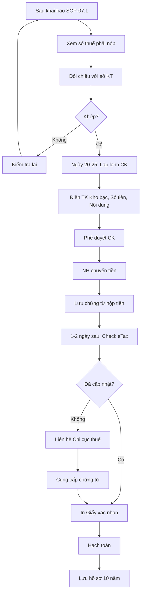

# SOP-07.2: NỘP THUẾ

## 1. THÔNG TIN | Mã: SOP-07.2 | Tần suất: Hàng tháng/quý

## 2. MỤC ĐÍCH
Nộp thuế đúng hạn, tránh phạt chậm nộp

## 3. HẠN NỘP

| **Loại thuế** | **Hạn khai** | **Hạn nộp** | **Phạt chậm** |
|---|---|---|---|
| GTGT tháng | Ngày 20/tháng sau | Ngày 25/tháng sau | 0.05%/ngày |
| TNCN tháng | Ngày 20/tháng sau | Ngày 25/tháng sau | 0.05%/ngày |
| TNDN quý | Ngày 30/tháng cuối quý | Ngày 30/tháng cuối quý | 0.05%/ngày |

## 4. QUY TRÌNH

### 4.1. Tính số thuế phải nộp

**Bước 1: Sau khi khai báo (SOP-07.1)**
- Hệ thống eTax tính tự động
- Số thuế phải nộp hiển thị rõ

**Bước 2: Đối chiếu với sổ sách**
- Kiểm tra khớp không

### 4.2. Nộp thuế

**Bước 3: Lập lệnh chuyển khoản (Trước ngày 25)**

Nộp qua:
- Internet Banking (Ưu tiên)
- Hoặc đến quầy NH
- Hoặc qua eTax (Liên kết TK)

**Bước 4: Điền thông tin**
- Tài khoản: TK thu thuế của Kho bạc
- Số tiền: Theo tờ khai
- Nội dung: "Nộp thuế [Loại] tháng [X] - MST [MST trường]"

**Bước 5: Chuyển tiền**

**Bước 6: Lưu chứng từ**
- Giấy nộp tiền
- Sao kê NH

### 4.3. Xác nhận

**Bước 7: Kiểm tra trên eTax (1-2 ngày sau)**
- Hệ thống đã cập nhật "Đã nộp" chưa

**Bước 8: Nếu chưa cập nhật**
- Liên hệ Chi cục thuế
- Cung cấp chứng từ chuyển khoản

**Bước 9: In Giấy xác nhận nộp thuế**

**Bước 10: Hạch toán**
```
Nợ TK 3331/3332/3334 (Thuế phải nộp)
  Có TK 112 (Tiền gửi NH)
```

## 5. LƯU ĐỒ



## 6. BIỂU MẪU
- QT03-T04: Giấy nộp tiền vào NSNN
- QT03-R16: Báo cáo nộp thuế tháng

## 7. TIÊU CHUẨN
| Chỉ tiêu | Mục tiêu |
|---|---|
| Nộp đúng hạn | 100% |
| Bị phạt chậm nộp | 0 lần/năm |

## 8. TRÁCH NHIỆM
- **Kế toán thuế**: Nộp thuế, theo dõi
- **KT trưởng**: Kiểm tra, phê duyệt CK

## 9. LƯU Ý
- ⚠️ **Nộp trước 1-2 ngày**: Tránh sự cố kỹ thuật ngày cuối
- ✅ **Chứng từ quan trọng**: Giấy nộp tiền = Bằng chứng đã nộp
- 🔥 **Ngày 25 rơi vào nghỉ**: Nộp trước ngày làm việc cuối

## 10. FAQ

**Q: Nếu không đủ tiền nộp thuế?**  
A: Vay ngắn hạn để nộp đúng hạn. Chậm = Phạt rất nặng + Ảnh hưởng uy tín.

**Q: Có thể xin hoãn nộp thuế không?**  
A: Có, nếu thiên tai, dịch bệnh. Phải làm đơn xin Cục thuế, chờ phê duyệt.

---
**PHÊ DUYỆT** | Kế toán thuế | KT trưởng | HT |
