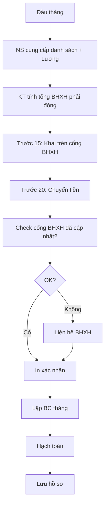

# SOP-07.3: QUẢN LÝ BẢO HIỂM XÃ HỘI

## 1. THÔNG TIN | Mã: SOP-07.3 | Tần suất: Hàng tháng

## 2. MỤC ĐÍCH
Đóng đầy đủ, đúng hạn BHXH cho nhân viên (Phối hợp với Phòng NS)

## 3. QUY ĐỊNH

| **Loại BH** | **Tỷ lệ DN** | **Tỷ lệ NV** | **Tổng** |
|---|---|---|---|
| BHXH | 17.5% | 8% | 25.5% |
| BHYT | 3% | 1.5% | 4.5% |
| BHTN | 1% | 1% | 2% |
| **Tổng** | **21.5%** | **10.5%** | **32%** |

**Mức đóng = Lương đóng BHXH × Tỷ lệ**

## 4. QUY TRÌNH (Chi tiết xem QT-02 SOP-05.2)

### 4.1. Hàng tháng

**Bước 1: Phòng NS cung cấp**
- Danh sách tăng/giảm BHXH
- Lương đóng BHXH của từng NV

**Bước 2: Kế toán tính tổng tiền phải đóng**

**Bước 3: Khai báo trên cổng BHXH (Trước ngày 15)**

**Bước 4: Nộp tiền (Trước ngày 20)**
- Chuyển khoản vào TK BHXH

### 4.2. Báo cáo

**Bước 5: Lập báo cáo BHXH tháng (QT03-R17)**

| **Chỉ tiêu** | **Số liệu** |
|---|---|
| Số NV tham gia BHXH | X người |
| Tổng lương đóng BHXH | Y triệu |
| BHXH DN phải đóng | Z triệu (21.5%) |
| BHXH NV đóng (trừ lương) | A triệu (10.5%) |
| Đã nộp ngày | [Ngày] |

## 5. LƯU ĐỒ

## 6. BIỂU MẪU
- QT03-R17: Báo cáo BHXH tháng

## 7. TIÊU CHUẨN
| Chỉ tiêu | Mục tiêu |
|---|---|
| Đóng đúng hạn | 100% |
| Sai sót | 0% |

## 8. TRÁCH NHIỆM
- **Phòng NS**: Cung cấp dữ liệu tăng/giảm, lương
- **Kế toán**: Khai báo, nộp tiền
- Xem chi tiết QT-02 SOP-05.2

## 9. LƯU Ý
- ⚠️ **Chậm nộp bị phạt**: 0.05%/ngày
- ✅ Phối hợp chặt với Phòng NS

## 10. FAQ
**Q: Ai chịu trách nhiệm chính?**  
A: Phòng NS chịu trách nhiệm chính. Phòng KT hỗ trợ khai báo, nộp tiền.

---
**PHÊ DUYỆT** | KT | NS | Phó HT |
