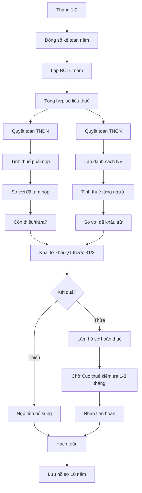

# SOP-07.4: QUYẾT TOÁN THUẾ

## 1. THÔNG TIN | Mã: SOP-07.4 | Tần suất: Hàng năm (Trước 31/3)

## 2. MỤC ĐÍCH
Quyết toán đầy đủ, chính xác các loại thuế đã nộp/còn thiếu trong năm

## 3. CÁC LOẠI QUYẾT TOÁN

| **Loại** | **Thời gian** | **Hạn nộp** |
|---|---|---|
| Quyết toán thuế TNDN | Năm tài chính | 31/3 năm sau |
| Quyết toán thuế TNCN | Năm tài chính | 31/3 năm sau |
| Quyết toán GTGT (nếu cần) | Năm tài chính | 31/3 năm sau |

## 4. QUY TRÌNH

### 4.1. Chuẩn bị (Tháng 1-2)

**Bước 1: Đóng sổ kế toán năm**
- Hạch toán hết các nghiệp vụ năm trước
- Kiểm tra, đối chiếu đầy đủ
- Lập BCTC năm (SOP-08.1)

**Bước 2: Tổng hợp số liệu thuế cả năm**

### 4.2. Quyết toán thuế TNDN

**Bước 3: Tính thuế TNDN phải nộp**

```
A. Tổng doanh thu năm: [X] tỷ
B. Tổng chi phí hợp lý, hợp lệ: [Y] tỷ
C. Lợi nhuận trước thuế: A - B = [Z] tỷ
D. Điều chỉnh tăng/giảm: [W] tỷ (Chi không hợp lý...)
E. Thu nhập tính thuế: C + D = [T] tỷ
F. Thuế TNDN phải nộp: E × 20% = [K] tỷ
G. Thuế đã tạm nộp (4 quý): [L] tỷ
H. Còn phải nộp / Nộp thừa: F - G
```

**Bước 4: Khai tờ khai quyết toán (03/TNDN)**

### 4.3. Quyết toán thuế TNCN

**Bước 5: Lập danh sách NV**

| **Họ tên** | **Tổng thu nhập năm** | **Giảm trừ** | **Thu nhập tính thuế** | **Thuế** | **Đã khấu trừ** | **Còn phải nộp/Hoàn** |
|---|---|---|---|---|---|---|
| Nguyễn Văn A | 350 triệu | 132 triệu | 218 triệu | 24.5 triệu | 25 triệu | **-500K (Hoàn)** |

**Bước 6: Khai tờ khai quyết toán (02/QTT-TNCN)**

### 4.4. Nộp và hoàn thuế

**Bước 7: Nộp tờ khai trước 31/3**

**Bước 8: Nộp tiền (nếu còn thiếu)**

**Bước 9: Làm thủ tục hoàn thuế (nếu nộp thừa)**
- Nộp hồ sơ hoàn thuế
- Chờ Cục thuế kiểm tra (1-3 tháng)
- Nhận tiền hoàn

## 5. LƯU ĐỒ



## 6. BIỂU MẪU
- QT03-T05: Tờ khai quyết toán TNDN
- QT03-T06: Tờ khai quyết toán TNCN
- QT03-F24: Hồ sơ xin hoàn thuế

## 7. TIÊU CHUẨN
| Chỉ tiêu | Mục tiêu |
|---|---|
| Nộp đúng hạn 31/3 | 100% |
| Sai sót | 0% |

## 8. TRÁCH NHIỆM
- **Kế toán thuế**: Quyết toán, khai báo
- **KT trưởng**: Kiểm tra, ký
- **HT**: Ký tờ khai

## 9. LƯU Ý
- ⚠️ **Chuẩn bị sớm**: Đừng để phút chót
- ✅ **Chi phí hợp lệ**: Chỉ tính chi có hóa đơn, hợp lý
- ✅ **Tư vấn chuyên gia**: Thuế phức tạp, nên có chuyên gia

## 10. FAQ

**Q: Nếu phát hiện sai sót sau khi nộp?**  
A: Khai bổ sung trong 10 năm. Càng sớm càng tốt.

---
**PHÊ DUYỆT** | Kế toán thuế | KT trưởng | HT |

---

✅ **HOÀN THÀNH SOP-07: THUẾ - BẢO HIỂM (4 files)!**
