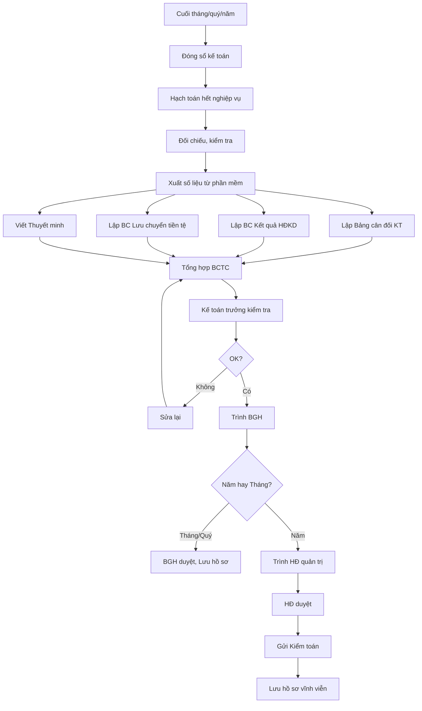

# SOP-08.1: LẬP BÁO CÁO TÀI CHÍNH

## 1. THÔNG TIN | Mã: SOP-08.1 | Tần suất: Tháng, Quý, Năm

## 2. MỤC ĐÍCH
Cung cấp thông tin tài chính chính xác, kịp thời cho lãnh đạo và các bên liên quan

## 3. CÁC LOẠI BÁO CÁO TÀI CHÍNH

| **Loại BCTC** | **Tần suất** | **Hạn hoàn thành** | **Người nhận** |
|---|---|---|---|
| BCTC quản trị | Hàng tháng | Ngày 10/tháng sau | BGH |
| BCTC quý | Hàng quý | Ngày 15/tháng sau quý | BGH, HĐ |
| BCTC năm | Hàng năm | Ngày 31/3 năm sau | BGH, HĐ, Kiểm toán, Thuế |

## 4. CẤU TRÚC BCTC CHUẨN (Theo VAS)

### 4.1. BCTC gồm 4 báo cáo chính

**1. BẢNG CÂN ĐỐI KẾ TOÁN (Balance Sheet)**

Phản ánh tài sản và nguồn vốn tại thời điểm cuối kỳ

```
TÀI SẢN = NGUỒN VỐN
```

| **Tài sản** | **Số đầu kỳ** | **Số cuối kỳ** | **Nguồn vốn** | **Số đầu kỳ** | **Số cuối kỳ** |
|---|---|---|---|---|---|
| A. Tài sản ngắn hạn | | | A. Nợ phải trả | | |
| - Tiền | 5 tỷ | 8 tỷ | - Nợ ngắn hạn | 2 tỷ | 3 tỷ |
| - Phải thu | 500 triệu | 300 triệu | - Nợ dài hạn | 1 tỷ | 500 triệu |
| B. Tài sản dài hạn | | | B. Vốn chủ sở hữu | | |
| - Tài sản cố định | 50 tỷ | 48 tỷ | - Vốn góp | 40 tỷ | 40 tỷ |
| | | | - Lợi nhuận chưa phân phối | 12.5 tỷ | 13.3 tỷ |
| **TỔNG** | **55.5 tỷ** | **56.3 tỷ** | **TỔNG** | **55.5 tỷ** | **56.3 tỷ** |

**2. BÁO CÁO KẾT QUẢ HOẠT ĐỘNG KINH DOANH (Income Statement)**

Phản ánh lãi/lỗ trong kỳ

| **Chỉ tiêu** | **Năm nay** | **Năm trước** |
|---|---|---|
| 1. Doanh thu | 60 tỷ | 55 tỷ |
| 2. Các khoản giảm trừ | 500 triệu | 400 triệu |
| 3. Doanh thu thuần (1-2) | 59.5 tỷ | 54.6 tỷ |
| 4. Giá vốn hàng bán | 0 | 0 |
| 5. Lợi nhuận gộp (3-4) | 59.5 tỷ | 54.6 tỷ |
| 6. Chi phí bán hàng | 2 tỷ | 1.8 tỷ |
| 7. Chi phí quản lý | 49.5 tỷ | 46 tỷ |
| 8. Lợi nhuận thuần từ HĐKD | 8 tỷ | 6.8 tỷ |
| 9. Thu nhập khác | 200 triệu | 100 triệu |
| 10. Chi phí khác | 100 triệu | 50 triệu |
| 11. Lợi nhuận trước thuế | 8.1 tỷ | 6.85 tỷ |
| 12. Thuế TNDN | 1.6 tỷ | 1.37 tỷ |
| **13. Lợi nhuận sau thuế** | **6.5 tỷ** | **5.48 tỷ** |

**3. BÁO CÁO LƯU CHUYỂN TIỀN TỆ (Cash Flow)**

Phản ánh nguồn thu, chi tiền

| **Chỉ tiêu** | **Số tiền** |
|---|---|
| I. Lưu chuyển từ HĐKD | +7 tỷ |
| II. Lưu chuyển từ hoạt động đầu tư | -5 tỷ (Mua TSCĐ) |
| III. Lưu chuyển từ hoạt động tài chính | +1 tỷ (Vay NH) |
| **Tăng/Giảm tiền trong kỳ** | **+3 tỷ** |
| Tiền đầu kỳ | 5 tỷ |
| **Tiền cuối kỳ** | **8 tỷ** |

**4. THUYẾT MINH BÁO CÁO TÀI CHÍNH**

Giải thích chi tiết các khoản mục

## 5. QUY TRÌNH LẬP BCTC



## 6. BIỂU MẪU
- QT03-B08: Bảng cân đối kế toán
- QT03-B09: BC Kết quả HĐKD
- QT03-B10: BC Lưu chuyển tiền tệ
- QT03-B11: Thuyết minh BCTC

## 7. TIÊU CHUẨN
| Chỉ tiêu | Mục tiêu |
|---|---|
| Hoàn thành BCTC tháng | ≤ 10 ngày |
| Hoàn thành BCTC năm | ≤ 31/3 |
| Sai sót trọng yếu | 0% |

## 8. TRÁCH NHIỆM
- **Kế toán tổng hợp**: Lập BCTC
- **KT trưởng**: Kiểm tra, ký
- **HT**: Ký (BCTC năm)

## 9. LƯU Ý
- ⚠️ **Tuân thủ VAS**: Theo đúng chuẩn mực kế toán VN
- ✅ **Trung thực**: Phản ánh đúng thực tế
- ✅ **Đầy đủ**: Không bỏ sót khoản mục quan trọng

## 10. FAQ

**Q: BCTC tháng có cần kiểm toán không?**  
A: Không. Chỉ BCTC năm cần kiểm toán độc lập.

---
**PHÊ DUYỆT** | KT tổng hợp | KT trưởng | HT |
