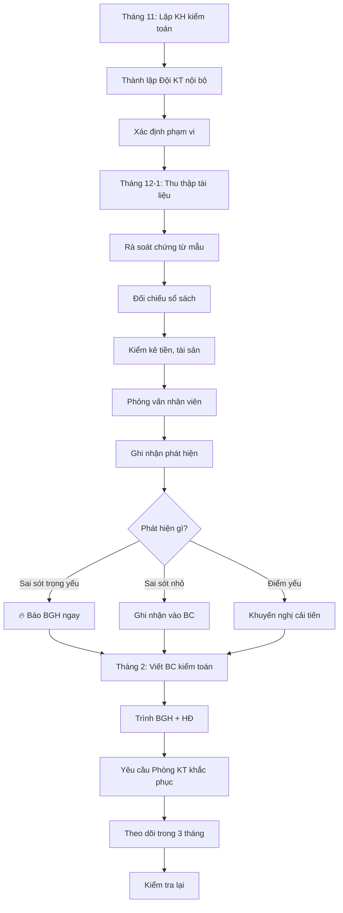

# SOP-08.2: KIỂM TOÁN NỘI BỘ

## 1. THÔNG TIN | Mã: SOP-08.2 | Tần suất: Hàng năm

## 2. MỤC ĐÍCH
Kiểm tra độc lập, phát hiện sai sót, gian lận, cải tiến quy trình

## 3. PHẠM VI KIỂM TOÁN

| **Lĩnh vực** | **Nội dung** |
|---|---|---|
| Thu chi | Học phí, lương, mua sắm, thanh toán |
| Sổ sách | Sổ kế toán, chứng từ |
| Tài sản | TSCĐ, hàng tồn kho |
| Công nợ | Nợ phải thu, phải trả |
| Thuế | Khai báo, nộp thuế |
| Tuân thủ | Quy trình, chính sách |

## 4. QUY TRÌNH

### 4.1. Lập kế hoạch (Tháng 11)

**Bước 1: Xác định phạm vi kiểm toán năm nay**
- Toàn diện (3-5 năm/lần)
- Hoặc trọng tâm (Tập trung 2-3 lĩnh vực)

**Bước 2: Thành lập Đội kiểm toán nội bộ**

| **Vai trò** | **Người** | **Yêu cầu** |
|---|---|---|
| Trưởng đội | Phó HT hoặc Chuyên gia ngoài | Độc lập với Phòng KT |
| Thành viên | 2-3 người | Am hiểu kế toán, tài chính |

**Bước 3: Lập kế hoạch chi tiết (QT03-P03)**

### 4.2. Thực hiện kiểm toán (Tháng 12 - Tháng 1)

**Bước 4: Thu thập tài liệu**
- Sổ sách kế toán
- Chứng từ gốc
- BCTC
- Hợp đồng
- Tờ khai thuế

**Bước 5: Kiểm tra chi tiết**

| **Phương pháp** | **Nội dung** |
|---|---|---|
| **Rà soát chứng từ** | Chọn mẫu ngẫu nhiên 20-30% chứng từ, kiểm tra hợp lệ |
| **Đối chiếu** | Sổ sách vs Chứng từ, Sổ KT vs Sổ quỹ, Sổ KT vs Sao kê NH |
| **Kiểm kê** | Đếm tiền quỹ, Kiểm kê TSCĐ, tồn kho |
| **Phỏng vấn** | Hỏi NV về quy trình, vấn đề |

**Bước 6: Ghi nhận phát hiện**

| **Loại phát hiện** | **Mức độ** | **Ví dụ** |
|---|---|---|---|
| **Sai sót trọng yếu** | Nghiêm trọng | Thiếu 100 triệu trong quỹ |
| **Sai sót không trọng yếu** | Trung bình | Ghi sai tài khoản nhưng số tiền đúng |
| **Điểm yếu kiểm soát** | Nhẹ | Không đủ chữ ký duyệt |
| **Khuyến nghị** | Cải tiến | Nên dùng phần mềm tự động |

### 4.3. Báo cáo (Tháng 2)

**Bước 7: Viết Báo cáo kiểm toán (QT03-R18)**

**Cấu trúc:**
1. Tóm tắt phát hiện
2. Chi tiết từng lĩnh vực
3. Khuyến nghị cải tiến
4. Kế hoạch khắc phục

**Bước 8: Trình BGH và HĐ**

**Bước 9: Theo dõi khắc phục**

Phòng KT phải khắc phục trong 3 tháng

## 5. LƯU ĐỒ

## 6. BIỂU MẪU
- QT03-P03: Kế hoạch kiểm toán nội bộ
- QT03-R18: Báo cáo kiểm toán nội bộ
- QT03-F25: Checklist kiểm toán

## 7. TIÊU CHUẨN
| Chỉ tiêu | Mục tiêu |
|---|---|
| Hoàn thành đúng hạn | 100% |
| Phát hiện sai sót (nếu có) | 100% |
| Tỷ lệ khắc phục kiến nghị | ≥ 95% |

## 8. TRÁCH NHIỆM
- **Đội KT nội bộ**: Kiểm tra, báo cáo
- **Phòng KT**: Cung cấp tài liệu, khắc phục
- **BGH/HĐ**: Xem xét, ra quyết định

## 9. LƯU Ý
- ⚠️ **Độc lập**: Đội KT không phụ thuộc Phòng KT
- ✅ **Khách quan**: Không thiên vị
- ✅ **Xây dựng**: Mục đích cải tiến, không để trừng phạt

## 10. FAQ

**Q: Có nhất thiết phải kiểm toán nội bộ không?**  
A: Trường nhỏ có thể bỏ qua. Nhưng trường lớn (> 1000 HS) nên làm để kiểm soát tốt.

---
**PHÊ DUYỆT** | Trưởng đội KT | BGH | HĐ |
