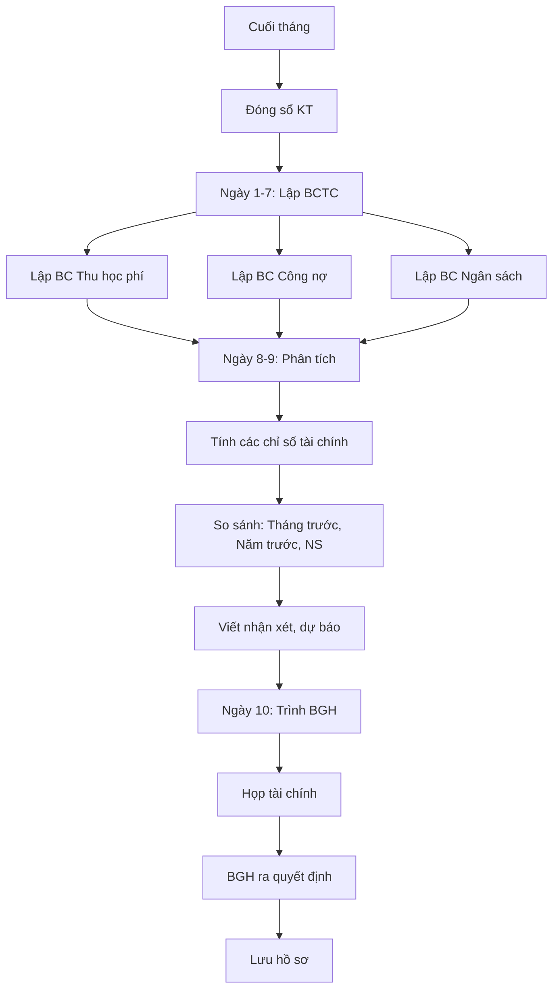

# SOP-08.3: BÁO CÁO ĐỊNH KỲ

## 1. THÔNG TIN | Mã: SOP-08.3 | Tần suất: Tuần, Tháng, Quý

## 2. MỤC ĐÍCH
Cung cấp thông tin tài chính kịp thời cho BGH theo dõi, ra quyết định

## 3. CÁC LOẠI BÁO CÁO

### 3.1. Báo cáo tuần

| **Báo cáo** | **Nội dung** | **Người làm** |
|---|---|---|
| BC thu học phí | Số tiền thu trong tuần, Tỷ lệ đóng đúng hạn | Kế toán thu |
| BC quỹ | Số dư tiền mặt, NH cuối tuần | Thủ quỹ |

### 3.2. Báo cáo tháng

| **Báo cáo** | **Nội dung** | **Hạn** |
|---|---|---|
| BCTC quản trị | Thu, Chi, Lãi/Lỗ, Tài sản, Nợ | Ngày 10 |
| BC công nợ | Nợ phải thu, phải trả | Ngày 10 |
| BC ngân sách | Thực hiện vs Kế hoạch | Ngày 10 |
| BC thuế | Thuế đã khai, đã nộp | Ngày 25 |

### 3.3. Báo cáo quý

| **Báo cáo** | **Nội dung** | **Hạn** |
|---|---|---|
| BCTC quý | Đầy đủ 4 báo cáo chuẩn | Ngày 15/tháng sau quý |
| Phân tích tài chính | Tỷ số, xu hướng, so sánh | Ngày 20/tháng sau quý |

## 4. QUY TRÌNH LẬP BÁO CÁO THÁNG

**Bước 1: Đóng sổ (Ngày 28-30)**

**Bước 2: Lập BCTC (Ngày 1-7)**

**Bước 3: Phân tích (Ngày 8-9)**

**Chỉ số quan trọng:**

| **Chỉ số** | **Công thức** | **Mục tiêu** |
|---|---|---|
| **Tỷ suất lợi nhuận** | LN / DT × 100% | ≥ 10% |
| **Tỷ lệ nợ** | Nợ / Tổng tài sản × 100% | ≤ 30% |
| **Khả năng thanh toán** | Tài sản ngắn hạn / Nợ ngắn hạn | ≥ 1.5 |
| **Hiệu quả sử dụng TS** | DT / Tổng tài sản | ≥ 1.0 |

**Nhận xét:**
- So với tháng trước
- So với cùng kỳ năm trước
- So với ngân sách
- Xu hướng, dự báo

**Bước 4: Trình BGH (Ngày 10)**

**Bước 5: Họp tài chính**
- BGH + KT trưởng thảo luận
- Đưa ra quyết định điều chỉnh

## 5. LƯU ĐỒ

## 6. BIỂU MẪU
- QT03-R19: BCTC quản trị tháng (Tóm gọn)
- QT03-R20: Báo cáo phân tích tài chính

## 7. TIÊU CHUẨN
| Chỉ tiêu | Mục tiêu |
|---|---|
| Hoàn thành đúng ngày 10 | 100% |
| BGH hài lòng với BC | ≥ 9/10 |

## 8. TRÁCH NHIỆM
- **Kế toán**: Lập báo cáo
- **KT trưởng**: Phân tích, trình bày
- **BGH**: Xem xét, quyết định

## 9. LƯU Ý
- ⚠️ **Trực quan**: Dùng biểu đồ, màu sắc
- ✅ **Ngắn gọn**: BGH bận, không đọc dài
- ✅ **Highlight điểm quan trọng**: Chữ đậm, màu đỏ

## 10. FAQ

**Q: BGH không hiểu báo cáo tài chính?**  
A: Giải thích bằng ngôn ngữ đơn giản, dùng biểu đồ trực quan. Không dùng thuật ngữ kế toán quá nhiều.

---
**PHÊ DUYỆT** | KT trưởng | Phó HT |
