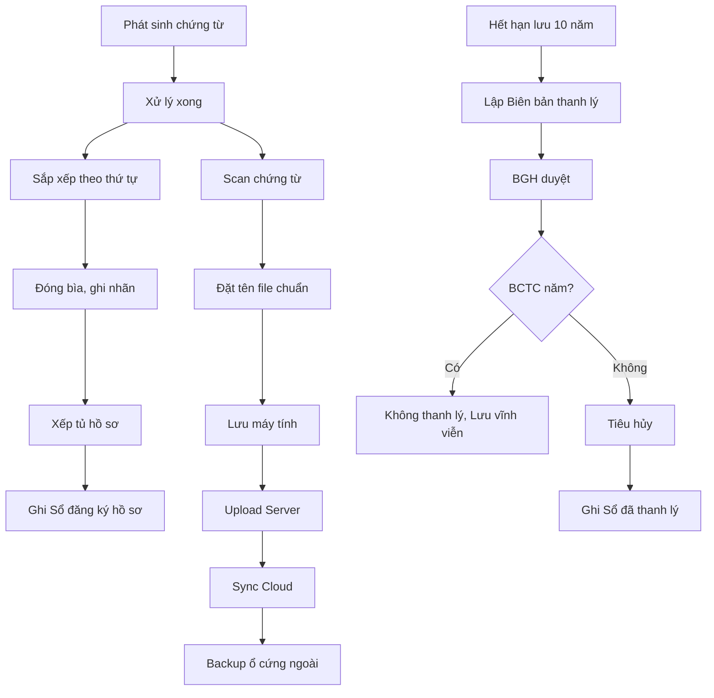

# SOP-08.4: LƯU TRỮ HỒ SƠ TÀI CHÍNH

## 1. THÔNG TIN | Mã: SOP-08.4 | Tần suất: Liên tục

## 2. MỤC ĐÍCH
Bảo quản an toàn, lâu dài, dễ tra cứu, tuân thủ luật

## 3. KỲ HẠN LƯU TRỮ (Theo Luật Kế toán)

| **Loại tài liệu** | **Thời gian** | **Hình thức** |
|---|---|---|
| **Chứng từ kế toán** | 10 năm | Giấy + Điện tử |
| **Sổ kế toán** | 10 năm | Giấy + Điện tử |
| **BCTC năm** | Vĩnh viễn | Giấy + Điện tử |
| **BCTC tháng/quý** | 5 năm | Điện tử OK |
| **Hợp đồng** | 10 năm từ hết hạn | Giấy + Điện tử |
| **Tờ khai thuế** | 10 năm | Giấy + Điện tử |
| **Hóa đơn** | 10 năm | Giấy (Bắt buộc) |

## 4. QUY TRÌNH

### 4.1. Lưu trữ vật lý (Giấy)

**Bước 1: Sắp xếp**

**Nguyên tắc:**
- Theo thứ tự thời gian (Tháng 1 → Tháng 12)
- Theo loại (Thu, Chi, Lương...)
- Theo số chứng từ

**Bước 2: Đóng bìa, hộp**

| **Thông tin trên bìa** | **Ví dụ** |
|---|---|
| Loại tài liệu | Chứng từ thu |
| Thời gian | Tháng 01/2024 |
| Số từ - đến | Số 001 - 150 |
| Người lưu | Nguyễn Văn A |

**Bước 3: Xếp vào tủ hồ sơ**
- Tủ sắt, có khóa
- Chống ẩm, mối mọt, cháy
- Ghi nhãn rõ ràng

**Bước 4: Lập Sổ đăng ký hồ sơ (QT03-S06)**

| **Số TT** | **Bìa số** | **Loại** | **Thời gian** | **Vị trí** | **Ngày lưu** | **Ngày hủy** |
|---|---|---|---|---|---|---|
| 1 | Bìa 01/2024 | Chứng từ thu | T1/2024 | Tủ A - Ngăn 1 | 01/02/2024 | 01/02/2034 |

### 4.2. Lưu trữ điện tử

**Bước 5: Scan chứng từ**
- Định kỳ cuối tháng
- Scan rõ nét, đầy đủ

**Bước 6: Đặt tên file chuẩn**

Format: `[Loại]_[Tháng]_[Năm]_[Số].[Đuôi]`

Ví dụ: `PhieuThu_01_2024_001.pdf`

**Bước 7: Lưu trữ đa điểm**

| **Vị trí** | **Mục đích** |
|---|---|---|
| Máy tính | Làm việc hàng ngày |
| Server nội bộ | Backup chính |
| Cloud (Google Drive, OneDrive) | Backup phụ, truy cập từ xa |
| Ổ cứng ngoài | Backup offline (1 tháng/lần) |

**Bước 8: Phân quyền truy cập**
- Mật khẩu mạnh
- Chỉ KT được xem

### 4.3. Thanh lý

**Bước 9: Hết thời hạn lưu → Thanh lý**

**Quy trình thanh lý:**
- Lập Biên bản thanh lý (QT03-D13)
- BGH ký duyệt
- Tiêu hủy (Xé, đốt, hoặc giao đơn vị chuyên nghiệp)
- **LƯU Ý**: BCTC năm KHÔNG thanh lý (Lưu vĩnh viễn)

## 5. LƯU ĐỒ

## 6. BIỂU MẪU
- QT03-S06: Sổ đăng ký hồ sơ lưu trữ
- QT03-D13: Biên bản thanh lý hồ sơ

## 7. TIÊU CHUẨN
| Chỉ tiêu | Mục tiêu |
|---|---|
| Tài liệu được lưu đầy đủ | 100% |
| Tìm được tài liệu khi cần | ≤ 5 phút |
| Mất mát, hư hỏng | 0% |

## 8. TRÁCH NHIỆM
- **Kế toán**: Sắp xếp, scan, lưu trữ
- **Thủ kho hồ sơ**: Quản lý tủ hồ sơ, cho mượn
- **IT**: Backup điện tử, bảo mật

## 9. LƯU Ý
- ⚠️ **An toàn tuyệt đối**: Chống cháy, ngập, mất cắp
- ✅ **Backup thường xuyên**: Ít nhất 1 tháng/lần
- ✅ **Phân quyền**: Không phải ai cũng xem được

## 10. FAQ

**Q: Nếu cháy, mất hồ sơ?**  
A: Rất nghiêm trọng! Phải báo cơ quan thuế, công an. Nếu có bản điện tử còn khắc phục được.

---
**PHÊ DUYỆT** | KT trưởng | Phó HT |

---

✅ **HOÀN THÀNH SOP-08: BÁO CÁO TÀI CHÍNH (4 files)!**
