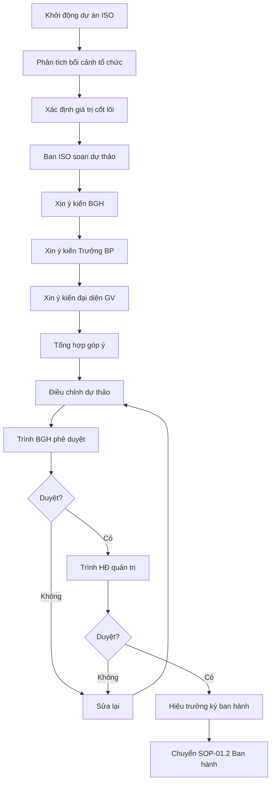

# SOP-01.1: XÂY DỰNG CHÍNH SÁCH CHẤT LƯỢNG

## 1. THÔNG TIN | Mã: SOP-01.1 | Tần suất: 3-5 năm hoặc khi thay đổi chiến lược

## 2. MỤC ĐÍCH
Xây dựng tuyên bố cam kết chất lượng rõ ràng, định hướng cho toàn trường

## 3. YÊU CẦU CHÍNH SÁCH CHẤT LƯỢNG (Theo ISO 9001)

Phải:
- ✅ Phù hợp với mục đích, bối cảnh tổ chức
- ✅ Cung cấp khung để thiết lập mục tiêu CL
- ✅ Cam kết đáp ứng yêu cầu
- ✅ Cam kết cải tiến liên tục
- ✅ Ngắn gọn, dễ hiểu, dễ nhớ (1 trang A4)

## 4. QUY TRÌNH XÂY DỰNG

### 4.1. Chuẩn bị

**Bước 1: Phân tích bối cảnh (Context Analysis)**

| **Phân tích** | **Nội dung** |
|---|---|
| Bên ngoài | Chính sách giáo dục, Cạnh tranh, Xu hướng quốc tế |
| Bên trong | Điểm mạnh, yếu, Nguồn lực, Văn hóa |
| Khách hàng | Mong đợi của PH, HS, Nhà nước |
| Đối tác | NCC, Chuyên gia, Trường đối tác |

**Bước 2: Xác định giá trị cốt lõi**

Ví dụ:
- Học sinh là trung tâm
- Chất lượng là ưu tiên hàng đầu
- Cải tiến liên tục
- Hợp tác đoàn kết

### 4.2. Soạn thảo

**Bước 3: Ban ISO soạn thảo dự thảo**

**Cấu trúc Chính sách CL:**

```
CHÍNH SÁCH CHẤT LƯỢNG
[Tên trường]

Chúng tôi cam kết:

1. ĐÁP ỨNG VÀ VƯỢT MONG ĐỢI:
   • Cung cấp giáo dục chất lượng cao cho học sinh
   • Lắng nghe và đáp ứng nhu cầu phụ huynh
   • Tuân thủ yêu cầu nhà nước và chuẩn quốc tế

2. CẢI TIẾN LIÊN TỤC:
   • Áp dụng chu trình PDCA trong mọi hoạt động
   • Khuyến khích đổi mới, sáng tạo
   • Học hỏi từ sai sót và thành công

3. PHÁT TRIỂN ĐỘI NGŨ:
   • Đào tạo nâng cao năng lực CBGVNV
   • Tạo môi trường làm việc chuyên nghiệp
   • Ghi nhận và khen thưởng thành tích

4. TUÂN THỦ QUY TRÌNH:
   • Xây dựng và tuân thủ các quy trình chuẩn
   • Đo lường và đánh giá hiệu quả
   • Minh bạch, trách nhiệm giải trình

Chính sách này là cam kết của Ban Giám hiệu và là trách nhiệm của mọi thành viên.

[Chữ ký Hiệu trưởng]
[Ngày ban hành]
```

**Bước 4: Xin ý kiến rộng rãi**
- BGH
- Trưởng các bộ phận
- Đại diện giáo viên
- Đại diện phụ huynh (nếu có)

**Bước 5: Điều chỉnh theo góp ý**

### 4.3. Phê duyệt

**Bước 6: Trình BGH phê duyệt**

**Bước 7: Trình Hội đồng quản trị (nếu cần)**

**Bước 8: Hiệu trưởng ký ban hành chính thức**

## 5. LƯU ĐỒ



## 6. BIỂU MẪU
- QT04-D01: Phân tích bối cảnh tổ chức
- QT04-D02: Dự thảo chính sách chất lượng
- QT04-F01: Form góp ý chính sách

## 7. TIÊU CHUẨN
| Chỉ tiêu | Mục tiêu |
|---|---|
| Chính sách đáp ứng yêu cầu ISO 9001 | 100% |
| Tỷ lệ CBGVNV hiểu chính sách | ≥ 95% |

## 8. TRÁCH NHIỆM
- **Ban ISO**: Soạn thảo, thu thập ý kiến
- **BGH**: Góp ý, phê duyệt, cam kết
- **HĐ quản trị**: Phê duyệt cuối

## 9. LƯU Ý
- ⚠️ **Ngắn gọn**: 1 trang A4, dễ đọc, dễ nhớ
- ✅ **Thực tế**: Cam kết có thể thực hiện được, không viển vông
- ✅ **Truyền cảm hứng**: Dùng ngôn ngữ tích cực, động viên

## 10. PHỤ LỤC

### 10.1. Checklist chính sách CL tốt

- [ ] Phù hợp với tầm nhìn, sứ mệnh trường
- [ ] Thể hiện cam kết cải tiến liên tục
- [ ] Thể hiện cam kết đáp ứng yêu cầu
- [ ] Ngắn gọn, dễ hiểu (≤ 300 từ)
- [ ] BGH cam kết thực hiện
- [ ] Có thể đo lường (qua KPI)

## 11. FAQ

**Q: Có cần dịch sang tiếng Anh không?**  
A: Nên có, đặc biệt trường quốc tế. Song ngữ Việt-Anh.

---
**PHÊ DUYỆT** | Trưởng Ban ISO | Phó HT | HT | Chủ tịch HĐ |
