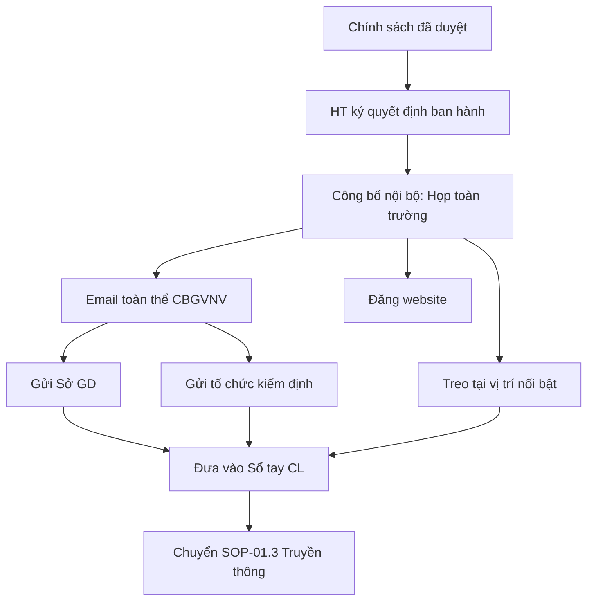

# SOP-01.2: BAN HÀNH CHÍNH SÁCH CHẤT LƯỢNG

## 1. THÔNG TIN | Mã: SOP-01.2 | Tần suất: Khi có chính sách mới

## 2. MỤC ĐÍCH
Công bố chính thức, tạo tính chính danh cho chính sách CL

## 3. QUY TRÌNH

**Bước 1: Hiệu trưởng ký ban hành**
- Quyết định ban hành (QT04-D03)
- Ngày hiệu lực

**Bước 2: Công bố nội bộ**
- Họp toàn trường
- Email toàn thể
- Đăng website

**Bước 3: Treo tại vị trí nổi bật**
- Văn phòng BGH
- Phòng giáo viên
- Sảnh chính

**Bước 4: Gửi các bên liên quan**
- Sở GD (nếu yêu cầu)
- Tổ chức kiểm định
- Đối tác

**Bước 5: Đưa vào Sổ tay chất lượng**

## 4. LƯU ĐỒ

## 5. BIỂU MẪU
- QT04-D03: Quyết định ban hành chính sách CL

## 6. TIÊU CHUẨN
| Chỉ tiêu | Mục tiêu |
|---|---|
| 100% CBGVNV biết chính sách | ≥ 95% |

## 7. FAQ
**Q: Có bắt buộc phải treo không?**  
A: Theo ISO, phải "truyền thông" đến mọi người. Treo là cách hiệu quả nhất.

---
**PHÊ DUYỆT** | Ban ISO | HT |
