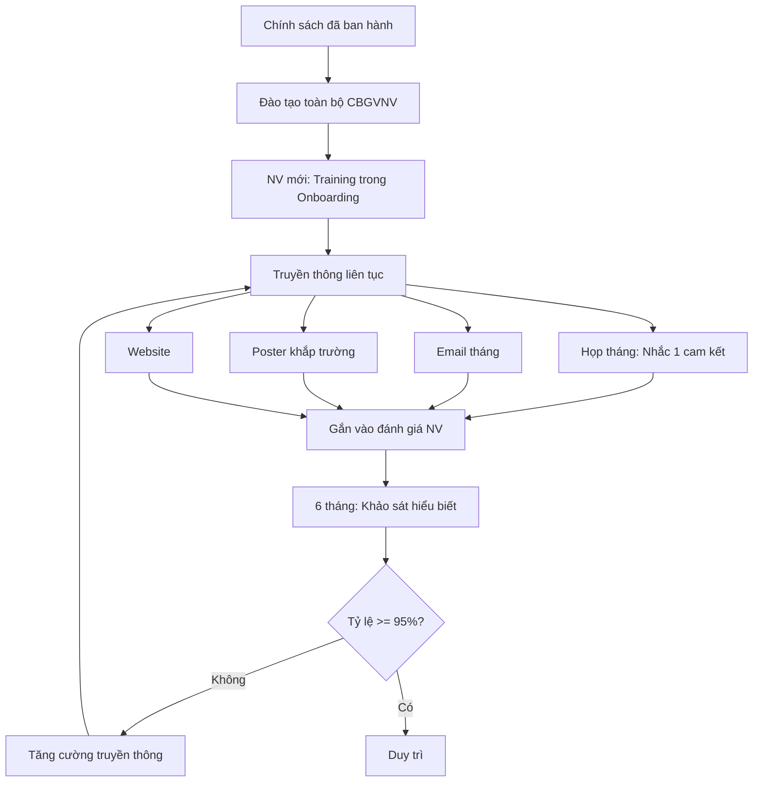

# SOP-01.3: TRUYỀN THÔNG CHÍNH SÁCH CHẤT LƯỢNG

## 1. THÔNG TIN | Mã: SOP-01.3 | Tần suất: Liên tục

## 2. MỤC ĐÍCH
Đảm bảo mọi người hiểu, nhớ, thực hành chính sách CL

## 3. QUY TRÌNH

### 3.1. Đào tạo ban đầu

**Bước 1: Training toàn bộ CBGVNV (2 giờ)**
- Giải thích từng cam kết
- Ý nghĩa, áp dụng thế nào
- Q&A

**Bước 2: NV mới**
- Trong Onboarding (Ngày đầu)

### 3.2. Nhắc nhở thường xuyên

**Bước 3: Các kênh truyền thông**

| **Kênh** | **Tần suất** | **Hình thức** |
|---|---|---|
| Họp toàn trường | Hàng tháng | BGH nhắc lại 1 cam kết |
| Email | Hàng tháng | Email nội bộ |
| Poster, banner | Thường trực | Treo khắp trường |
| Website | Thường trực | Trang "Về chúng tôi" |
| Sổ tay NV | Khi phát hành | Trang đầu |

**Bước 4: Gắn vào hoạt động hàng ngày**
- Đánh giá NV → Có tiêu chí về tuân thủ chính sách CL
- Khen thưởng → Ưu tiên NV sống đúng chính sách

### 3.3. Đánh giá hiểu biết

**Bước 5: Khảo sát định kỳ (6 tháng)**
- Hỏi ngẫu nhiên 20-30 NV
- "Chính sách CL của trường là gì?"
- Tỷ lệ trả lời đúng

**Bước 6: Tăng cường nếu tỷ lệ thấp**

## 4. LƯU ĐỒ

## 5. TIÊU CHUẨN
| Chỉ tiêu | Mục tiêu |
|---|---|
| NV nhớ và hiểu chính sách | ≥ 95% |

## 6. FAQ
**Q: Chính sách CL có cần dịch Anh không?**  
A: Nên có cho GV nước ngoài.

---
**PHÊ DUYỆT** | Ban ISO | Phó HT |
