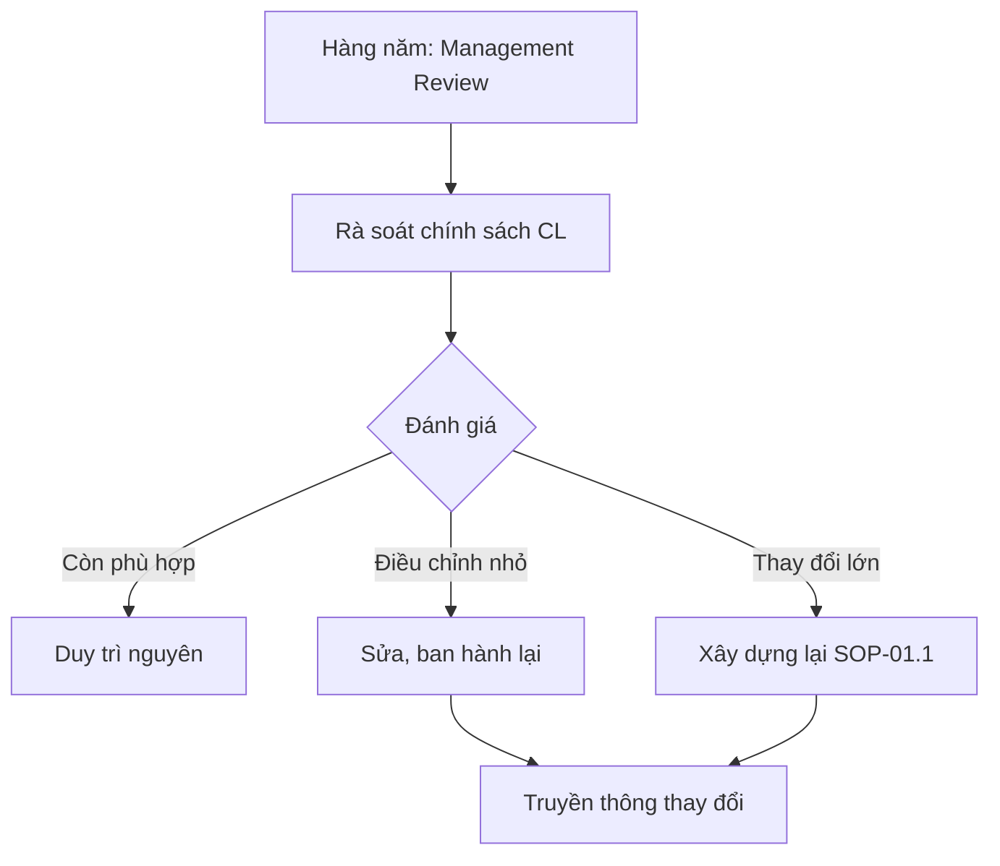

# SOP-01.4: RÀ SOÁT VÀ CẬP NHẬT CHÍNH SÁCH

## 1. THÔNG TIN | Mã: SOP-01.4 | Tần suất: Hàng năm

## 2. MỤC ĐÍCH
Đảm bảo chính sách CL luôn phù hợp, cập nhật

## 3. QUY TRÌNH

**Bước 1: Trong Management Review (2 lần/năm)**
- BGH rà soát chính sách CL
- Còn phù hợp không?
- Cần thay đổi gì?

**Bước 2: Quyết định**
| Kết quả | Hành động |
|---|---|
| Còn phù hợp | Duy trì, không sửa |
| Cần điều chỉnh nhỏ | Sửa, ban hành lại |
| Cần thay đổi lớn | Quay lại SOP-01.1 |

**Bước 3: Nếu sửa → Lặp lại quy trình ban hành**

## 4. LƯU ĐỒ

## 5. TIÊU CHUẨN
| Chỉ tiêu | Mục tiêu |
|---|---|
| Rà soát đúng hạn | 100% |

## 6. FAQ
**Q: Bao lâu sửa 1 lần?**  
A: Tùy. Có trường 5-10 năm không sửa. Có trường 2-3 năm sửa 1 lần.

---
**PHÊ DUYỆT** | Ban ISO | HT |

---

✅ **HOÀN THÀNH SOP-01 (4 files)!**
