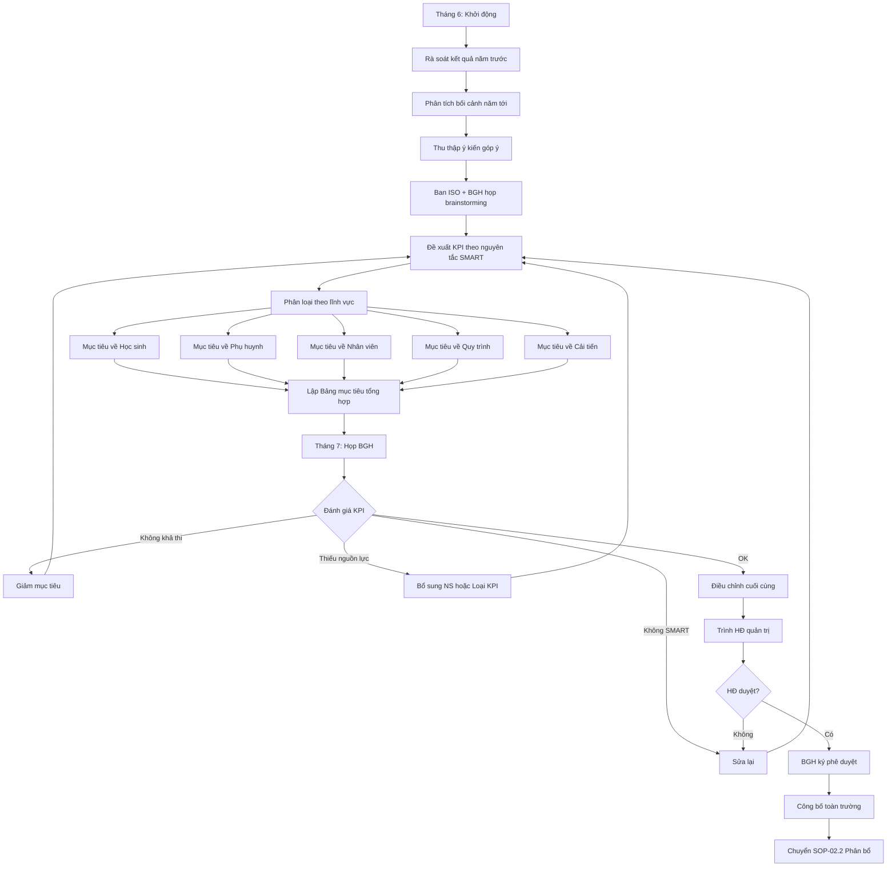
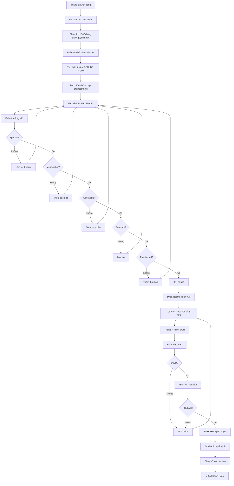

# SOP-02.1: THIẾT LẬP MỤC TIÊU CHẤT LƯỢNG

## 1. THÔNG TIN QUY TRÌNH

| **Thuộc tính** | **Nội dung** |
|---|---|
| Mã SOP | SOP-02.1 |
| Tên quy trình | Thiết lập mục tiêu chất lượng |
| Quy trình cha | SOP-02: Mục tiêu chất lượng |
| Phiên bản | 1.0 |
| Tần suất | Hàng năm (Tháng 6-7, chuẩn bị cho năm học mới) |

## 2. MỤC ĐÍCH

- **Cụ thể hóa chính sách**: Biến chính sách CL thành mục tiêu đo lường được
- **Định hướng hoạt động**: KPI rõ ràng giúp mọi người biết làm gì
- **Đánh giá hiệu quả**: Có số liệu để đo lường thành công
- **Tạo động lực**: Mục tiêu thách thức nhưng khả thi

## 3. PHẠM VI ÁP DỤNG

Áp dụng cho toàn trường, tất cả các lĩnh vực hoạt động

## 4. QUY TRÌNH THỰC HIỆN

### 4.1. Chuẩn bị và phân tích (Tháng 6)

**Bước 1: Rà soát kết quả năm trước**

Ban ISO tổng hợp:
- Các mục tiêu năm trước đạt được bao nhiêu %
- Những KPI nào đạt, không đạt
- Nguyên nhân thành công/thất bại
- Bài học kinh nghiệm

**Bước 2: Phân tích bối cảnh năm tới**

| **Yếu tố** | **Phân tích** | **Ảnh hưởng đến mục tiêu** |
|---|---|---|
| Quy mô | Số HS tăng/giảm bao nhiêu? | Ảnh hưởng đến tỷ lệ %, nguồn lực |
| Chính sách mới | Bộ GD có quy định mới? | Cần bổ sung KPI tuân thủ |
| Cạnh tranh | Trường khác làm gì? | Cần nâng cao chất lượng |
| Nguồn lực | Ngân sách, nhân sự | Ảnh hưởng tính khả thi |

**Bước 3: Thu thập ý kiến đóng góp**

Gửi Form khảo sát (QT04-F02) cho:
- Ban Giám hiệu
- Trưởng các bộ phận
- Đại diện giáo viên
- Đại diện phụ huynh (nếu có)

**Câu hỏi mẫu:**
- Theo bạn, mục tiêu nào quan trọng nhất?
- Trường cần cải thiện gì?
- Mục tiêu nào nên bổ sung?
- Mục tiêu nào nên loại bỏ?

### 4.2. Đề xuất mục tiêu (Tháng 7)

**Bước 4: Ban ISO + BGH họp brainstorming**

**Áp dụng nguyên tắc SMART:**

| **Chữ** | **Ý nghĩa** | **Ví dụ** |
|---|---|---|
| **S - Specific** | Cụ thể | "Tăng điểm hài lòng PH" (không cụ thể) → "Điểm hài lòng PH đạt 85/100" (cụ thể) |
| **M - Measurable** | Đo lường được | Phải có con số, %, thời gian |
| **A - Achievable** | Khả thi | Không đặt quá cao (100% HS Giỏi = Không thể) |
| **R - Relevant** | Liên quan | Phải liên quan đến chính sách CL |
| **T - Time-bound** | Có thời hạn | "Đạt vào 30/6/2025" |

**Bước 5: Phân loại mục tiêu theo lĩnh vực**

**A. Mục tiêu về Học sinh:**

| **KPI** | **Mục tiêu** | **Phương pháp đo** | **Người chịu trách nhiệm** |
|---|---|---|---|
| Tỷ lệ HS đạt + Giỏi | ≥ 85% | Kết quả học tập cuối năm | Phòng Học thuật |
| Tỷ lệ HS Giỏi | ≥ 30% | Kết quả học tập cuối năm | Phòng Học thuật |
| Điểm trung bình toàn trường | ≥ 8.0/10 | Kết quả học tập cuối năm | Phòng Học thuật |
| Tỷ lệ giữ chân HS | ≥ 95% | Số HS ở lại / Tổng HS đầu năm | Phòng Tuyển sinh |

**B. Mục tiêu về Phụ huynh:**

| **KPI** | **Mục tiêu** | **Phương pháp đo** | **Người chịu trách nhiệm** |
|---|---|---|---|
| Điểm hài lòng PH tổng thể | ≥ 85/100 | Khảo sát 2 lần/năm | Ban ISO |
| Điểm hài lòng về giảng dạy | ≥ 85/100 | Khảo sát | Phòng Học thuật |
| Điểm hài lòng về CSVC | ≥ 80/100 | Khảo sát | Phòng Hành chính |
| Tỷ lệ phản hồi khảo sát | ≥ 70% | Số PH trả lời / Tổng | Ban ISO |

**C. Mục tiêu về Nhân viên:**

| **KPI** | **Mục tiêu** | **Phương pháp đo** | **Người chịu trách nhiệm** |
|---|---|---|---|
| Điểm hài lòng nhân viên | ≥ 80/100 | Khảo sát 2 lần/năm | Phòng Nhân sự |
| Tỷ lệ giữ chân NV | ≥ 85% | Số NV ở lại / Tổng | Phòng Nhân sự |
| Tỷ lệ hoàn thành đào tạo | 100% | Số NV đào tạo / Kế hoạch | Phòng Nhân sự |

**D. Mục tiêu về Quy trình:**

| **KPI** | **Mục tiêu** | **Phương pháp đo** | **Người chịu trách nhiệm** |
|---|---|---|---|
| Tỷ lệ tuân thủ quy trình | ≥ 95% | Audit nội bộ | Ban ISO |
| Số NC trong audit | ≤ 5 NC/lần | Báo cáo audit | Ban ISO |
| Tỷ lệ khắc phục NC đúng hạn | 100% | Theo dõi CAR | Ban ISO |

**E. Mục tiêu về Cải tiến:**

| **KPI** | **Mục tiêu** | **Phương pháp đo** | **Người chịu trách nhiệm** |
|---|---|---|---|
| Số dự án cải tiến | ≥ 10 dự án/năm | Báo cáo CI | Ban ISO |
| Số ý tưởng cải tiến | ≥ 50 ý tưởng/năm | Hộp thư góp ý | Ban ISO |

**Bước 6: Lập Bảng mục tiêu chất lượng tổng hợp (QT04-D04)**

### 4.3. Thảo luận và phê duyệt

**Bước 7: Họp Ban Giám hiệu**

**Nội dung thảo luận:**
- Các KPI có SMART không?
- Có khả thi không?
- Nguồn lực có đủ không?
- Có cần bổ sung/loại bỏ KPI nào?
- Mức độ ưu tiên?

**Bước 8: Điều chỉnh theo ý kiến BGH**

**Bước 9: Trình Hội đồng quản trị (nếu cần)**

**Bước 10: BGH phê duyệt chính thức**

- Ký vào Bảng mục tiêu CL
- Công bố rộng rãi

**Bước 11: Chuyển sang SOP-02.2 (Phân bổ mục tiêu)**

## 5. LƯU ĐỒ QUY TRÌNH



## 6. BIỂU MẪU LIÊN QUAN

| **Mã** | **Tên** |
|---|---|
| QT04-F02 | Form khảo sát góp ý mục tiêu CL |
| QT04-D04 | Bảng mục tiêu chất lượng năm |
| QT04-R02 | Báo cáo đánh giá mục tiêu năm trước |

## 7. TIÊU CHUẨN VÀ CHỈ TIÊU

| **Chỉ tiêu** | **Mục tiêu** |
|---|---|
| Hoàn thành thiết lập mục tiêu trước T8 | 100% |
| Tỷ lệ mục tiêu đạt chuẩn SMART | 100% |
| Tỷ lệ CBGVNV hiểu rõ KPI của mình | ≥ 95% |

## 8. TRÁCH NHIỆM CỤ THỂ

| **Vai trò** | **Trách nhiệm** |
|---|---|
| **Ban ISO** | Phân tích, đề xuất KPI, tổng hợp ý kiến |
| **BGH** | Thảo luận, quyết định KPI, phê duyệt |
| **Trưởng BP** | Đóng góp ý kiến, cam kết đạt KPI được giao |
| **HĐ quản trị** | Phê duyệt các KPI quan trọng, chiến lược |

## 9. LƯU Ý QUAN TRỌNG

- ⚠️ **Không quá nhiều KPI**: 8-12 KPI là đủ. Quá nhiều → Loãng, mất tập trung
- ✅ **Cân bằng**: Giữa thách thức (để phát triển) và khả thi (để đạt được)
- ✅ **Liên kết**: KPI phải xuất phát từ Chính sách CL, phục vụ Tầm nhìn
- ✅ **Đo lường được**: Nếu không đo được → Không phải KPI tốt
- 🔥 **Gắn với đánh giá**: KPI phải gắn với đánh giá NV, BP → Tạo động lực

## 10. PHỤ LỤC

### 10.1. Ví dụ KPI SMART vs Không SMART

| **Không SMART** | **Vấn đề** | **SMART** |
|---|---|---|
| "Nâng cao chất lượng giảng dạy" | Không cụ thể, không đo được | "Tỷ lệ HS đạt Giỏi ≥ 30% vào 30/6/2025" |
| "Phụ huynh hài lòng hơn" | Không đo được | "Điểm hài lòng PH ≥ 85/100 (khảo sát T12 và T6)" |
| "100% HS Giỏi" | Không khả thi | "Tỷ lệ HS đạt + Giỏi ≥ 85%" |
| "Cải thiện" | Mơ hồ | "10 dự án cải tiến hoàn thành trong năm học" |

### 10.2. Ma trận mục tiêu chất lượng

| **Mục tiêu CL** | **Liên kết Chính sách** | **KPI** | **Trách nhiệm** | **Tần suất đo** |
|---|---|---|---|---|
| Học sinh phát triển toàn diện | Cam kết 1: Vượt mong đợi | • % HS Giỏi ≥ 30%<br>• Điểm TB ≥ 8.0 | Học thuật | Học kỳ |
| Phụ huynh hài lòng | Cam kết 1: Đáp ứng nhu cầu | • Điểm hài lòng ≥ 85/100 | Ban ISO | 6 tháng |
| Đội ngũ chất lượng cao | Cam kết 3: Phát triển đội ngũ | • Giữ chân NV ≥ 85%<br>• Đào tạo 100% | Nhân sự | Năm |
| Quy trình chuẩn | Cam kết 4: Tuân thủ | • Tuân thủ ≥ 95%<br>• NC ≤ 5 | Ban ISO | 6 tháng |
| Cải tiến liên tục | Cam kết 2: Cải tiến | • 10 dự án CI/năm | Ban ISO | Năm |

**Bước 5: Soạn thảo Bảng mục tiêu CL năm (QT04-D04)**

### 4.4. Phê duyệt và công bố

**Bước 6: Trình Ban Giám hiệu**

Thuyết trình:
- Tại sao chọn các KPI này?
- Dựa trên dữ liệu gì?
- Tính khả thi như thế nào?
- Cần nguồn lực gì?

**Bước 7: BGH thảo luận**

**Các câu hỏi thường gặp từ BGH:**
- KPI này đo thế nào?
- Ai chịu trách nhiệm?
- Có đủ ngân sách không?
- Nếu không đạt, hậu quả gì?

**Bước 8: Điều chỉnh theo ý kiến BGH**

**Bước 9: Trình Hội đồng quản trị (nếu cần)**

Đặc biệt các KPI liên quan đến:
- Đầu tư lớn
- Thay đổi chiến lược
- Cam kết với bên ngoài (Kiểm định...)

**Bước 10: Phê duyệt chính thức**

- BGH/HĐ ký
- Ban hành Quyết định
- Công bố toàn trường

**Bước 11: Chuyển sang SOP-02.2 (Phân bổ cho bộ phận)**

## 5. LƯU ĐỒ QUY TRÌNH



## 6. BIỂU MẪU LIÊN QUAN

| **Mã** | **Tên** |
|---|---|
| QT04-F02 | Form khảo sát góp ý mục tiêu CL |
| QT04-D04 | Bảng mục tiêu chất lượng năm |
| QT04-R02 | Báo cáo đánh giá KPI năm trước |
| QT04-D06 | Quyết định ban hành mục tiêu CL |

## 7. TIÊU CHUẨN VÀ CHỈ TIÊU

| **Chỉ tiêu** | **Mục tiêu** |
|---|---|
| Hoàn thành thiết lập trước T8 | 100% |
| Tất cả KPI đạt chuẩn SMART | 100% |
| Tỷ lệ KPI được đạt cuối năm | ≥ 80% |

## 8. TRÁCH NHIỆM CỤ THỂ

| **Vai trò** | **Trách nhiệm** |
|---|---|
| **Ban ISO** | Phân tích, đề xuất, soạn thảo KPI |
| **BGH** | Brainstorming, thảo luận, quyết định |
| **Trưởng BP** | Đóng góp ý kiến, cam kết thực hiện |
| **HĐ quản trị** | Phê duyệt KPI chiến lược |

## 9. LƯU Ý QUAN TRỌNG

- ⚠️ **Kiểm tra SMART nghiêm ngặt**: Mỗi KPI phải qua 5 tiêu chí
- ✅ **Tham khảo benchmarking**: Xem trường khác đặt KPI thế nào
- ✅ **Cân bằng lĩnh vực**: Không chỉ tập trung học tập, còn phải có PH, NV, quy trình...
- ✅ **Leading vs Lagging indicators**: 
  - Leading (Chỉ số dẫn dắt): % GV đào tạo → Dự đoán chất lượng tương lai
  - Lagging (Chỉ số kết quả): % HS Giỏi → Kết quả quá khứ
  - Cần cả 2 loại!
- 🔥 **Gắn với ngân sách**: Mỗi KPI cần có nguồn lực hỗ trợ

## 10. PHỤ LỤC

### 10.1. Template Bảng mục tiêu CL năm

```
MỤC TIÊU CHẤT LƯỢNG NĂM HỌC 20XX-20XX
[Tên trường]

I. MỤC TIÊU VỀ HỌC SINH:
1. Tỷ lệ HS đạt + Giỏi: ≥ 85%
   • Phương pháp đo: Kết quả học tập cuối năm
   • Trách nhiệm: Phòng Học thuật
   • Thời hạn: 30/6/20XX

2. Tỷ lệ HS Giỏi: ≥ 30%
   • Phương pháp đo: Kết quả học tập cuối năm
   • Trách nhiệm: Phòng Học thuật
   • Thời hạn: 30/6/20XX

II. MỤC TIÊU VỀ PHỤ HUYNH:
3. Điểm hài lòng PH: ≥ 85/100
   • Phương pháp đo: Khảo sát T12 và T6
   • Trách nhiệm: Ban ISO
   • Thời hạn: 30/6/20XX

[...]

Phê duyệt:
[Chữ ký Hiệu trưởng]
[Ngày]
```

### 10.2. Checklist KPI SMART

**Trước khi phê duyệt, kiểm tra từng KPI:**

✅ **S - Specific (Cụ thể):**
- [ ] Rõ ràng, không mơ hồ
- [ ] Ai đọc cũng hiểu giống nhau

✅ **M - Measurable (Đo lường được):**
- [ ] Có con số, %
- [ ] Có phương pháp đo rõ ràng
- [ ] Có nguồn dữ liệu đáng tin cậy

✅ **A - Achievable (Khả thi):**
- [ ] Dựa trên dữ liệu năm trước
- [ ] Tăng hợp lý (10-20%), không nhảy vọt
- [ ] Có nguồn lực hỗ trợ

✅ **R - Relevant (Liên quan):**
- [ ] Liên kết với Chính sách CL
- [ ] Phục vụ Tầm nhìn, Chiến lược
- [ ] Quan trọng với trường

✅ **T - Time-bound (Có thời hạn):**
- [ ] Có ngày cụ thể
- [ ] Có mốc đánh giá giữa kỳ (nếu KPI cả năm)

## 11. FAQ

**Q1: Nếu đặt mục tiêu quá cao, không đạt được thì sao?**  
A: Phân tích nguyên nhân, điều chỉnh cho năm sau. Không phạt nếu cố gắng hết sức. Nhưng nếu không cố gắng → Xử lý.

**Q2: Có nên công khai KPI ra bên ngoài (PH, website) không?**  
A: Nên! Thể hiện minh bạch, cam kết. Nhưng chỉ công khai 3-5 KPI quan trọng nhất.

**Q3: KPI có thay đổi giữa năm được không?**  
A: Được, nếu có lý do chính đáng (quy mô thay đổi lớn, chính sách mới...). Nhưng hạn chế, tránh thường xuyên.

**Q4: Nếu đạt 100% KPI từ tháng 3?**  
A: Tốt! Nhưng nên xem xét: Mục tiêu có quá dễ không? Năm sau nâng cao hơn.

**Q5: KPI có cần phê duyệt của Sở Giáo dục không?**  
A: Không. Đây là KPI nội bộ. Nhưng nếu tham gia kiểm định, tổ chức kiểm định sẽ xem.

---

**PHÊ DUYỆT**

| Trưởng Ban ISO | Phó Hiệu trưởng | Hiệu trưởng | Chủ tịch HĐ |
|---|---|---|---|
| [Họ tên] | [Họ tên] | [Họ tên] | [Họ tên] |
